# Git kolaboracija

<p align="center">
 
</p>

<!-- vscode-markdown-toc -->
* [Postavljanje repozitorija i dodavanje suradnika](#Postavljanjerepozitorijaidodavanjesuradnika)
	* [Vlasnik: Postavljanje repozitorija i dodavanje suradnika](#Vlasnik)
	* [Suradnik: dodati remote i napraviti pull](#Suradnik)
		* [Prvi pristup (clone)](#Prvipristupclone)
		* [Drugi pristup (fetch / checkout)](#Drugipristupfetchcheckout)
* [Temeljne git naredbe](#Temeljnegitnaredbe)
	* [git add  i git commit](#gitaddigitcommit)
	* [git branch](#gitbranch)
	* [git merge](#gitmerge)
	* [git push and pull](#gitpushandpull)
* [Git workflow](#Gitworkflow)
	* [Git workflow: single master](#Gitworkflowsinglemaster)
	* [Git workflow: feature branches](#Gitworkflowfeaturebranches)
* [Git i VSCode](#GitiVSCode)
	* [VScode: add i commit](#VScodeaddicommit)
	* [VSCode: checkout and merge](#VSCodecheckoutandmerge)
	* [VSCode: conflict resolution](#VSCodeconflictresolution)
* [Savjeti za rad](#Savjetizarad)
* [Korisni resursi](#Korisniresursi)

<!-- vscode-markdown-toc-config
	numbering=false
	autoSave=true
	/vscode-markdown-toc-config -->
<!-- /vscode-markdown-toc -->

Kad počnemo raditi na projektu, jedna osoba će stvoriti online repozitorij gdje će biti kod,
a ostali će imati lokalne verzije koda. Svako malo, kako projekt bude
napredovao dodavat će se novi kod kroz `push` i `merge` naredbe. Ovdje ćemo objasniti kako će to ići.  
Postoji više pristupa kolaborativnom radu, ali mi ćemo objasniti 2.

## <a name='Postavljanjerepozitorijaidodavanjesuradnika'></a>Postavljanje repozitorija i dodavanje suradnika

Svi online repozitorij ima vlasnika i suradnike. Može imati i kontributore, ali njih ćemo zasad zanemariti (specifičniji su za open-source projekte). Za početak rada vlasnik treba inicijalizirati repo i dodati suradnike.  
Suradnici trebaju samo klonirati repo ili dodati remote kroz git. Objasnit ćemo oba pristupa.

### <a name='Vlasnik'></a>Vlasnik: Postavljanje repozitorija i dodavanje suradnika

Nakon što je stvoren repozitorij, osoba koja je vlasnik treba učiniti dvije stvari:
- Dodati master branch kroz prvi commit
- Dodati kolege kao kolaboratore

To se radi na GitHubu. Nakon što je repozitorij stvoren, potrebno je lokalno stvoriti projekt kao što je opisano u [prvim vježbama]().

Nakon što se inicijalizira projekt koristeći `gatsby new`, dodaje se `remote` i radi prvi push:

```bash
$ git remote add origin linkNaNoviPrazanRepo
$ git push -u origin master
```
Sada, koristeći GitHub sučelje, dodaju se kolaboratori:

<p align="center">
 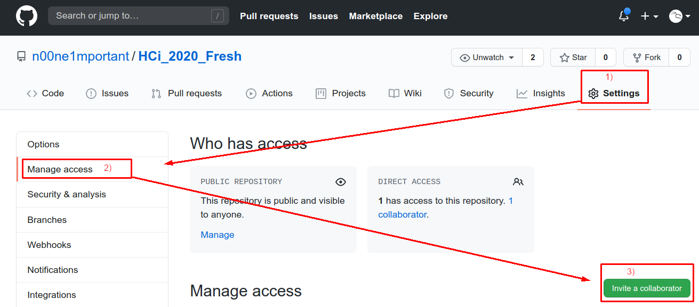
</p>

Prvo idete na  **Settings** pa **Manage access** i onda na **Invite a collaborator**.

Kad kolaborator prihvati, pojavit će se ispod (vidite na slici da ja imam jednog kolaboratora). Tada i on može raditi *push* i *pull* commitova na vaš repo (to je moguće ograničiti, ali nema potrebe u našem primjeru).

### <a name='Suradnik'></a>Suradnik: dodati remote i napraviti pull

Suradnik se treba samo spojiti na GitHub repo vlasnika. To se može napraviti na dva načina (jednako su laka... bar ja mislim):

- Suradnik ode na GitHub link repozitorija, kopira ga i klonira repo
- Suradnik doda remote i napravi fetch

#### <a name='Prvipristupclone'></a>Prvi pristup (clone)

Objasnimo prvi pristup. Nakon što otvorite GitHub link projekta samo ga kopirate. Link imate na dva mjesta:

<p align="center">
 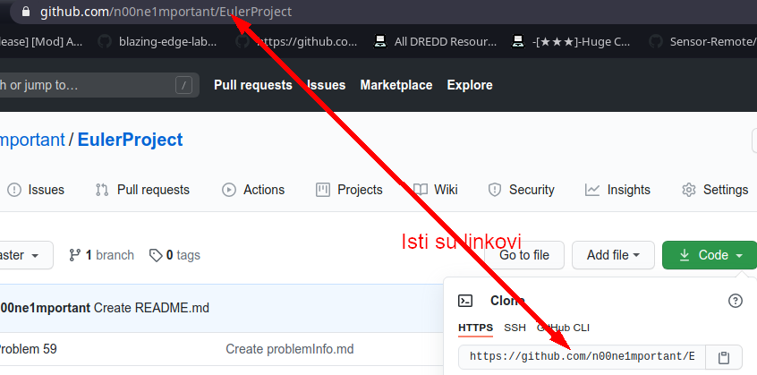
</p>

Kad je link kopiran, otvorite konzolu i upišete:

```bash
$ git clone kopiraniLink imeFoldera
```

Ime foldera je opcionalno. Ako ga ne stavite, git će dati ime repozitorija (na ovom primjeru bit će `EulerProject`).

Objasnimo drugi način

#### <a name='Drugipristupfetchcheckout'></a>Drugi pristup (fetch / checkout)

Otvorite folder gdje želite stvoriti repozitorij u terminalu.
Sad pišete sljedeće četiri naredbe jednu za drugom (ponovno vam treba link na repo):

```bash
$ git init
$ git remote add origin kopiraniLinkNaRepo
$ git fetch origin
$ git checkout master
```

Naredbe koje ste napravili iznad su zapravo naredbe koje čine [git clone](https://stackoverflow.com/questions/58577014/why-git-clone-when-i-can-do-the-same-with-git-pull-after-git-init/58577050#58577050). Znači da radite git clone ručno :)  
Na ovaj način možete dodati branch po branch, dok git clone dodaje sve odjednom.

To je to. U ovom trenutku imate lokalni repo spojen na remote i možete početi raditi. Kako ćete raditi objašnjeno je u sljedećem poglavlju.

## <a name='Temeljnegitnaredbe'></a>Temeljne git naredbe

### <a name='gitaddigitcommit'></a>git add  i git commit

`git add` označava datoteku ili folder koji dodajete u *staging* ili tzv. *index*. Ono što je dodano u index može se commitat sa `git commit`.

`git commit` sprema sve dodane promjene u indexu (`git add`) u **commit**. Commit je skup promjena nad datotekama. Ujedno je i gradivna jedinica git-a i git brancheva (grana).
 
### <a name='gitbranch'></a>git branch
 
Ako je git commit čvor u vezanoj listi commitova, onda je branch cijela lista. Tehnički to nije baš tako, ali vizualno je jako blizu istini. Branch mijenjamo sa `git checkout` naredbom. Možemo stvoriti branch i prebaciti se na njega istovremeno sa `git checkout -b noviBranch`. Sa `git branch imeBrancha` samo stvaramo novi branch na koji se onda prebacimo sa `git checkout imeBrancha`, dakle bez `-b` flaga ako branch već postoji. Branchevi se prikazuju kao liste.  
Vjerojatno ste vidjeli ovakve slike:

<p align="center">
  
<p>

Bitna napomena za sliku iznad. Strjelice prikazane zapravo bi trebale ići unazad jer git čuva pointer na parent, ne na child. Znači kad idete kroz commit history uvijek idete sa kraja prema početku, nikad obrnuto. Git nativno podržava koračanje unazad, ali ne podržava koračanje unaprijed (ne postoji sintaksa ni naredba za to). Ova vizualizacija je zbog jednostavnosti prikaza. Obje notacije se koriste u praksi pa neka vas ne zbune strjelice u suprotnom smjeru ako ih vidite.

<p align="center">
  
<p>

Primijetite kako se branchevi izdvajaju iz mastera. To jest, da svaki branch nastaje iz (ili iza) nekog commita. Za jednostavan rad s gitom, gledajte na brancheve kao na vezane liste, a commitove kao čvorove.  
Git uvijek dodaje commit na kraj liste, nikad ispred commita ili na početak. Branch je pokazivač na zadnji element liste. Pogledajte zeleni i plavi branch. Ime brancha pokazuje na zadnji element. Dodavanjem novog commita branch ide naprijed na novi commit.

Branch logički razdvaja vaš kod od onog što se događa na masteru. Sve promjene koje radite u branchu ostaju u tom branchu čak i ako ga pushate. Znači, sve greške, bugovi i ostali nered koji uvedete u kod se ne vidi van tog brancha. Jednom kad želite svoj kod pokazati svijetu (tj. ostalim kolegama), radite **merge** na master.

### <a name='gitmerge'></a>git merge

Merge je naredba kojom promjene iz jednog brancha dovodite u drugi branch. Najčešće radite merge u **master**.  

Merge ima 2 tipa: FF i MC:

- FF je fast-forward merge. To je merge koji se dogodi kad nema novih promjena na masteru nakon što smo se branchali. Znači master se samo brzo gurne naprijed na naš branch tj. zadnji commit (otud naziv)

- MC je merge commit. To je kad postoje promjene na masteru nakon što smo se mi branchali. Merge commit onda sadrži naše promjene iz brancha i nove promjene u masteru
 
FF merge se uvijek događa kad radite sami pa nema nikog drugog da ubacuje promjene osim vas. MC se događa u grupnom radu. Slijedi par vizualnih primjera:
Fast-Forward Merge:

<p align="center">
  
<p>

Merge commit merge, također se zove i *Three way merge* zbog algoritma kojeg koristi:

<p align="center">
  
<p>

### <a name='gitpushandpull'></a>git push and pull

**Git push** je jednostavan za shvatiti. On jednostavno gura na GitHub promjene koje smo radili lokalno pod uvjetom da je to moguće. To nije moguće ako GitHub ima promjene koje mi nemamo, tj. naš lokalni branch je stariji od onog na GH. Tada trebamo **pull**.

Pull radi 2 stvari: dohvaća promjene i onda radi merge u naš branch (najčešće master). Nakon toga se stvara Merge Commit i možemo napraviti push.

## <a name='Gitworkflow'></a>Git workflow

Samostalan rad uz git rad je jednostavan. Radite promjene, radite commit i onda push. Kad radite u timu taj *flow* se malo mijenja.
Trebate se prilagoditi jedni drugima što može predstavljati problem.

Problem je što više ljudi mijenja isti kod i onda rade *push* na isti repo.
Zašto je ovo problem postane očito jako brzo ako malo razmislite o ovome.

1) Ako vam treba 2 dana za napraviti promjene, a vašim kolegama manje i oni završe prije vas i naprave push, onda će se dogoditi da se vaše promjene temelje na staroj verziji koda dok je na GitHubu nova.

2) Ako vi i vaš kolega mijenjate istu datoteku i oboje napravite push, koje promjene će git uzeti?

3) Ako vi radite *Login* na u 4 commita, a vaš kolega radi *Footer* u 3 i vi napravite push nakon 2 commita, kolega nakon 3 pa opet vi nakon 2, onda je `git log` nered u kojem se ne vidi kad je šta dodano i zašto.

Ovi problemi se rješavaju uz pomoć 2 alata: praćenje dogovorenog *workflowa* i korištenje git naredbi za to (merge, pull i branch).  

Također, objasnit ćemo kako se rješavaju konflikti.

### <a name='Gitworkflowsinglemaster'></a>Git workflow: single master

Single master workflow je jednostavan i brz workflow za male timove između 2 i 4 čovjeka. Radi se jednostavno: svaki suradnik radi promjene na svom masteru lokalno i onda radi push. Kako se rješavaju problemi spomenuti iznad?

1) Svaki put kad radite push, git će provjeriti je li vaša verzija koda starija od one na GitHubu. Ako jest, morate napraviti pull prvo. Pull će spojiti vaše promjene s promjenama na GithHbu. Pull naredba radi **merge** automatski. Nakon toga, možete push.

2) Ako promjene na GH nad istim datotekama kao i vaše, imate `merge conflict`, tj. pull se ne može izvršiti do kraja. Potrebno je napraviti `conflict resolution`. Ovo se sastoji od toga da odaberete promjene koje želite zadržati (svoje ili kolegine) ili prilagodite svoje promjene da se uklapaju u novi kod koje je dodao vaš kolega. Kad napravite što je potrebno, potvrdite merge i pull će se izvršiti do kraja.

3) Ovaj problem nažalost ostaje s ovim workflowom. Jedino rješenje je raditi push onda i samo onda kad ste gotovi s onim što radite. Tada se commitovi neće miješati.

Ovakav pristup je dosta sličan drugim alatima poput SVN-a.
(ako nekog [zanima](https://www.perforce.com/blog/vcs/git-vs-svn-what-difference))

### <a name='Gitworkflowfeaturebranches'></a>Git workflow: feature branches

Daleko najpopularniji pristup. Upravo ovaj pristup definira git i izdvaja ga od drugih alata poput SVN-a. Flow ide ovako...

Svaki put kad počnete raditi na nečem novom, npr. radite *Footer* komponentu, stvarate branch za to. Kada završite s radom, tj. napravili ste *Footer* i zadovoljni ste, vrijeme je da uvedete te promjene u ostatak koda. U tom trenutku radite *merge* eksplicitno u *master*. Tada rješavate probleme 1 i 2 kao u workflowu iznad dok problem 3 uopće nemate zbog ovog pristupa:

1) Kad napravite merge na master, ako nema drugih promjena merge prolazi glatko kao *Fast-Forward* ili ako ima kao 3-way merge.

2) Ako postoji konflikt, rješava se isto kao i inače. Čak je poželjno periodički provjeriti je li se master mijenja. Ako je, možete dodati te promjene u svoj branch tako da napravite merge s mastera u njega. Ovo nije obavezno.

3) Ovaj problem nemate! Sve promjene su logički grupirane i neovisne!

Pravila ovog pristupa:

- NIKAD ne radite commit na masteru, samo merge u njega iz brancheva
- Periodički provjeravate promjene na masteru i dodajete ih u svoj branch (poželjno)
- Branch prije merga mora biti funkcionalan. NE smije biti bugova ili WIP brancheva
- Preporučuje se online merge kroz Pull Request, ali nije nužno

## <a name='GitiVSCode'></a>Git i VSCode

Rad sa gitom dosta je olakšan VSCode-om. Možete vizualno raditi `add`, `commit`, `merge` i `sync`. Krenimo s **add** i **commit**.

### <a name='VScodeaddicommit'></a>VScode: add i commit

Trenutno dok pišem ovo imam 4 promjene u "kodu":

<p align="center">
  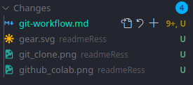
<p>

Koristeći plusić pored njih dodat ću sve osim *.md* datoteke.

<p align="center">
  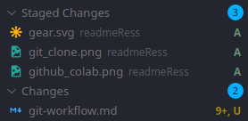
<p>

Iznad napišem poruku tipa "adding docs resources"

<p align="center">
  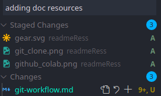
<p>

Ctrl + ENTER (ili kvačica):

<p align="center">
  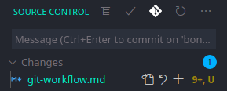
<p>

`git status` mi daje ovo:

<p align="center">
  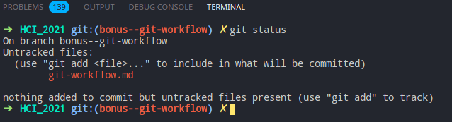
<p>

Što je isto što i na slici iznad samo iz terminala.

A `git log` ovo:

<p align="center">
  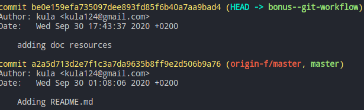
<p>

### <a name='VSCodecheckoutandmerge'></a>VSCode: checkout and merge

VSCode vam dopušta mijenjanje brancheva i njihovo merganje.  
Mijenjanje brancheva radite u donjem lijevom kutu:

<p align="center">
  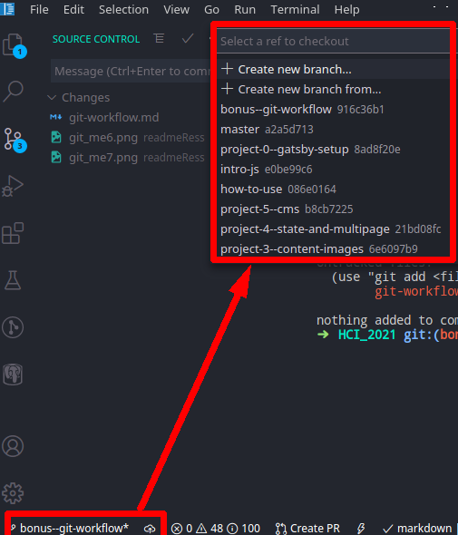
<p>

Nakon što promijenite branch, možete ga merge i push. Za ovaj primjer, napravit ću merge ovog brancha `bonus--git-workflow` u `master`.

Prvo potrebno je commitati sve promjene. Zatim mijenjamo branch u master i na kraju radimo merge sve kroz VScode bez ijedne naredbe. Letz G0!  

---
Prvo, dodajemo promjene (ja imam samo jednu):

<p align="center">
  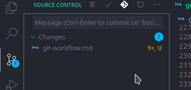
<p>

Zatim mijenjamo branch na master:

<p align="center">
  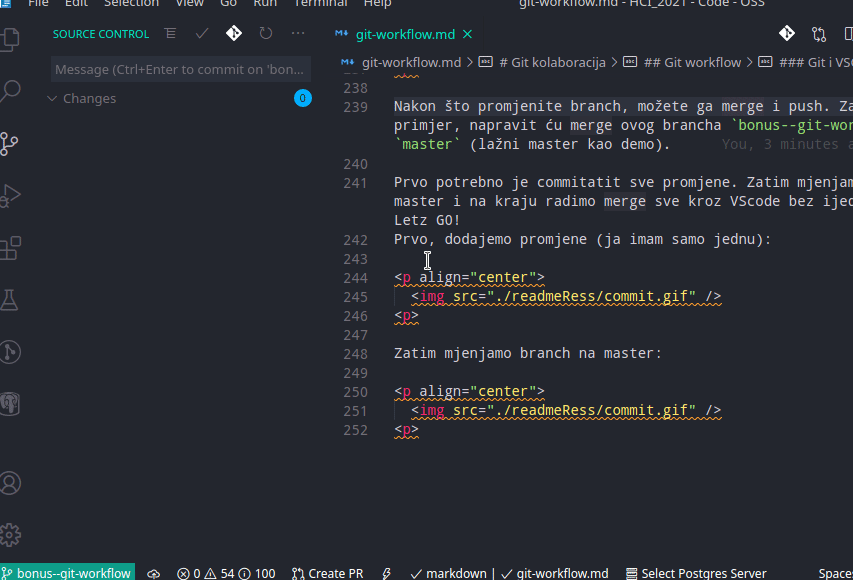
<p>

I na kraju radimo merge:

<p align="center">
  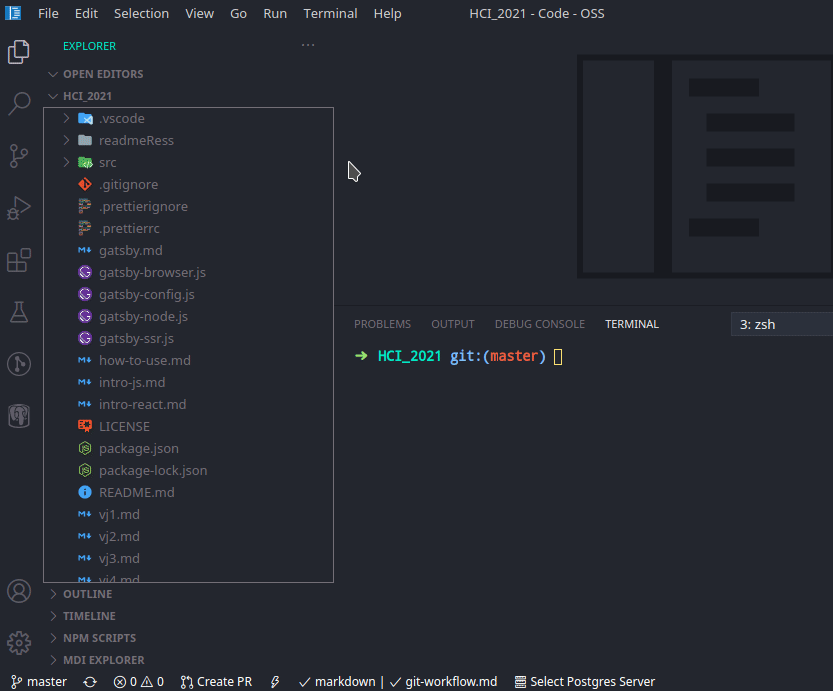
<p>

Primijetite da imamo broj 2 uz uzlaznu strjelicu. Ako kliknemo na njega napravit će se **push**. Broj 0 pokazuje broj dolaznih commitova. Budući da radim sam, meni je to uvijek nula. Kod vas su to commitovi vaših kolega. Klik na taj button će napraviti **sync**: pull pa push.

### <a name='VSCodeconflictresolution'></a>VSCode: conflict resolution

Rješavanje konflikta bez VSCoda je dosta nezgodno, a U VSCodu je dosta jednostavno (jako smislena rečenica).

Za demonstraciju uzrokovat ću **merge conflict** i riješiti ga u VSCodu.  
U tu svrhu napravio sam brancheve koje ću zvati `mc-master` i `mc-ivan`.

Krenimo ovako. Imamo 3 osobe:
- Mate: Vlasnik repoa, on je napravio prvi commit
- Jure: Kolega, on je napravio drugi commit
- Ivan: Mi, radimo svoj commit

Prvo je Mate napravio svoj commit. Onda smo se mi branchali, tako da naš history sadrži samo prvi commit. Ovo je inicijalni commit:

```js
function myFunction () {
  console.log("Hello this Mate!")
}
```

Nakon toga mi se branchamo i dodajemo ovo u svoj branch `mc-ivan`:

```js
function myFunction () {
  console.log("Hello this Mate!")
  console.log("Hello this is Ivan")
}
```

Međutim, ono što mi ne znamo je da je u međuvremenu commit napravio i kolega
Jure:

```js
function myFunction () {
  console.log("Hello this Mate!")
  console.log("Hello this is Jure")
}
```

Zapravo imamo ovo:

<p align="center">
  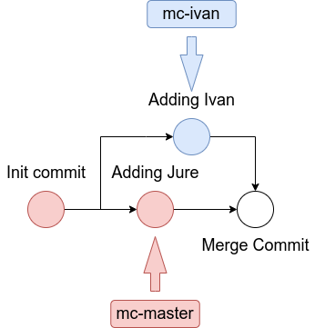
<p>

Sad krećemo s mergeom u master. Prvo radimo checkout na `mc-master` i onda merge `mc-ivan` brancha. Vidimo da merge ne prolazi i imamo conflict:

<p align="center">
  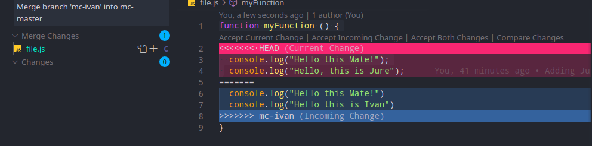
<p>

Ako kliknemo na `Accept Current Change` git će izabrati crvene promjene.
Time gubimo `Hello Ivan`. Ako odaberemo `Accept Incoming Change` gubimo crvene promjene tj. `Hello Jure`. Zato biramo obje: `Accept Both Changes`.
To nam daje ovo:

<p align="center">
  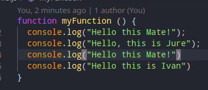
<p>

Vidimo da se Mate pojavljuje dvaput. Izbrišimo ga:

<p align="center">
  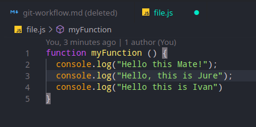
<p>

I sad imamo finalne promjene. Potrebno je spremiti file (Ctrl + S) i potvrditi merge. Na lijevoj strani dodamo file sa + i commitamo na kvačicu. Merge je sad prošao.

Da smo radili na dvije različite datoteke ili mijenjali datoteku na dva različita mjesta ne bi došlo do konflikta. Zato je bitna podjela rada.

## <a name='Savjetizarad'></a>Savjeti za rad

Podijelite se po modulima ili po komponentama. Neka samo jedan radi na jednoj komponenti ili modulu. Pokušajte se što je manje moguće križati. Jedino mjesto gdje će tada doći do konflikta je `pages` folder kad dodajete modul ili komponentu u stranicu. Tada onaj koji radi **pull** samo odabere `Accept Both Changes` i nema problema.

U bilo kojem trenutku tijekom mergea možete napraviti **abort** sa `git merge --abort`. To će poništiti promjene mergea i vratiti vas na orginalni branch.

Znam da ovo neće ići glatko, zato smo tu za pomoć. Za sve probleme i pitanja oko gita javite se direktno kroz Teams i pomoći ću vam. Git nije dio zahtjeva ovog kolegija nego samo alat. Ne očekuje se od vas da naučite sve ovo, samo dovoljno za rad. Iako izgleda teško na prvu, nije toliko, pogotovo kad imate nekog za pitati :)

## <a name='Korisniresursi'></a>Korisni resursi

Na webu postoji nekoliko **Git cheatsheet** dokumenata i slika. Evo neki:
- [pdf](https://education.github.com/git-cheat-sheet-education.pdf)
- [medium članak](https://towardsdatascience.com/the-git-cheat-sheet-5858865457ef)

Slika:


Nešto predobro! Definitivno pogledajte:  
[Vizualizacija git naredbi!](https://dev.to/lydiahallie/cs-visualized-useful-git-commands-37p1#merge)

Dokumentacija i objašnjenja naredbi:
- [Add](https://www.atlassian.com/git/tutorials/saving-changes)
- [Commit](https://www.atlassian.com/git/tutorials/saving-changes/git-commit)
- [Merge](https://www.atlassian.com/git/tutorials/using-branches/git-merge)
- [Pull](https://www.atlassian.com/git/tutorials/syncing/git-pull)