# Uvod
Ulazimo u zadnju fazu projekta. Ovdje ćemo pokazati kako napraviti deploy projekta na **Netlify**. Naravno postoje i drugi servisi za hosting, ali za **Netlify** je najpopularniji i jednostavan je za korištenje.
 
Opisat ćemo kako se u gatsby-u može ubaciti third-party sadržaj i kako gatsby može koristiti **CMS**. Objasnit ćemo i što je to **CMS**.
 
Segment stranice koji ćemo napraviti bit će galerija slika. Te slike ćemo dovući u gatsby kroz GraphQL s interneta i one će biti optimizirane i spremne za prikaz. Kako budemo dodavali slike u izvor, tako će se one automatski moći dodati u gatsby bez da moramo mijenjat kod.
# Segment stranice
<p align="center">
  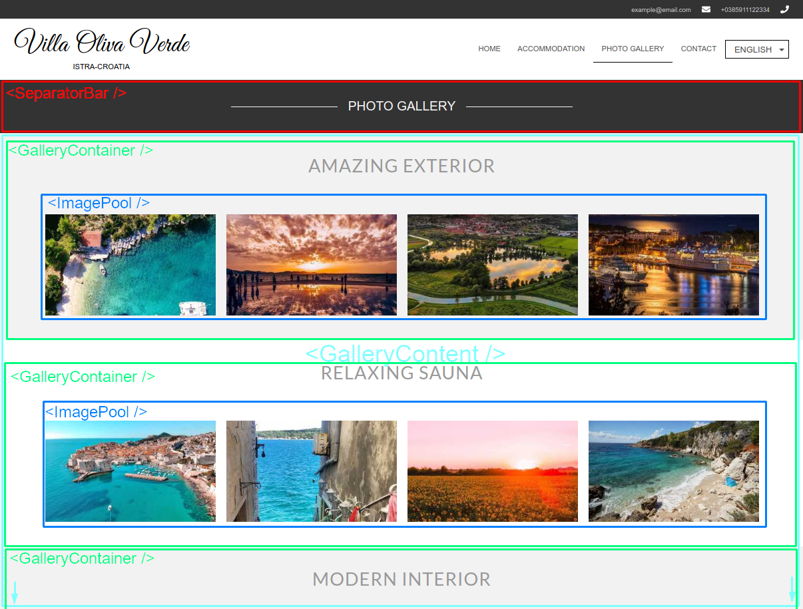
</p>
 
Definiramo novu stranicu. Vidimo da ima svoj naslovni bar i da se sastoji isključivo od kolekcije slika. Taj naslovni bar koristimo u `Contact` stranici. Za početak ćemo ga izvući i dodijeliti mu props tako da ga možemo koristiti i ovdje.
 
Dalje, komponenta koju imamo je container za niz slika. Ne bi trebalo biti teško za napraviti. Također, vidimo da svako drugi container ima sivu pozadinu i svaki od njih ima drugi tekst. Ako razmišljate o `map()` funkciji nad nizom stringova, čestitam! Počinjete razmišljati kao React programer. Što sa slikama?
 
U ovim vježbama pokazat ćemo kako se može lako zakačiti na vanjsku stranicu kroz GraphQL i dovući slike. Stranica na koju se kačimo je **Instagram**, a profil je službeni profil Hrvatske turističke stranice: ["Croatia full of life"](https://www.instagram.com/croatiafulloflife/). Vidimo da će trebati dohvatiti dosta velik broj slika. To nije nikakav problem. Svaki od ovih containera ima naslov koji će biti prop i niz slika za prikazati koji je također prop.
# React concept <a name="cms"></a>
Koncept koji želimo pokazati ovdje je **CMS**. Točnije, ovo što radimo je **Headless CMS**. **CMS** stoji za **C**ontent **M**anagment **S**ystem. Riječ je o sustavu za upravljanje sadržajem stranice nakon što je ona napravljena. Zapitajte se kako novinarski portali ažuriraju svoj sadržaj. Mislite da novinari znaju HTML, CSS ili Markdown i pišu članke pa onda rade *git push*? Teško. Na stranu to što je to van njihove struke, zamislite na što bi ličio taj git history. <br/>Isto je s blogovima. Mislite da se svaki blog dodaje kao novi page u stranicu? Svaki put HTML/CSS pa *commit* / *push*?
 
Taj problem dodavanja sadržaja u stranicu koja je live rješava **CMS**. *CMS* radi slično kao i pisanje komentara po društvenim mrežama. Postoji definirano sučelje gdje pišete sadržaj (npr. novinski članak), dodajete slike, boldirate tekst, ubacujete *Twitter* ili *Instagram feed* u to i kad završite napravite submit. Stranica detektira da se stvorio novi sadržaj i povuče ga, automatski mu dodijeli link (probajte pročitati link na neki članak na news portalima i vidjet ćete da je jednak naslovu). Taj članak je onda živ i možete ga vidjeti. Pretvoren je u HTML. Napisao ga je novinar koji ne mora znati ni kako se HTML izgovara. To omogućuje *CMS*.
 
Zašto je Headless? Jer nemamo integrirano sučelje unutar stranice za dodavanje sadržaja (Wordpress), nego sadržaj dolazi u stranicu kroz neki API (u našem slučaju, GraphQL). Više [ovdje](https://medium.com/@OPTASY.com/headless-cms-vs-traditional-cms-which-one-is-the-best-fit-for-your-needs-d0fa999fe0be). BTW, pogledajte taj URL. Očito je da je *auto-generated* (CMS) :)
 
Gatsby ima definirano sučelje (GraphQL) i plugin system koji mu omogućava da se zakači na bilo koji CMS koji preferirate. Često se koriste [Contentful](https://www.contentful.com/) i [Ghost](https://ghost.org/) iako ima i drugih.
 
U ovim vježbama pokazat ćemo kako se kači na *Instagram* za vježbu. U sljedećim vježbama spojit ćemo se na *Contentful* CMS i stvarati dinamičan sadržaj (blog).
# Sadržaj git commitova <a name="toc"></a>
Za početak riješimo `ContactSeparator`. Očito, moramo promijeniti to ime da se može koristiti općenito. Mijenjanjem imena moramo promijeniti i import. Također, dodajemo mu prop za prikaz proizvoljnog teksta. Promijenit ćemo mu ime u `SeparatorBar` i dodat ćemo mu `tetx` prop. Zatim prelazimo na galerije slika.
 
- [**Commit 1: creating accutal Combobox**](#c1)
  - Mijenjamo ime ContactSeparatora u `modules/SeparatorBar`
  - Dodamo `text` u props
  - Dodamo poziv u pages
- [**Commit 2: adding PhotoGallery page**](#c2)
  - Stvaramo page
  - Dodajemo navigaciju u `const`
- [**Commit 3: adding and configuring instagram plugin**](#c3)
  - Instaliramo NPM plugin
  - Dodajemo konfiguraciju u `gatsby-config.js`
- [**Commit 4: adding and configuring instagram plugin**](#c4)
  - Stvaramo `GalleryContainer`
  - Stvaramo `GalleryContent`
  - Dodajemo `GalleryContainer` x 3 u `GalleryContent`
  - Dodajemo `GalleryContent` u `pages`
- [**Commit 5: adding ImagePool**](#c5)
  - Tražimo GraphQL izraz
  - Definiramo ImagePool komponentu
  - Pišemo staticQuery
- [**Commit 6: configuring ImagePool**](#c6)
  - Dodajemo props za uzimanje skupa slika
  - Radimo slice pa map
- [**Commit 7: Upgrading GalleryContainer to accept bounds and style**](#c7)
  - Dodajemo `isGray` props
  - Dodajemo `start` i `end` props
- [**Commit 8: Correcting styling**](#c8)
  - Dodajemo style u `ImagePool`
  - Dodajemo style u `GalleryContainer`
- [**Commit 9: Refactoring to use map **](#c9)
  - Dodajemo map
  - Dodajemo isGray logiku
  - Dodajemo start / end logiku
# Implementacija
Implementiramo redom stablo komponenti:
<p>
  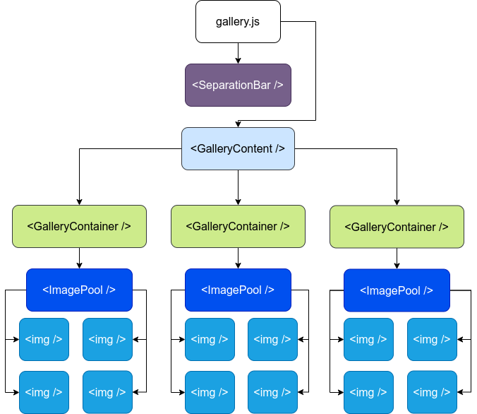
</p>
 
## Commit 1: ContactSeparator refactor <a name="c1"></a>
- Mijenjamo ime ContactSeparatora u `modules/SeparatorBar`
- Dodamo `text` u props
- Dodamo poziv u pages
 
Idemo u `modules/ContactSeparator` i dodajemo props i mijenjamo ime foldera i komponente u `SeparatorBar`. Dodajemo props:
```jsx
import React from 'react'
 
import styles from './style.module.css'
 
const SeparatorBar = ({text}) => (
    <section className={styles.separator}>
        <div className={styles.horizontalLine} />
        <h2>{text}</h2>
        <div className={styles.horizontalLine} />
    </section>
)
 
export default SeparatorBar
```
Ok, sad trebamo primijeniti promjene u `pages/contact.js`:
```jsx
import React from "react"
import HeaderFooterLayout from "../layouts/headerFooter"
import SeparatorBar from '../modules/SeparatorBar'
import ContactForm from '../modules/ContactForm'
 
const ContactPage = () => (
    <HeaderFooterLayout>
        <SeparatorBar text="Contact"/>
        <ContactForm />
    </HeaderFooterLayout>
)
 
export default ContactPage
```
Spreman za korištenje u novoj stranici.
 
Možemo commit!<br/>
[Sadržaj commitova](#toc)
 
## Commit 2: adding PhotoGallery page <a name="c2"></a>
- Stvaramo page
- Dodajemo navigaciju u `const`
 
Dodajmo page `pages/gallery.js` za početak:
```jsx
import React from "react"
import HeaderFooterLayout from "../layouts/headerFooter"
import SeparatorBar from '../modules/SeparatorBar'
 
const PhotoGallery = () => (
    <HeaderFooterLayout activeTab="Photo Gallery">
        <SeparatorBar text="Photo Gallery"/>
    </HeaderFooterLayout>
)
 
export default PhotoGallery
```
Dodajmo navigaciju u `constants/const`:
```jsx
export const navs = [
    {tab: 'Home', to: '/'},
    {tab: 'Accommodation', to: '/'}, 
    {tab: 'Photo Gallery', to: '/gallery'}, 
    {tab: 'Contact', to: '/contact'}
]
```
Osvježimo stranicu i trebali bismo vidjeti ovo:
<p align="center">
  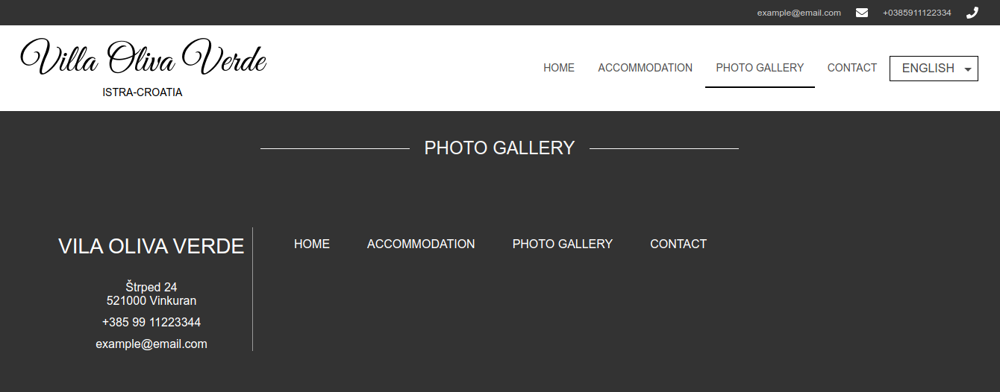
</p>
 
Dobar početak! Možemo commit.</br>
[Sadržaj commitova](#toc)
 
## Commit 3: adding and configuring instagram plugin <a name="c3"></a>
- Instaliramo NPM plugin
- Dodajemo konfiguraciju u `gatsby-config.js`
 
U ovom commit-u nema koda, samo instalacija paketa i dodavanje u config. Krenimo sa instalacijom:
```bash
$ npm -i gatsby-source-instagram --save 
```
Kad se paket instalira, dodajemo ga u konfiguraciju. Dokumentacija je [ovdje](https://www.gatsbyjs.com/plugins/gatsby-source-instagram/). Mi pratimo dokumentaciju za ["scraping for posts"](https://www.gatsbyjs.com/plugins/gatsby-source-instagram/#public-scraping-for-posts) i kasnije [posts](https://www.gatsbyjs.com/plugins/gatsby-source-instagram/#posts).
 
U `gastby-config.js` dodamo kod kao u dokumentaciji:
```js
plugins: [
    `gatsby-plugin-react-helmet`,
    // ...
    {
      resolve: `gatsby-source-instagram`,
      options: {
        username: `266897135`,
      },
    },
    // ....
]
```
`username` je broj koji možemo dobiti [ovdje](#https://codeofaninja.com/tools/find-instagram-user-id/). Naš odgovara `croatiafulloflife` profilu. Naravno, možete staviti bilo koji profil.
 
Promjena u `gatsby-config.js` datoteci zahtijeva ponovno pokretanje gatsby aplikacije. Ugasimo server sa CTR+C i pokrenimo `gastby develop` još jednom.
 
Možemo commitat.
 
[Sadržaj commitova](#toc)
 
## Commit 4: adding GalleryContainer <a name="c4"></a>
- Stvaramo `GalleryContainer`
- Stvaramo `GalleryContent`
- Dodajemo `GalleryContainer` x 3 u `GalleryContent`
- Dodajemo `GalleryContent` u `pages`
 
Komponenta `GalleryContainer` je komponenta koja će držati slike i naslove.  `GalleryContent` je modul koji drži 3 `GalleryContainer` komponente.
 
Definirajmo komponentu `components/GalleryContainer`:
```jsx
import React from 'react'
 
import styles from './style.module'
 
const GalleryContainer = ({title}) => (
    <section className={styles.galleryContainer}>
        <h1>{title}</h1>
        <div>IMAGES</div>
    </section>
)
 
export default GalleryContainer
```
Odmah je ubačen `title` prop koji označava naslov ("Amazing exterior", "Relaxing Sauna" itd).
</br>Ubacimo i CSS:
 
```css
.galleryContainer {
    width: 80%;
    display: flex;
    flex-flow: column;
    align-items: center;
    justify-content: center;
}
```
Sad stvaramo njegov modul koje ga poziva. Definirat ćemo ga u `modules/GalleryContent` i root mu je `<main>`.
```jsx
import React from 'react'
 
import styles from './style.module.css'
import GalleryContainer from '../../components/GalleryContainer'
 
const GalleryContinent = () => (
    <main className={styles.galleryContent}>
        <GalleryContainer title="Amazing exterior" />
        <GalleryContainer title="Relaxing sauna" />
        <GalleryContainer title="Modern interior" />
    </main>
)
 
export default GalleryContinent
```
CSS:
```css
.galleryContent {
    display: flex;
    flex-flow: column;
    justify-content: center;
    align-items: center;
}
```
Dodajmo ga u `pages/gallery`:
```jsx
import React from "react"
import HeaderFooterLayout from "../layouts/headerFooter"
import SeparatorBar from '../modules/SeparatorBar'
import GalleryContent from "../modules/GalleryContent"
 
const PhotoGallery = () => (
    <HeaderFooterLayout activeTab="Photo Gallery">
        <SeparatorBar text="Photo Gallery"/>
        <GalleryContent />
    </HeaderFooterLayout>
)
 
export default PhotoGallery
```
Imamo ovo:
<p>
  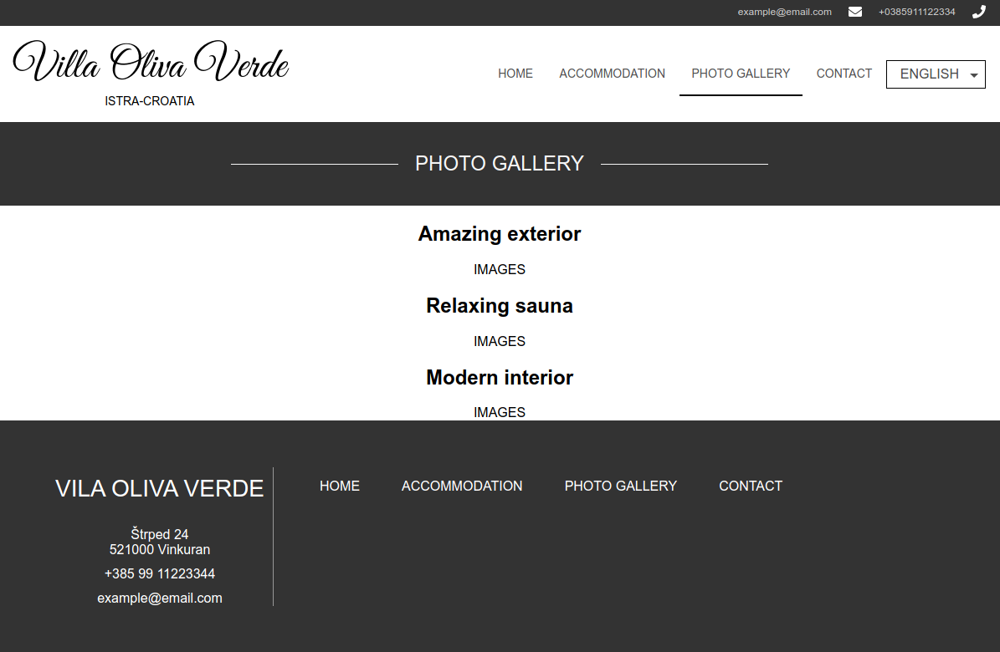
</p>
 
Možemo commit!</br>
[Sadržaj commitova](#toc)
 
## Commit 5: adding ImagePool <a name="c5"></a>
- Tražimo GraphQL izraz
- Definiramo ImagePool komponentu
- Pišemo staticQuery
 
Definirajmo što sljedeća komponenta mora raditi:
  - Dohvatiti sve slike s instagrama
  - Prikazati određen broj tih slika u nizu (galerija)
 
Krenut ćemo od samog GraphQL izraza.
### GraphQL
Otvorimo `localhost:8000/___graphql` i idemo redom:
  - Otvaramo `allInstaNode`: pristupa svim postovima (max 50)
    - `edges`: niz postova
      - `node`: odaberemo pojedinačni čvor (post)
        - `localFile`: uzimamo `file` isto kao kod [slika]()
          - `...GatsbyImageSharpFixed`: uzimamo objekt za `gatsby-image`
 
<p align="center">
  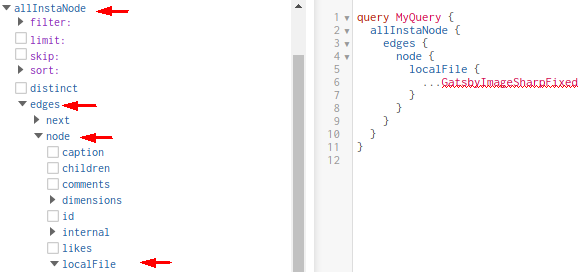
</p>
 
Ako se pitate otkud meni ovo, odgovor je kao i uvijek: [dokumentacija](https://www.gatsbyjs.com/plugins/gatsby-source-instagram/#posts).
 
> Primijetite da `...GatsbyImageSharpFixed` NE postoji s lijeva. To je zato što je to **fragment** definiran unutar [`gatsby-transformer-sharp`](https://www.gatsbyjs.com/plugins/gatsby-image/#gatsby-transformer-sharp) komponente kojoj ovaj GraphQL editor nema pristup. Što se nalazi unutar tog fragmenta možete vidjeti [ovdje](https://github.com/gatsbyjs/gatsby/blob/26582d31ab14f7bac6d5738e4245ceca2e6d411d/packages/gatsby-transformer-sharp/src/fragments.js#L6). Relevantan [GitHub issue](https://github.com/gatsbyjs/gatsby/issues/9882)
 
Sad kad imamo osnovnu strukturu ubacit ćemo par filtera:
  - Ne želimo dohvaćati video niti kolekcije slika
  - Želimo max 24 slike (2 x 4 + 1 x 16)
  - Za fixed definiramo veličinu
 
Ovo radimo dodavanjem **filtera**. Filteri su ljubičasti, a polja su plava u editoru. Koristit ćemo `limit` filter koji ćemo staviti na `24` što znači maksimalno 24 slike. `mediaType` ćemo staviti na `eq` i `GrpahImage` što znači samo slike, bez videa i kolekcija. Imamo ovo:
 
<p align="center">
  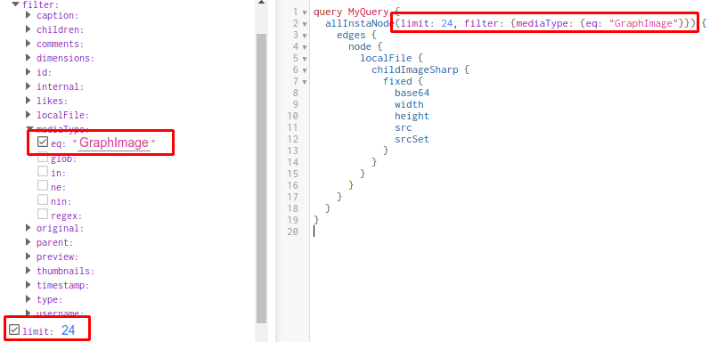
</p>
 
> Fragment `...GatsbyImageSharpFixed` smo zamijenili onim što on predstavlja unutar `localFile`. Očito je da je on samo kratica i ništa posebno.
 
Nismo definirali veličinu pa ubacimo i to:
<p align="center">
  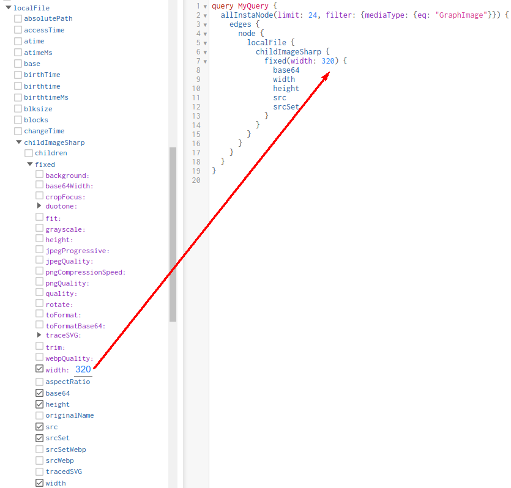
</p>
 
Pokrenimo query i s desne strane vidimo rezultat:
 
<p align="center">
  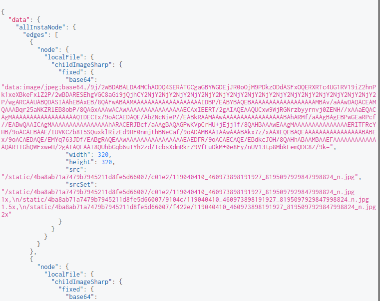
</p>
 
Probajte hoverat mišom preko `src` stringa. Ovaj rezultat definira strukturu objekta kojeg ćemo dobiti unutar komponente nakon što se query izvrši. Krenimo pisati tu komponentu.
 
### `<ImagePool />`
Komponentu ćemo nazvati `<ImagePool />` jer će sadržavati sve naše slike. Komponenta će interno složiti slike u niz i vratiti ga. Prije nego dođemo do toga, napravimo osnovnu komponentu i složimo query:
```jsx
import React from 'react'
import { useStaticQuery, graphql } from "gatsby"
import Img from "gatsby-image"
 
const ImagePool = () => {
    const data = useStaticQuery(graphql`
        query {
          myImages: allInstaNode(limit: 24, filter: {mediaType: {eq: "GraphImage"}}) {
            edges {
              node {
                localFile {
                  childImageSharp {
                    fixed(width: 320) {
                        ...GatsbyImageSharpFixed
                    }
                  }
                }
              }
            }
          }
        }
    `)
    return (
    <div>
        {data.myImages.edges.map(edge =>
          
        )}
    </div>
    )
}
 
export default ImagePool
```
 
Objasnimo kratko kod. Nakon što se query izvrši rezultat je spremljen kao što je prikazano na slici iznad. Pristupamo mu kroz `data`. Rekli smo da je `edges` niz (array) pa možemo zvati `map()` na njemu što i radimo. Nakon toga uzimamo sve `.node.localFile.childImageSharp.fixed` i stvaramo `gatsby-image` od njih. Tako na kraju dobijemo niz slika. Izi!
 
Testa radi, dodajmo ovu komponentu u `GalleryContainer` umjesto `<div>`:
```jsx
import React from 'react'
 
import ImagePool from '../ImagePool'
 
import styles from './style.module.css'
 
const GalleryContainer = ({title}) => (
    <section className={styles.galleryContainer}>
        <h1>{title}</h1>
        <ImagePool />
    </section>
)
 
export default GalleryContainer
```
Vidjet ćemo ovaj nered:
 
<p align="center">
  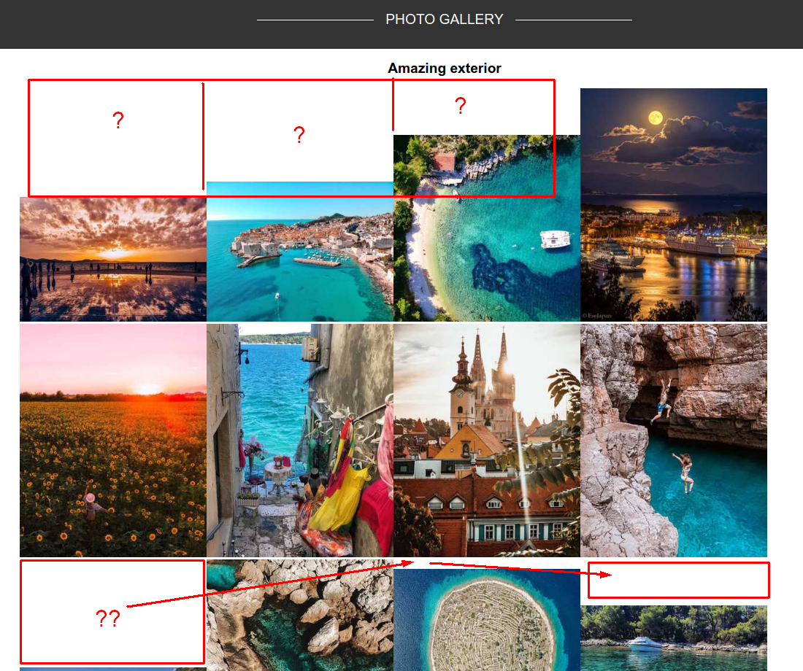
</p>
 
Vidimo da visine nisu ujednačene jer smo zakucali `width`, a gatsby čuva *aspect ratio*. Idemo i to pregaziti tako što ćemo definirati i `height: 190`:
```js
//...
childImageSharp {
  fixed(width: 320 height: 190) {
      ...GatsbyImageSharpFixed
//...
```
I sad vidimo puno manji nered:
 
<p align="center">
  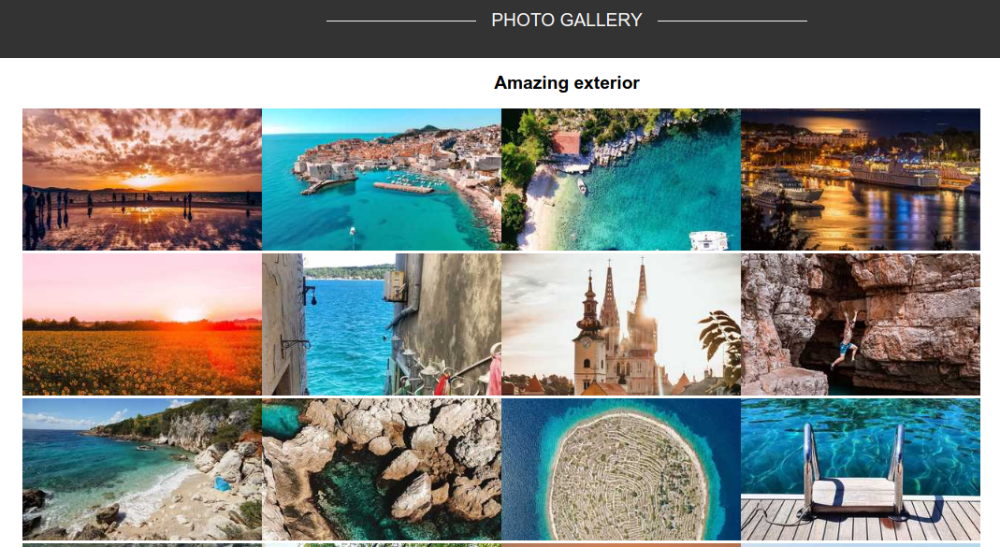
</p>
 
Možemo commit `components/ImagePool` komponentu.
 
[Sadržaj commitova](#toc)
 
## Commit 6: configuring ImagePool <a name="c6"></a>
- Dodajemo props za uzimanje skupa slika
- Radimo slice pa map
 
Sjetimo se što je bio cilj komponente s tim da smo prvi cilj zadovoljili:
  - ~~Dohvatiti sve slike s instagrama~~
  - Prikazati određen broj tih slika u nizu (galerija)
 
Vidjeli smo na testu ranije da se prikazuje niz slika, ali svih 24 odjednom. Želimo prikazati 4 + 4 + 16 u 3 galerije. Očito da `ImagePool` mora primati argumente koji će to omogućiti. Budući da je broj slika zakucan na 24, možemo slati početni i krajnji index slika koje želimo prikazati.
 
Na primjer, pošaljemo 1 i 4 za prve 4 slike, pa 4 i 8 za druge 4 itd.
 
Definirajmo to:
```jsx
import React from 'react'
import { useStaticQuery, graphql } from "gatsby"
import Img from "gatsby-image"
 
const ImagePool = ({start, end}) => {
    const data = useStaticQuery(graphql`
        query {
          myImages: allInstaNode(limit: 24, filter: {mediaType: {eq: "GraphImage"}}) {
            edges {
              node {
                localFile {
                  childImageSharp {
                    fixed(width: 320 height: 190) {
                        ...GatsbyImageSharpFixed
                    }
                  }
                }
              }
            }
          }
        }
    `)
    return (
    <div>
        {data.myImages.edges.map(edge => 
          
        )}
    </div>
    )
}
 
export default ImagePool
```
 
Sad bi trebalo primijeniti te granice. JS ima funkciju koja se zove [`slice`](https://developer.mozilla.org/en-US/docs/Web/JavaScript/Reference/Global_Objects/Array/slice) i koja vraća niz koji je podniz tog niza. Znači, ako pozovemo `slice` prije poziva `map` funkcije, ona će se izvršiti nad podnizom umjesto nad originalnim nizom. To ćemo i napraviti:
```jsx
//...
return (
    <div>
        {data.myImages.edges.slice(start, end).map(edge => 
          
        )}
    </div>
```
 
Probajmo poslati parametre iz `GalleryContainer` komponente:
```jsx
import React from 'react'
 
import ImagePool from '../ImagePool'
 
import styles from './style.module.css'
 
const GalleryContainer = ({title}) => (
    <section className={styles.galleryContainer}>
        <h1>{title}</h1>
        <ImagePool start={1} end={4} />
    </section>
)
 
export default GalleryContainer
```
Imamo ovo:
 
<p align="center">
  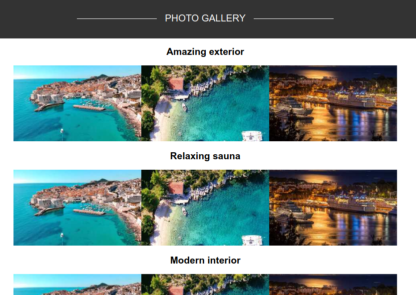
</p>
Primijetimo da imamo 3 slike, ne 4. Zašto? (Hint: array indexing)
 
To je to zasad, možemo commit.
 
[Sadržaj commitova](#toc)
 
## Commit 7: Upgrading GalleryContainer to accept bounds and style <a name="c7"></a>
- Dodajemo `isGray` props
- Dodajemo `start` i `end` props
 
Vidimo da su sve slike iste u sve tri instance. Također, nema sive pozadine. Komponenta `GalleryContainer` mora to rješavati, ne `ImagePool`. Modul `GalleryContent` stvara 3 `GalleryContainer` komponente koje se razlikuju po naslovu, sadržaju slika i pozadinskoj boji. Znači da `GalleryContainer` mora primati neki props, `GalleryContent` ga mora slati.
 
Taj props je:
 - `start` i `end` koji se prosljeđuje u `ImagePool`
 - `isGray` koji govori treba li komponenta imati sivu pozadinu
 
 Znači sve skupa 3. Dodajmo ih!
 ```jsx
 import React from 'react'
 
import ImagePool from '../ImagePool'
 
import styles from './style.module.css'
 
const GalleryContainer = ({title, start, end, isGray}) => (
    <section style={{bbackgroundColor: isGray ? '#f2f2f2' : 'white'}}
    className={styles.galleryContainer}>
        <h1>{title}</h1>
        <ImagePool start={start} end={end} />
    </section>
)
 
export default GalleryContainer
 ```
 
Sad idemo u module i tražimo `GalleryContent`. Šaljemo parametre:
```jsx
import React from 'react'
 
import styles from './style.module.css'
import GalleryContainer from '../../components/GalleryContainer'
 
const GalleryContinent = () => (
    <main className={styles.galleryContent}>
        <GalleryContainer title="Amazing exterior" start={0} end={4} isGray />
        <GalleryContainer title="Relaxing sauna" start={4} end={8} />
        <GalleryContainer title="Modern interior" start={8} end={24} isGray />
    </main>
)
 
export default GalleryContinent
```
Vidimo da su logika i sadržaj tu, ali CSS nije baš. Dodajmo ga u sljedeći commit. Zasad. Commitajmo što imamo.
<p align="center">
  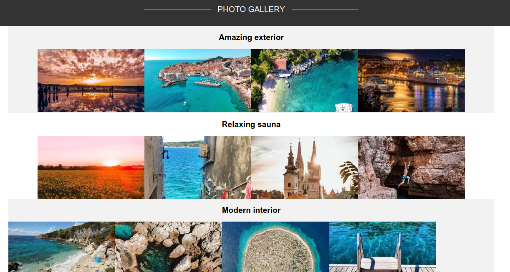
</p>
 
[Sadržaj commitova](#toc)
 
## Commit 8: Correcting styling <a name="c8"></a>
- Dodajemo style u `ImagePool`
- Dodajemo style u `GalleryContainer`
 
Vidimo da su slike zbijene i da zadnje slike "bježe" prema lijevo. To je zato što rade overflow, a nemaju flex. Nije problem :)
 
Krenimo s `ImagePool` komponentom. Njoj još nismo niti definirali style datoteku.
```jsx
import styles from './style.module.css'
//...
<div className={styles.imagePool}>
    {data.myImages.edges.slice(start, end).map(edge => 
      
    )}
</div>
``` 
Definirajmo `flex-wrap` i padding. 
 
> Bitno je napomenuti da koristimo `fixed` ne `fuild` pa će zbog toga prilikom promjene veličine ekrana slike prelaziti u idući red. Razlog je što je sa `fixed` slikama lakše raditi, a sam styling nije poanta ovih vježbi pa smo uzeli fixed. Možete za vježbu probati sa fluidom. Ako se usudite ^ ^
 
CSS:
```css
.imagePool {
    display: flex;
    flex-wrap: wrap;
    padding: 40px 0;
    width: calc(1280px + 8 * 10px);
}
 
.imagePool > div {
    margin: 6px 10px;
}
```
Dodajmo još nešto zanimljivo na slike: *zoom on hover*.  
Ispod dodajemo *hover* selektor i *transition*:
```css
.imagePool > div {
    margin: 6px 10px;
    transition: all 0.5s ease-in-out;
}
 
.imagePool > div:hover {
    transform: scale(1.1);
}
```
> Strelica selektor > je jako bitna u ovom slučaju. [Zašto?](hhttps://stackoverflow.com/questions/746525/how-is-the-greater-than-or-character-used-in-css)
 
`GalleryContainer` CSS:
```css
@import url("https://fonts.googleapis.com/css?family=Lato");
 
.galleryContainer {
    width: 100%;
    display: flex;
    flex-flow: column;
    align-items: center;
    justify-content: center;
    padding-top: 30px;
}
 
.galleryContainer h1 {
    text-align: center;
    margin: 10px 0px 25px;
    font-size: 34px;
    font-weight: 500;
    text-transform: uppercase;
    color: #999;
    letter-spacing: 1.4px;
    font-family: Lato;
}
```
 
Možemo commitat  
[Sadržaj commitova](#toc)
 
## Commit 9: Refactoring to use map <a name="c9"></a>
- Dodajemo map
- Dodajemo isGray logiku
- Dodajemo start / end logiku
 
Ovaj commit je totalno nepotreban i ne trebamo ga raditi, ali nije loše vježbati `map()`.
 
Ako ste za, idemo u `GalleryContent` modul i vidimo niz `GalleryContainer` komponenti. Napravit ćemo niz stringova i `map()` ćemo ga.
```jsx
import React from 'react'
 
import styles from './style.module.css'
import GalleryContainer from '../../components/GalleryContainer'
 
const titles = ["Amazing exterior", "Relaxing sauna", "Modern interior"]
 
const GalleryContinent = () => (
    <main className={styles.galleryContent}>
        {titles.map(title => <GalleryContainer title={title} />)}
    </main>
)
 
export default GalleryContinent
```
 
Sad dodajemo logiku za `isGray`:
```jsx
<main className={styles.galleryContent}>
    {titles.map((title, index) =>
      <GalleryContainer title={title} isGray={index % 2 === 0} />
    )}
</main>
```
Primijetimo `index` argument. To je drugi argument svakoj `map` funkciji. U većini slučajeva u Reactu vam neće trebati. Ovo je jedan od onih slučajeva kad je potreban.
 
Uzimamo svaki neparan element da je siv koristeći [modulo](https://stackoverflow.com/questions/16505559/how-can-i-use-modulo-operator-in-javascript) operator nad indexom.
 
Sad najteži dio. Definicija granica. Imamo 4 za prva dva i 16 za treći. Možemo reći da je svaki treći poseban. Za početak pokušajmo dobiti raspon od 4:
```jsx
<main className={styles.galleryContent}>
    {titles.map((title, index) =>
        <GalleryContainer title={title} isGray={index % 2 === 0}
        start={index * 4} end={(index + 1) * 4}/>
    )}
</main>
``` 
Imamo ga. Sad trebamo **special case** kad je index 3. Radimo provjeru i ako je index jednak 3 uzimamo 4 * 4, ako ne onda ostaje kako je. Tako vas to vuče na ternarni operator, čestitam! :)
```jsx
import React from 'react'
 
import styles from './style.module.css'
import GalleryContainer from '../../components/GalleryContainer'
 
const titles = ["Amazing exterior", "Relaxing sauna", "Modern interior"]
 
const GalleryContinent = () => (
    <main className={styles.galleryContent}>
        {titles.map((title, index) =>
            <GalleryContainer title={title} isGray={index % 2 === 0}
            start={index * 4}
            end={(index + 1) === 3
                ? (index + 4) * 4
                : (index + 1) * 4}
            />
        )}
    </main>
)
 
export default GalleryContinent
```
 
Možemo dodati i ovaj nepotreban commit :)  
[Sadržaj commitova](#toc)
# Review
Ono što je bitno upamtiti iz ovih vježbi je način na koji GraphQL radi. Također, što je to CMS jer ćemo se njime detaljnjije bavit u sljedećim vježbama.
- GraphQL  [[link]](#c1)
- CMS [[link]](#cms)
