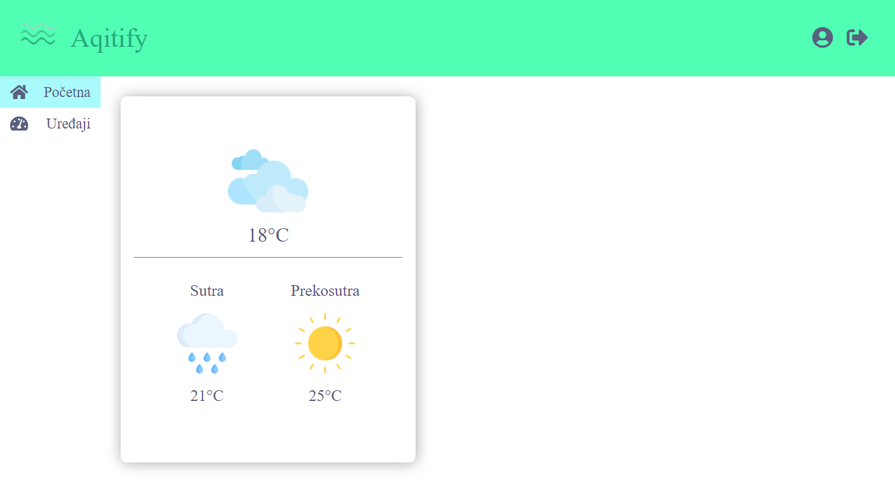
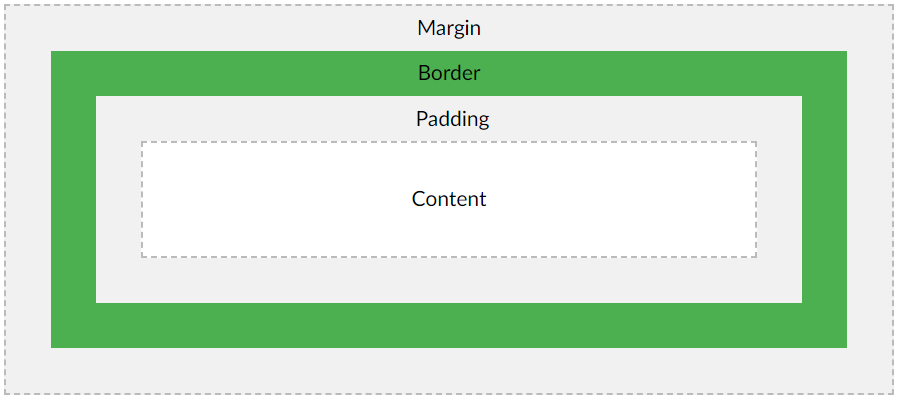
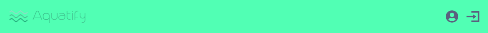
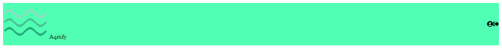
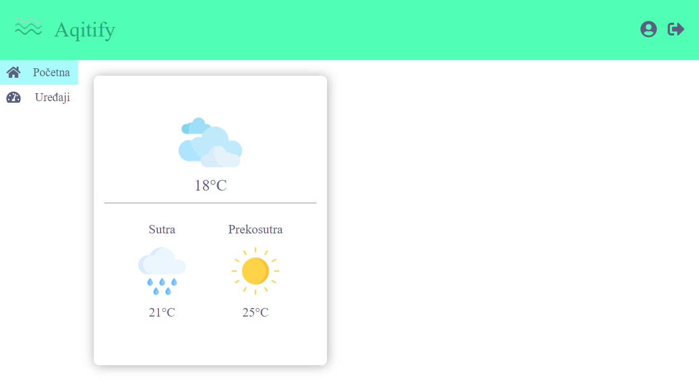
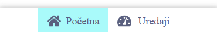
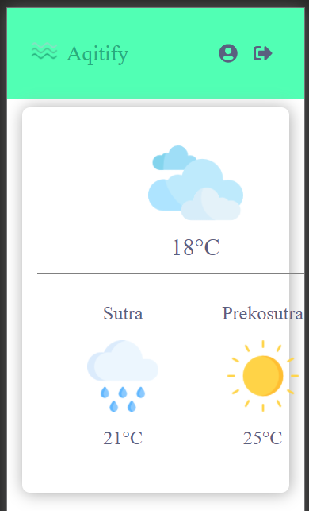
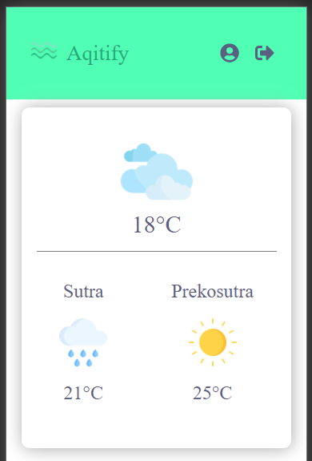

- [Uvod](#uvod)
  - [Osnove](#osnove)
    - [Display](#display)
      - [inline](#inline)
      - [block](#block)
      - [inline-block](#inline-block)
      - [Default display of elements](#default-display-of-elements)
    - [Position](#position)
      - [static](#static)
      - [relative](#relative)
      - [absolute](#absolute)
      - [fixed](#fixed)
      - [sticky](#sticky)
      - [Docs i izvori:](#docs-i-izvori)
    - [Flex](#flex)
    - [Margin, Padding and Border](#margin-padding-and-border)
    - [Mjerne jedinice](#mjerne-jedinice)
    - [CSS Selector Score](#css-selector-score)
  - [Responzivnost](#responzivnost)
  - [Commitovi](#commitovi)
    - [Commit 1: Setup and docs](#commit-1-setup-and-docs)
    - [Commit 2: Adding FontAwesome](#commit-2-adding-fontawesome)
    - [Commit 3: Creating Header](#commit-3-creating-header)
      - [index.js](#indexjs)
      - [style.module.css](#stylemodulecss)
    - [Commit 4: Adding global definitions and colors](#commit-4-adding-global-definitions-and-colors)
    - [Commit 5: Adding Sidebar](#commit-5-adding-sidebar)
    - [Commit 6: Creating MenuItem and adding to SideBar](#commit-6-creating-menuitem-and-adding-to-sidebar)
    - [Commit 7: Adding active class](#commit-7-adding-active-class)
    - [Commit 8: Adding Card](#commit-8-adding-card)
    - [Commit 9: Responsive Header](#commit-9-responsive-header)
    - [Commit 9: Responzive SideBar](#commit-9-responzive-sidebar)
    - [Commit 10: Responzive Card](#commit-10-responzive-card)
- [Review](#review)
 
# Uvod
 
U ovom branchu napravit ćemo novu jednostavnu stranicu s nule. 
Kroz dizajn te stranice pokazat ćemo tipične probleme i dizajn obrasce (patterne) koji se koriste sa CSS-om. Ovaj put focus je na CSS-u, ne na HTML/JS-u.
 
Stranica koju radimo je stranica za nadzor kvalitete vode. Dio je projekta na 5toj godini (bit će vam zabavno :P):

<p align="center">

</p>

## Osnove
Proć ćemo prvo osnove CSS-a prije nego krenemo na korištenje. Dalje u kodu pozivat ćemo se na osnove i definicije dane ovdje. Pod osnovama mislim na:
- Display
- Position
- Flex
- Padding, Margin and Border
- Mjerne jedinice
- CSS selector score
 
Objasnit ćemo sve ove pojmove prvo teoretski i kasnije ćemo vidjeti razlike u primjeni.
 
### Display
Property `display` definira način na koji će se element prikazati. U HTML-u postoji više display varijanti od kojih se najčešće koriste `block`, `inline`, `inline-block`, `flex` i `grid`. Tu su još i `table` i uz njega vezane vrijednosti poput `table-cell`, `table-column` i tako dalje.  
Fokusirajmo se zasad na tri osnovna:  
- `inline`
- `block`
- `inline-block`
#### inline
Element koji je `inline` bit će prikazan u istom retku kao i prethodni element. Na njega **ne možete** primjenjivati **width** i **height** svojstva.  
Uglavnom se koristi za prikaz teksta (npr. `span` je inline) ili komada teksta unutar drugih blok elemenata. Margine i padding neće raditi po vertikali (ne mogu se dodati margine ni padding top i bottom)  
Dobar primjer bi bio crveni komad teksta unutar nekog paragrafa.
 
#### block
Element koji je `block` bit će prikazan u sljedećem retku i uzima puni **width** koji može uzeti. Koliki će width uzeti ovisi o njegovom parent elementu. Na block elemente možete djelovati s **width** i **height** svojstvima.  
Margine i padding radit će očekivano te se može koristiti `margin: 0 auto` za centriranje po X osi.
 
#### inline-block
Element koji je `inline-block` bit će prikazan u istom retku, ali sadrži i blok svojstva. Možete djelovati s **width** i **height** na njega te margine i padding će raditi očekivano. 
 
#### Default display of elements
Prije nego krenemo dalje ovdje je skraćen popis elemenata i njihovih default display vrijednosti. 
Neki elementi koji su `inline` po defaultu:
 
- `span`
- `a`
- `i`
- `label`
- `button`
 
Neki elementi koji su `block` po defaultu:
 
- `div` i sve što je zapravo `div`:
  - `section`
  - `footer`
  - `header`
  - `article`  
  itd
- `address`
- `figure`
- `form`
- `p`
- svi `h` elementi
- `ul` i `nav` 
 
Elementi koji su `inline-block` po defaultu načelno ne postoje, ali u nekim browserima to su `button` i `span`.
 
Dobar vizualni primjer [ovdje](https://www.w3schools.com/Css/css_inline-block.asp).  
[Try it!](https://www.w3schools.com/Css/tryit.asp?filename=trycss_inline-block_span1)
 
Dokumentacija:
 
- [w3](https://www.w3schools.com/CSSref/pr_class_display.asp)
- [block-mdn](https://developer.mozilla.org/en-US/docs/Web/HTML/Block-level_elements)
- [inline-mdn](https://developer.mozilla.org/en-US/docs/Web/HTML/Inline_elements)
 
### Position
Definira pozicioniranje elementa. Ovisno o njegovom `display` svojstvu elementi će se pozicionirati drugačije.  
Svojstvo position može poprimiti vrijednosti:
 
- `static`
- `relative`
- `absolute`
- `fixed`
- `sticky`
- `inital`
- `inherit`
 
Možete naći punu dokumentaciju [ovdje](https://www.w3schools.com/CSSref/pr_class_position.asp). Mi ćemo proći kroz neke od njih koje se češće koriste.
 
#### static
`static` je default vrijednost. To znači da `static` elementi prate *document flow*. Uzimaju u obzir poziciju drugih elemenata i HTML struktura će ih posložiti tamo gdje mogu stati bez da se preklapaju s drugim elementima (go with the flow princip).
 
#### relative
Po ponašanju slično `static` vrijednosti. Elementi koji su `relative` mogu se pomicati pomoću `top`, `right`, `bottom` i `left` svojstava. Pomiču se u odnosu na svoj "prirodni" `static` položaj (otud naziv relative).
 
#### absolute
Apsolutno pozicioniranje nije baš skroz apsolutno. Element koji je `apsolute` pozicionira se pomoću `top`, `right`, `bottom` i `left` koje djeluju malo drugačije. Umjesto da uzimaju u obzir prirodnu početnu točku kao kod `relative` vrijednosti, `absolute` se orijentira po koordinatnom sustavu čije je ishodište u gornjem lijevom kutu.  
 
Ta točka ishodišta je uobičajena u računarstvu. Element na kojeg se oslanja (koji sadrži to ishodište) je prvi parent element koji nije `static` (najčešće je `relative`). Također, `absolute` elemente ne briga pozicija drugih elemenata te ih može prekriti ili se "sudarati" s njima.  
> Element koji je `absolute` maknut je iz toka dokumenta! To znači da njegove margine, visina i širina nemaju učinka na druge elemente ni na njegovog parenta.
 
Koristi se kad se radi bilo kakav overlay. Recimo da prekrivate sliku nekom podlogom na koju ćete staviti tekst da bude bolje vidljiv, tada će slika biti `relative`, a overlay `absolute` s vrijednostima npr. `bottom: 30px` i `left: 0`. Naravno, **width** će biti isti kao od slike, a overlay onda može sadržavati i tekst npr. neki child `span` koji želite prikazati.
 
#### fixed
Isto kao `absolute`, ali više apsolutno. Koordinatni sustav kod `fixed` je u lijevom gornjem kutu browsera. To znači da ako korisnik scrolla stranicu, element ostaje fiksiran na istom mjestu.  
Koristi se za prikaz modala te pop-up prozora i formi. Budući da mu je orijentacija browser, takvi elementi mogu se dosta jednostavno i precizno pozicionirati.  
 
#### sticky
Zanimljivo svojstvo koje kombinira `static` i `fixed`.  
Element koji je `sticky` ponaša se kao `static` dok ne izađe iz viewa zbog scrolla.  
Kad se to dogodi zalijepi se za vrh browsera i ponaša se kao `fixed`. Kad scroll prođe ispod njegovog parenta, onda ponovno postaje `static`.  
[Demo](https://css-tricks.com/position-sticky-2/)
 
#### Docs i izvori:
- [CSS-Tricks](https://css-tricks.com/absolute-relative-fixed-positioining-how-do-they-differ/)
- [CSS-Tricks: absolute and relative combo](https://css-tricks.com/absolute-positioning-inside-relative-positioning/)
 
### Flex
Iako je flex samo jedna od nekoliko `display` opcija ovdje ćemo mu posvetiti cijeli jedan odjeljak.  
Flex je riješio dobar dio problema pozicioniranja elemenata tako da se fokusira na ono što programer želi postići umjesto na kako (deklarativan vs imperativan pristup).  
Parent element koji sadrži nekoliko *child* elemenata često se naziva  **container** te se na njega stavlja `display: flex` koji onda preuzima pozicioniranje *childa*. Flex radi tako da prvo definira **flow** ili **direction** koji može biti:
 
- `row`
- `column`
- `row` ili `column` `-reversed` (npr. `row-reversed`)
 
Možemo gledati na `row` i `column` kao na X i Y osi. Os koja se odabere pomoću `flow` postaje **glavna** ili **main** os. Njome raspoređujemo elemente koristeći `justify-content`, a **sporednom** ili **cross** osi raspoređujemo elemente koristeći `align-items`.  
Često korišteni skup vrijednosti za `justify-content`:
 
- `center`: centrira elemente
- `space-between`: maksimalan razmak između elemenata
- `space-around`: ostavljen prostor oko elemenata
- `space-evenly`: ujednačena podjela praznog prostora i elemenata
- `flex-start`: gura elemente na početak i slaže ih u niz
- `flex-end`: gura elemente na kraj i slaže ih u niz
 
Često korišteni skup vrijednosti za `align-items`:
 
- `stretch`: **default** rasteže sadržaj da popuni *container*
- `center`: centrira po 
- `start`: gura elemente na početak i slaže ih u niz
- `end`: gura elemente na kraj i slaže ih u niz
- `baseline`: slaže elemente tako da im se središnja linija poklapa
 
Pojedini *child* element u nizu može imati posebna svojstva čime se može za taj *child* definirati iznimka. Može se koristiti **#id** za selektiranje tog pojedinog *childa* ili se može koristiti **nth()** CSS funkcija za to. Više [**ovdje**](https://www.w3schools.com/cssref/sel_nth-child.asp) i [**ovdje**](https://www.w3schools.com/cssref/sel_nth-of-type.asp).
 
Pogledajmo što se može napraviti za pojedini element.  
 
- Koristeći `order` možemo promijeniti redoslijed
- Koristeći `flex-grow` možemo promijeniti koliko prostora će biti dodijeljeno elementu:  
  `flex-grow: 4; /* default 0 */` znači da će element biti 4 puta veći od drugih
- Koristeći `flex-shrink` možemo definirati koliko se element može smanjiti (suprotno od grow)
- Koristeći `flex-basis` definiramo baznu veličinu za `grow` i `shrink` te samo poravnavanje
- Koristeći `align-self` možemo element poravnati kao izuzetak od `align-items`
 
Budući da se Flex koristi sve više i više, toplo preporučujem da se nauče osnove i da ga se počne koristiti. Rješava većinu problema koju možete imati s pozicioniranjem elemenata unutar `containera`, korištenjem `grow` i `shrink` može se (dijelomično) implementirati responzivnost bez korištenja media query-ja.
 
Dosta dobra dokumentacija i primjeri:
- [CSS-tricks](https://css-tricks.com/snippets/css/a-guide-to-flexbox/)
- [w3s](https://www.w3schools.com/cssref/css3_pr_flex.asp)
- [Popularna flex igra za učenje [**preporučujem svima**]](https://flexboxfroggy.com/)
 
### Margin, Padding and Border
O marginama i paddingu ima smisla pričati u kontekstu `block` i `inline-block` elemenata jer za `inline` nisu jednako dobro definirane. Svaki `block` element koristi `box-model`.  
 
<p align="center">
  
</p>
 
Kao što se vidi na slici, riječ je o slojevitom modelu. 
 
Centralni sloj je sam sadržaj. To je ono što je definirano s **width** i **height** svojstvima. 
 
Padding sloj je dodani padding. On se dodaje **na definirani height i width**.
 
Nakon paddinga definirate border i van bordera marginu.
 
Koja je osnovna razlika između margine i paddinga?  
Padding se dodaje **unutar** elementa, a margina izvan. To znači da ako stavite `background-color` na element, padding će biti obojen dok margina neće. Ovo je jedna od bitnijih razlika. Na padding možemo gledati kao na prošireni dio elementa. Također, margine susjednih blokova mogu se preklapati dok padding ne može.

Sintaksa:
 - `margin-top`
 - `margin-right`
 - `margin-down`
 - `margin-left`
 - kratica je samo `margin` i vrijedosti u smijeru kazaljke na satu: `margin: top right left down`
 - kratica za vertikalne i horizontalne margine: `margin: ver hor`

Isto vrijedi za *padding*.
 
### Mjerne jedinice
U CSS-u postoji dosta mjernih jedinica. Uglavnom pričamo o dužinama i vremenu. Za vrijeme se koriste sekunde (**s**) za trajanje animacija i tranzicija. Postotak se može koristiti za gotovo sve.  
Prijeđimo sad na **dužinu**.
 
| Jedinica   | Opis                                                                                  |
| ---------- | ------------------------------------------------------------------------------------- |
| Pixel (px) | Broj piksela                                                                          |
| cm         | Broj centimetara                                                                      |
| mm         | Broj milimetara                                                                       |
| em         | Omjer za veličinu fonta (npr. 2 je veličina fonta puta 2)                             |
| rem        | Omjer za veličinu fonta root elementa (`<html>` taga)                                 |
| vw i vh    | Viewport width/height: 1% iznosa veličine browsera (npr. 50vw je 50%  širine browsera |
 
Puni spisak [**ovdje**](https://www.w3schools.com/CSSref/css_units.asp)
 
### CSS Selector Score
Također se naziva i **Specificity**, a riječ je o brojčanoj vrijednosti koja predstavlja važnost pojedinog selektora. Ako dva selektora specificiraju isto svojstvo, a definiraju različite vrijednosti, uzima se onaj koji ima veći *Specificity*.  
Na ovaj način neke definicije mogu "pregaziti" neke druge. Ovaj način primjene vrijednosti zove se *Cascading*, otkud CSS dobiva ime.  
Poredat ću prioritete od najvećeg prema najmanjem:  
 
**1)** *inline style*: CSS zapisan direktno u elementu. Primjer: `<h1 style="color: red">Hello!</h1>`  
U Reactu to je: `<h1 style={{color: 'red'}} />`
 
**2)** *ID*: ID ima najviši prioritet od selektora
 
**3)** *Class*: Klase su zlatna sredina
 
**4)** *Pseudo Class*: Najniži prioritet
 
Izračun *Specificity-ja* je jednostavna formula koju ja neću navoditi ovdje. Ono što je još bitno za razumjeti je da se svaki od gore navedenih svojstava zbraja. Znači da selektiranjem pomoću dvije klase je jače od jedne, klasom i pseudo klasom je jače od samo klasom i tako dalje.  
Definicije koje su niže u CSS dokumentu su jače od onih više u dokumentu. Znači da ono što definirate nakon je uvijek jače od onog prije. Na primjer:
 
```css
.someClass p {
  margin: 0;
  margin-left: 15px;
}
```
 
Hoće li element imati margine?  
Hoće! Jer `margin-left` dolazi **nakon** `margin: 0`. Isto vrijedi i ovdje: 
 
```css
.someClass p {
  margin: 0;
}
 
.someOtherClas p {
  margin-left: 15px;
}
```
 
ako `<p>` ima obje klase na sebi, primijenit će se druga.
 
Detaljno objašnjenje uz formulu [**ovdje**](https://webdesign.tutsplus.com/tutorials/what-is-css-specificity--cms-34141).

## Responzivnost
Responzivnost se postiže korištenjem *media querya*. Njih ima dosta i koriste se u različite svrhe, ali za responzivnost se koristi `screen`  
i definira se minimalna ili maksimalna veličina ekrana.  
Unutar njih definiramo novi CSS koji će pregaziti "glavni" CSS kad se aktivira definirana širina. Sintaksa:
```css
/* When the browser is at least 600px and above */
@media screen and (min-width: 600px) {
  .element {
    /* Apply some styles */
  }
}
```

ili

```css
/* When the browser is at most 600px and below */
@media screen and (max-width: 600px) {
  .element {
    /* Apply some styles */
  }
}
``` 

Korištenjem više ovakvih upita možemo definirati **intervale**. Na primjer za ekrane od 400 do 600px jedan set CSS-a, za 600 do 100 drugi set itd.

Budući da će se tražiti responzivnost na jednom ili dva uređaja, više od ovog nije ni potrebno.

Više o temi [**ovdje**](https://css-tricks.com/a-complete-guide-to-css-media-queries/)

## Commitovi
Kao i uvijek, promjene su raspoređene u commitove. Slijede u nastavku:

- [Commit 1: Setup and docs](#commit-1-setup-and-docs)
- [Commit 2: Adding FontAwesome](#commit-2-adding-fontawesome)
- [Commit 3: Creating Header](#commit-3-creating-header)
  - [index.js](#indexjs)
  - [style.module.css](#stylemodulecss)
- [Commit 4: Adding global definitions and colors](#commit-4-adding-global-definitions-and-colors)
- [Commit 5: Adding Sidebar](#commit-5-adding-sidebar)
- [Commit 6: Creating MenuItem and adding to SideBar](#commit-6-creating-menuitem-and-adding-to-sidebar)
- [Commit 7: Adding active class](#commit-7-adding-active-class)
- [Commit 8: Adding Card](#commit-8-adding-card)
- [Commit 9: Responsive Header](#commit-9-responsive-header)
- [Commit 9: Responzive SideBar](#commit-9-responzive-sidebar)
- [Commit 10: Responzive Card](#commit-10-responzive-card)
 
### Commit 1: Setup and docs
Ovaj korak je ponavljanje podešavanja Gatsby projekta. Brisanje komponenti i fileova te dodavanje dokumenta kojeg upravo čitate. Možete ga naći [**ovdje**](https://github.com/kula124/HCi_2020_Fresh/tree/project-1--contact-bar#commit-1-project-clean-up-).
 
[Sadržaj Commitova](#commitovi)
### Commit 2: Adding FontAwesome
Trebat će nam FontAwesome pa ćemo instalirati u ovom koraku kao i prije:
```bash
$ npm i --save @fortawesome/fontawesome-svg-core  @fortawesome/free-solid-svg-icons @fortawesome/react-fontawesome
```
 
 
[Sadržaj Commitova](#commitovi)
### Commit 3: Creating Header
Kao i inače, krećem sa stvaranjem nove komponente u `components/Header`:
 
<p align="center">

</p>
 
#### index.js
 
Prateći dizajn, logo slika i tekst bi trebali biti grupirani i ikone s druge strane također. Sve to skupa treba biti unutar `header` taga koji će biti kao `container`.
 
```jsx
import React from 'react'
import { FontAwesomeIcon } from '@fortawesome/react-fontawesome'
import { faUserCircle, faSignOutAlt } from '@fortawesome/free-solid-svg-icons'
 
import styles from './style.module.css'
 
const Header = () => (
  <header className={styles.container}>
    <section className={styles.logo}>
      
      <span>Aqitify</span>
    </section>
    <section className={styles.profileIcons}>
      <FontAwesomeIcon icon={faUserCircle} />
      <FontAwesomeIcon icon={faSignOutAlt} />
    </section>
  </header>
  )
 
export default Header
```
 
#### style.module.css 
 
Što se tiče CSS-a, trebamo napraviti par stvari:  
 
- Definirati samo `height` jer `width` će ići po cijeloj širini za `.container`(jer je `header` block element)
- Trebamo razmaknuti dva `section` taga koje imamo
- Trebamo definirati `background-color` na `#51ffb4`
 
Kod za `.container` je onda:
 
```css
.container {
  height: 115px;
  background-color: #51ffb4;
  display: flex;
  justify-content: space-between;
  align-items: center;
}
 
.container section {
  margin: 0 30px;
}
```
 
Sad imamo nešto ovako:
 
<p align="center">

</p>
 
Flex je odradio svoj dio posla kao i inače.  
Zanemarimo zasad margine oko stranice. To ćemo riješiti u `global.css` datoteci.  
Sad riješimo veličinu logo slike i pripadnog teksta. Također, ubacit ćemo razmak između njih pomoću `margin-left`.  
Koristimo:
 
- `.logo img` za selektiranje slike
- `.logo span` za selektiranje teksta
 
> Alternativna sintaksa je img.logo i span.logo
 
Slijedi kod:
 
```css
.logo img {
  width: 55px;
}
 
.logo span {
  font-size: 40px;
  margin-left: 20px;
  color: #26ac7b;
}
```
Vidi se margina s gornje strane, ali riješili smo što smo htjeli riješiti.
 
<p align="center">

</p>
 
Prijeđimo na desnu stranu i ponovimo postupak. Ciljamo font-awesome ikone.  
U inspektoru u browseru vidimo da su to `svg` tagovi. 
 
<p align="center">

</p>
 
Font-Awesome daje svoj [**API**](https://github.com/FortAwesome/react-fontawesome#features) kroz props za mijenjanje samih ikona. 
 
`svg` tag je malo specifičan jer to nije obična slika nego vektorska slika (više [**ovdje**](https://www.w3schools.com/html/html5_svg.asp)) pa obični `width` i `height` rade drugačije (ponekad ne rade tj. deformiraju sliku).  
U ovom primjeru  zanemarit ćemo službeni API i pristupat ćemo izravno `svg` tagovima čisto radi demonstracije.
 
> U praksi je preporuka držati se službenog API-a i pristupa  
> "Hack" rješenja bi trebalo izbjegavati, ali ovdje je cilj pokazati kako radi CSS  tako da recimo da je opravdano ¯\\_(ツ)_/¯
 
Ali zato će raditi flex, margine i padding itd. pa napravimo to:
 
```css
.container .profileIcons svg {
  margin: 0 10px;
  width: 2em;
  height: 2em;
  color: #5a607f;
}
```
 
Primijetite da koristimo `.container` pa onda `.profileIcons svg`. Razlog je bodovanje selektora. Element se "opire" promjeni na ovaj način pa korištenjem "izravnijeg" selektora možemo pregaziti unutarnju definiciju. Ovo je često kod zaobilaznih rješenja s CSS-om.
 
Koristimo `em` umjesto pixela jer je riječ o (na neki način) fontu pa ima više smisla.
 
Možemo commit dosadašnje promjene.

[Sadržaj Commitova](#commitovi)
 
### Commit 4: Adding global definitions and colors
Sad je vrijeme da se riješimo margina i  posložimo boje. Koristimo dobri stari `global/global.css` file i `gatsby-browser.js`.
 
Stvaramo folder i file U `/src/global/global.css` i radimo:
 
- uklanjanje margina na `header`, `footer` i `section` elementima
- mičemo `list-style` s `li` tagova
 
```css
header,
footer,
h1,
body,
html,
section {
  margin: 0;
  padding: 0;
}
 
li {
  list-style: none;
}
 
html,
body {
  height: 100%;
  width: 100%;
}
```
 
Također, dodajemo još jedan file: `/src/global/colors.css`. Unutar ovog filea, definirat ćemo boje koje se koriste kroz aplikaciju koristeći **CSS varijable**.
 
Dokumentacija:
- varijable: [w3s](https://www.w3schools.com/css/css3_variables.asp)
- Import: [w3s](https://www.w3schools.com/csSref/pr_import_rule.asp)
 
Definicija izgleda ovako:
 
`global/color.css`
```css
:root {
  --font-theme: #5a607f;
  --logo-green: #26ac7b;
  --header-color: #51ffb4;
}
```
 
Sad primijenimo ove fileove tako što ćemo ih učitati u browser.  
Koristimo `gatsby-browser.js` (kao u prvoj vježbi):
 
```js
/**
 * Implement Gatsby's Browser APIs in this file.
 *
 * See: https://www.gatsbyjs.org/docs/browser-apis/
 */
 
// You can delete this file if you're not using it
import './src/global/global.css'
import './src/global/colors.css'
```
 
> Umjesto importa u browser, mogli smo importati boje po dokumentima. U CSS dokumentu gdje želimo boje, napravimo `import` boja i koristimo ih. Tako možemo imati više boja s istim imenom u različitim CSS dokumentima.
 
Idemo u `styles.module.css` i mijenjamo zakucane boje s varijablama. `var()` funkcija u CSS-u učitava varijablu.
 
```css
.container {
  height: 115px;
  background-color: var(--header-color);
  display: flex;
  justify-content: space-between;
  align-items: center;
}
 
.logo img {
  width: 55px;
}
 
.logo span {
  font-size: 40px;
  margin-left: 20px;
  color: var(--logo-green);
}
 
.container .profileIcons svg {
  margin: 0 10px;
  width: 2em;
  height: 2em;
  color: var(--font-theme);
}
```
 
Trebali bismo imati ovo:
 
<p align="center">

</p>
 

[Sadržaj Commitova](#commitovi)

### Commit 5: Adding Sidebar
 
Dodajmo `<SideBar>`. Sidebar se zasad sastoji od 2 `<MenuItem>` elementa pa ćemo u ovom commitu dodati samo `<SideBar>` *container*, a `<MenuItem>` u sljedećem commitu. Također, dodat ćemo ga u `pages/index.js` da se može vidjeti.
 
U `src/components/SideBar/index.js`:
 
```jsx
import React from 'react'
 
import styles from './style.module.css'
 
const SideBar = () => (
  <nav className={styles.container}>
  </nav>
  )
 
export default SideBar
```
 
U `pages/index.js`:
 
```jsx
import React from "react"
 
import Header from '../components/Header'
import SideBar from "../components/SideBar"
 
const IndexPage = () => (
  <main>
    <Header />
    <SideBar/>
  </main>
)
 
export default IndexPage
```
 
### Commit 6: Creating MenuItem and adding to SideBar
`<SideBar>` sadrži `<MenuItem>` pa dodajmo i njega.  
U `src/components/MenuItem/index.js`:
 
```jsx
import React from 'react'
import { FontAwesomeIcon } from '@fortawesome/react-fontawesome'
 
import styles from './style.module.css'
 
const MenuItem = ({icon, title}) => (
  <li className={styles.container}>
      <FontAwesomeIcon icon={icon} />
      <span>{title}</span>
  </li>
  )
 
export default MenuItem
```
 
Ikonu i tekst prima kao prop.
 
> Što se tiče organizacije koda, MenuItem je tehnički mogao ići unutar SideBar foldera kao unutarnja komponenta. Ovaj put sam odlučio ne raditi tako čisto da imate oba pristupa. Odaberite koji vam je draži :)
 
Dopunimo i `src/components/SideBar/index.js`
 
```jsx
import React from 'react'
import { faHome, faTachometerAlt } from '@fortawesome/free-solid-svg-icons'
 
import MenuItem from '../MenuItem'
 
import styles from './style.module.css'
 
const SideBar = () => (
  <nav className={styles.container}>
    <MenuItem icon={faHome} title='Početna' />
    <MenuItem icon={faTachometerAlt} title='Uređaji' />
  </nav>
  )
 
export default SideBar
```
 
<p align="center">

</p>
 
Sad, krenimo s CSS-om za `MenuItem`. Želimo malo razmaknuti ikonu i tekst. Također, ikona i font moraju biti iste boje koju smo definirali u globalnom dokumentu. Napravimo to koristeći CSS "hack" selektirajući `svg` tag direktno. Krenimo klasu po klasu:
 
```css
/*<MenuItem> CSS*/
.container {
  width: 120px;
  justify-content: space-between;
  display: flex;
  align-items: center;
  text-align: left;
  padding: 10px 15px;
}
```
 
Dajemo `justify-content: space-between;` i zakucan `width`. To je jako čest pristup za maksimalno razdvajanje elemenata. Za centriranje slike ili ikone vezane uz tekst, koristi se `align-items: center;`. Kod velike većine slučajeva sporedna os će biti centrirana znači da će `align-items` gotovo uvijek biti `center`.
 
```css
/*<MenuItem> CSS*/
.container span {
  display: block;
  color: var(--font-theme);
  font-size: 22px;
}
```
 
Primijetite `display: block`. To smo mogli izbjeći korištenjem `p` umjesto `span` jer `p` je `block` po definiciji.  
I sad zanimljiv dio:
 
```css
.container svg {
  width: 1.7em !important;
  height: 1.7em !important;
  color: var(--font-theme);
}
```
 
Koristimo `em` umjesto piksela jer želimo da se `svg`koji je ikona ravna po veličini fonta u ovom slučaju. Međutim, što je ovaj `!important` keyword?  
On je vezan uz *Specificity*. U ovom slučaju definicije koje dajemo za `width` i `height` su "preslabe". Nemaju dovoljno visok *Specificity* za pregaziti internu definiciju koju daje `Font-Awesome` paket. Znači da se naše definicije neće primijeniti. Za ovaj rijedak slučaj koristi se `!important` direktiva koja stavlja *Specificity* na maksimalnu vrijednost.  
Ako se ikad nađete u situaciji da vam treba `!important` znači da nešto radite krivo. Koristite ga oprezno i rijetko jer može dosta otežati stvari. Pogotovo kada radite u timovima i jedan od članova odluči koristiti `!important` direktivu pa ostali članovi shvate da im CSS ne radi kako bi trebao.  
U ovom slučaju svjesni smo da radimo CSS *hack* kako sam već par puta spomenuo pa je `!important` donekle opravdan. Činilo mi se zgodno iskoristiti priliku pokazati kako se koristi i čemu služi, ali preporučujem da ga se izbjegava jer u 99% slučajeva nije potreban.
 
Dodajmo malo `:hover` pseudo klasu:
 
```css
.container:hover {
  transition: background-color 0.3s ease-in-out;
  background-color: lightblue;
  cursor: pointer;
}
```
 
Dodajemo `background-color` kad se prijeđe mišem preko itema. Također, miš postaje pointer (prst) tako da korisnik vidi da je item klikabilan. Ovo je bitno sa strane dizajna. Blaga animacija koristeći `transition` čini ovu promjenu ugodnu oku. `transition` prima 3 parametra u ovom slučaju:  
 
- svojstvo koje se animira (`background-color`, a može biti i `all`)
- trajanje (0.3s)
- tip animacije (ease-in-out)
 
Puni kod:
 
```css
.container {
  width: 120px;
  justify-content: space-between;
  display: flex;
  align-items: center;
  text-align: left;
  padding: 10px 15px;
}
 
.container span {
  display: block;
  color: var(--font-theme);
  font-size: 22px;
}
 
.container svg {
  width: 1.7em !important;
  height: 1.7em !important;
  color: var(--font-theme);
}
 
.container:hover {
  transition: background-color 0.3s ease-in-out;
  background-color: lightblue;
  cursor: pointer;
}
```
 
Imamo ovo:
 
<p align="center">

</p>
 
CSS za `SideBar` nije bio ni potreban na kraju. Nije ga loše definirati da se izbjegne nepredviđeno ponašanje (jer ne znamo uvijek što je definirano po defaultu i ne mora biti isto za svaki browser) no to ostavljam vama.
 
Commit and go!

[Sadržaj Commitova](#commitovi)
 
### Commit 7: Adding active class
 
Na početnu stranicu dodat ćemo jednu karticu i također moramo naznačiti da je početni `MenuItem` aktivan. Koristit ćemo props-drilling kao kod vježbi, ali ovaj put focus je na CSS-u. Riješimo prvo `.js`:
 
 ```jsx
 // pages/index.js
 //...
 const IndexPage = () => (
  <main>
    <Header />
    <SideBar activeTab='Početna' />
  </main>
)
 ```
 
```jsx
 // /components/SideBar/index.js
 //...
const SideBar = ({activeTab}) => (
  <nav className={styles.container}>
    <MenuItem icon={faHome} activeTab={activeTab} title='Početna' />
    <MenuItem icon={faTachometerAlt} activeTab={activeTab} title='Uređaji'>
  </nav>
  )
 ```
 
 ```jsx
 // /components/MenuItem/index.js
 //...
 const MenuItem = ({icon, title, activeTab}) => (
  <li className={activeTab == title ?
    `${styles.container} ${styles.active}` : styles.container}
  >
      <FontAwesomeIcon icon={icon} />
      <span>{title}</span>
  </li>
  )
 ```
 
 Logika je ovaj put malo drugačija, ali princip je isti. Sad na CSS.  
 Dodajemo u `MenuItem` CSS na kraju:
 
 ```css
 .container.active {
  background-color: rgb(169, 250, 250);
}
 ```
 
 Spajanje klasa na ovaj način znači logičko **i(&&)**. Ovo će pregaziti `:hover` jer je `:hover` pseudo klasa koja je slabija od klase po *specificity* vrijednosti. Znači ako prijeđemo mišem preko aktivnog itema, neće se aktivirati hover što i želimo.
 
 > Pokušajte samo sa .active {} umjesto .container.active {}. Hoće li se aktivirati hover i zašto?
 
Commit!


[Sadržaj Commitova](#commitovi)
 
### Commit 8: Adding Card
Koristit ćemo kartice u ovoj stranici. Budući da kartice prate isti format, ima smisla napraviti karticu koja se ponaša kao layout. Znači da prima različit sadržaj i primjenjuje isti style oko njega (*container* praktički).  
Javascript kod:
 
```jsx
// components/Card/index.js
import React from 'react'
 
import styles from './style.module.css'
 
const Card = ({children}) => (
  <div className="cardContainer">
    {children}
  </div>
)
 
export default Card
```
 
CSS za `Card`:
 
```css
.cardContainer {
  padding: 50px 20px;
  box-shadow: 1px 1px 20px darkgrey;
  border-radius: 10px;
  margin: 30px;
}
```
 
Dosta jednostavan. Koristimo `padding` da sadržaj koji bude unutra nije nabijen na rubove. Ne možemo koristiti margin za isti efekt. `box-shadow` stavlja sjenu i prima 5 parametara:
 
- početak po X (offset)
- početak po Y (offset)
- blur (koliko je sjena jasna)
- dodani intenzitet (koliko je jaka, ovdje je to izostavljeno pa je 0)
- boja
 
Margina miče našu karticu od rubova.
 
Inače bismo napravili `Cards` component koji onda radi `map()` i različitim sadržajem stvara kartice, ali nećemo tako raditi. Budući da je cilj CSS, skratit ćemo put do njega.
Stvaramo `StatuscCard` component koja koristi `Card`:
 
```jsx
// components/StatusCard/index.js
import React from 'react'
 
import styles from './style.module.css'
import Card from '../Card'
 
const StatusCard = () => (
  <Card>
    <div className={styles.content}>
      <figure className={styles.topFigure}>
        
        <figcaption>
          18°C
        </figcaption>
      </figure>
      <div className={styles.line} />
      <section className={styles.predictionContainer}>
        <figure className={styles.predictionFigure}>
          <figcaption>
            Sutra
          </figcaption>
          
          <figcaption>
            21°C
          </figcaption>
        </figure>
        <figure className={styles.predictionFigure}>
          <figcaption>
            Prekosutra
          </figcaption>
          
          <figcaption>
            25°C
          </figcaption>
        </figure>
      </section>
    </div>
  </Card>
)
 
export default StatusCard
```
 
Imamo 3 stavke: vrijeme danas, sutra i prekosutra. Vrijeme danas je istaknuto i nalazi se na vrhu. Imamo liniju koja odvaja danas od ostalih.  
Ostala vremena stavljamo u poseban `predictionContainer` koji je `row`.  
Svaki figure je onda `column` koji ima tekst s dvije slike.
 
Krenimo s `.content` klasom:
 
```css
.content {
  width: 400px;
  display: flex;
  flex-flow: column;
  justify-content: center;
  align-items: center;
  color: var(--font-theme);
  text-align: center;
}
 
.content img {
  width: 90px;
  height: 90px;
}
```
 
Sve je čisto. Flex je column koji se sastoji od tri stavke:
 
- Danas
- Linija
- Sutra i prekosutra (skupa kao jedna stavka)
 
Na razini `.content` klase definiramo i boju i `align` teksta.  
Također definiramo veličinu svih slika unutar `.content` na **90px**.
 
Sljedeća je gornji `figure` tj. vrijeme danas:
 
```css
.topFigure figcaption {
  font-size: 30px;
}
 
.topFigure img {
  width: 120px;
  height: 120px;
}
```
 
Definicija za `.topFigure` gazi veličinu teksta i slike te je stavlja na veće vrijednosti. To je ono što želimo. Budući da se nalazi ispod `.content` u CSS-u i koristi precizniju klasu `.topFigure` je važnija definicija i ima prednost.
 
Slijedi donji niz:
 
```css
.predictionContainer {
  display: flex;
  flex-flow: row;
  justify-content: center;
  align-self: center;
}
 
.predictionFigure {
  display: flex;
  flex-flow: column;
  align-items: center;
  justify-content: center;
}
 
.predictionFigure figcaption {
  font-size: 24px;
  margin: 20px 0;
}
```
 
Najviši nivo je `row` pa je svaki od `figure` elemenata `column` koristeći `.predictionFigure` klasu.  
Vidimo i da je sve centrirano što odgovara dizajnu.  
`font-size` daje novu veličinu fonta. Boja ostaje ista, definirana u `.content`. Na kraju `margin` stvara prostor između slike i teksta.
 
Dodajmo u `pages/index.js`:
 
```jsx
import React from "react"
 
import Header from '../components/Header'
import SideBar from "../components/SideBar"
import StatusCard from "../components/StatusCard"
 
const IndexPage = () => (
  <main>
    <Header />
    <SideBar activeTab='Početna' />
    <StatusCard />
  </main>
)
 
export default IndexPage
```
 
I imamo ovo:
 
<p align="center">

</p>
 
Izgleda krivo... Razlog što je `SideBar` blok element isto kao i naš `StatusCard`. Ispravno rješenje bi sad bilo staviti `SideBar` i `Cards` (koji nikad nismo napravili) u neki `PageContent` `container` koji će biti `flex` i držati njih skupa. Ali to je trošak vremena tako da ćemo za demonstraciju napraviti ovo u `pages/index.js`: 
 
```jsx
import React from "react"
 
import Header from '../components/Header'
import SideBar from "../components/SideBar"
import StatusCard from "../components/StatusCard"
 
const IndexPage = () => (
  <main>
    <Header />
    <div style={{display: 'flex'}}>
      <SideBar activeTab='Početna' />
      <StatusCard />
    </div>
  </main>
)
 
export default IndexPage
```
 
I sad imamo ovo:
 
<p align="center">

</p>
 
Commit!
 
[Sadržaj Commitova](#commitovi)
 
### Commit 9: Responsive Header

Za postizanje responzivnosti koristimo *media-query*. U ovom primjeru ciljamo uređaje manje od **415px**. Na kraj CSS koda za header dodajemo ovo:
```css
@media screen and (max-width: 415px) {
  .logo img {
    width: 35px;
  }

  .logo span {
    font-size: 27px;
    margin-left: 10px;
  }

  .container .profileIcons svg {
    margin: 0 10px;
    width: 1.5em;
    height: 1.5em;
    color: var(--font-theme);
  }
}
```

Ako želimo pokriti više veličina, možemo dodati više *pragova* i dodatni CSS za svaki od njih.

> Ako se responzivnost ne primjenjuje onda treba pripaziti da se media query nalazi na **kraju** dokumenta, ne na početku. Razmislite zašto.

### Commit 9: Responzive SideBar

Sredimo *SideBar*!  
Želimo da se nalazi na dnu screena i da ide horizontalno.
Za početak mijenjamo  `flex-flow` u `row` i `position` u `fixed`.
Vidimo da je CSS za sad prazan pa ćemo ga dopunit:

```css
@media screen and (max-width: 415px) {
  .container {
    display: flex;
    width: 100vw;
    position: fixed;
    bottom: 0;
    flex-flow: row;
    justify-content: center;
   box-shadow: 1px 0 10px darkgray;
  }
}
```

Sad izgleda ok, ali ikone su malo velike. Možemo i smanjiti font.  
Idemo na `MenuItem`:

```css
@media screen and (max-width: 415px) {
  .container {
    width: 90px;
  }

  .container span {
    font-size: 18px;
  }

  .container svg {
    width: 1.5em !important;
    height: 1.5em !important;
  }
}
```

<p align="center">

</p>

Klasični downsize!

[Sadržaj Commitova](#commitovi)

### Commit 10: Responzive Card
Ostaje `Card`. Možda najteži dio, ali opet se svodi na downsize.
Krenimo sa `Card` komponentom pa ćemo preć na sadržaj.

```css
@media screen and (max-width: 415px) {
  .cardContainer {
    padding: 5vw;
    margin: 10px auto;
    width: 80vw;
  }
}
```
Koristimo `vw` kao mjeru. To je isto često kod responzivnog dizajna, ali treba paziti kako ga koristiti.

<p align="center">

</p>

Sad sadržaj:

```css

@media screen and (max-width: 415px) {
  .content {
    width: 100%;
  }

  .content img {
    width: 60px;
    height: 60px;
  }

  .topFigure figcaption {
    font-size: 30px;
  }

  .topFigure img {
    width: 90px;
    height: 90px;
  }
}
```

<p align="center">

</p>


# Review
CSS je širi od ovog što je prikazano ovdje, ali nadam se da će pružiti dobru referencu i temelj za daljnje učenje.  
Sve što sam koristio za napraviti stranicu s vježbi pokriveno je u ovom dokumentu (i više: varijable).  
Ostalo je na vama :^)
 
> *Take your life in your own hands, and what happens? A terrible thing:  
> no one to blame.*  
> -Erica Jong
 
Kao i uvijek, tu smo za pomoć ^ ^
 
TODO:
- Improve
 