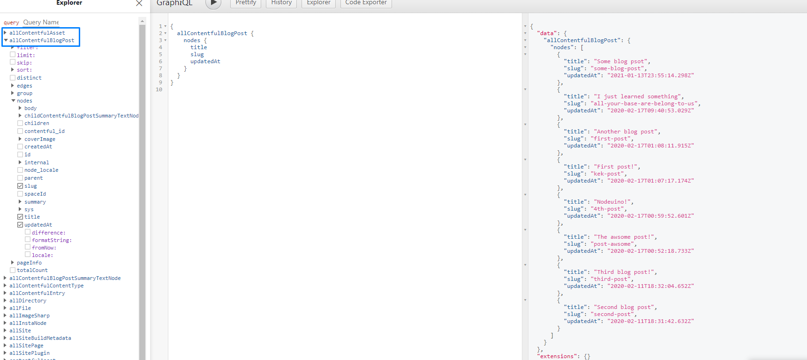

# Uvod
U ovim vježbama pokazat ćemo kako koristiti **Contentful** CMS servis.  
Budući da smo o CMS-u već pričali nećemo se dugo zadržavati na teoriji. CMS-om ćemo realizirati blog objave u stranici.
 
U Gatsby-u to se radi u 3 koraka:
 
1) Instalira se i podesi _source plugin_
2) Definira se Layout komponenta koja će sadržavati blog objavu
3) Napravi se dinamička kreacija stranica koristeći taj layout
 
Krenimo!
 
## Commits
Krenut ćemo s dodavanjem plugina kroz NPM i s podešavanjem. Nakon toga stvaramo par novih komponenti i page te na kraju radimo "programsko (dinamično) stvaranje stranica". Za to se koristi `gatsby-node.js`. O tom po tom :)
 
### Commit 1: NPM installing source plugin
Naredbom:
```sh
$ npm install gatsby-source-contentful
```
 
instalira se plugin. Međutim, to nije sve. Može biti potrebno i podići gatsby na noviju verziju:
 
```sh
$ npm install gatsby^2.25.0,
```
 
Ako se stranica pokrene bez upozorenja onda nije potrebno. Meni je došlo eksplicitno upozorenje da podignem verziju gatsbya (tkz. _bump_)
 
Ono što ćemo još trebati je **dotenv** za spremanje ključa.
 
```sh
$ npm install dotenv
```
 
To je to!  
Commit and go
 
### Commit 2: Config i .env
U `gatsby-config.js` ide sljedeći unos u niz plugina:
```js
    {
      resolve: `gatsby-source-contentful`,
      options: {
        spaceId: process.env.SPACE_ID,
        accessToken: process.env.ACCESS_KEY,
        downloadLocal: true,
      }
    }
```
Sad treba objasniti što je `process.env`. Ako pratimo upute za ovaj plugin piše da jednostavno stavimo ključ i id tu. Problem je što će onda taj ključ ić u git naravno u github gdje ga cijeli svijet vidi.
 
Ne želimo staviti ključ tako da ga svi vide, ali ako ga ne stavimo ne možemo koristiti plugin. Rješenje je process environment objekt.
#### `.env` file
Prvo stvaramo novi file: `.env` u rootu projekta. Taj file onda popunimo s ključevima:
```toml
SPACE_ID=ayujigrtz540
ACCESS_KEY=zgu4Py2RSPno6PLBhZkPtn38UFD2RL.CQgKGbbLmsKE
```
> Ključ koji vidite nije pravi i neće raditi
 
I sad potrebno je dovesti te ključeve u proces. Tome služi `dotenv` paket koji smo skinuli ranije:
 
```js
require("dotenv").config()
```
 
Taj poziv se dodaje u vrh `gatsby-config.js` filea. Sada su stvorene nove proces varijable:
- process.env.SPACE_ID
- process.env.ACCESS_KEY
 
kao što smo definirali u `.env` datoteci. Sad naši ključevi ostaju tajna.
 
> **!!BITNO!!**  
> .env ne ide u git! Ako je git ispravno podešen, onda stvaranje i brisanje te datoteke neće utjecat na *git status*
 
To je to za sad!
 
Ako napravimo `gatsby-develop` možemo vidjeti novi source u `graphql` exploreru:
 
<p align="center">

</p>
 
Time završavamo s konfiguracijom (zasad).
 
### Commit 3: Blogs page
Prikaz blogova radit ćemo na novoj stranici "blogs". Pa po starom receptu, dodajmo novu stranicu u `pages` folder:
 
```jsx
import React from 'react'
import HeaderFooterLayout from '../layouts/headerFooter'
import BlogsContainer from '../modules/BlogsContainer'
 
const Blogs = () => (
  <main>
    <HeaderFooterLayout activeTab="Blogs" >
    </HeaderFooterLayout>
  </main>
)
 
export default Blogs
```
 
Zasada to je samo layout, ako se što vidi.
Dodajmo novu stranicu u navigaciju u `constants/const`:
 
```js
export const navs = [
  { tab: "Home", to: "/" },
  { tab: "Accommodation", to: "/" },
  { tab: "Photo Gallery", to: "/gallery" },
  { tab: "Contact", to: "/contact" },
  { tab: "Blogs", to: "/blogs"}
]
```
Zasad, commitajmo promjene!
 
### Commit 4: Adding blogs container
Dodajmo novi modul za prikaz blogova u `modules/BlogsContainer`:
 
```jsx
import React from 'react'
import {useStaticQuery, graphql, Link} from 'gatsby'
import Img from 'gatsby-image'
import styles from './style.module.css'
 
const BlogContainers = () => {
  const data = useStaticQuery(graphql`
    query {
      allContentfulBlogPost {
        nodes {
          summary {
            internal {
              content
            }
          }
          body {
            raw
          }
          title
          slug
          updatedAt
          coverImage {
            fixed(width: 300) {
              src
              srcSet
              srcSetWebp
              srcWebp
              width
              height
              base64
              aspectRatio
            }
          }
        }
      }
    }`)
 
    return (
      <section className={styles.container}>
        <h2>Read our blogposts!</h2>
        <ul className={styles.list}>
          {data.allContentfulBlogPost.nodes.map(node => {
            return (
              <Link to={`/post/${node.slug}`}>
                <li>
                  
                  <h3>{node.title}</h3>
                  <span>{node.summary.internal.content}</span>
                </li>
              </Link>
            )
          })}
        </ul>
      </section>
  )
}
 
export default BlogContainers
```
 
i CSS: 
```css
.container {
  display: inline-flex;
  flex-flow: column;
  align-items: center;
  justify-content: center;
}
 
.list {
  padding-left: 0;
  display: flex;
  flex-flow: row;
  flex-wrap: wrap;
  width: fit-content;
  margin: 0 100px;
}
 
.list li {
  list-style: none;
  margin: 5px 12px;
  width: min-content;
}
 
.list li span {
  word-wrap: break-word;
}
```
 
Query koji vidimo na vrhu stranice dohvaća blogove, a ova komponenta ih onda mapira i prikazuje u listi. Primijetite `<Link />` koji omotava svaki element liste. Moguće je kliknuti na svaki od blogova i otvoriti ga na novoj stranici.
 
Trenutno to ne radi i to je sljedeći i posljednji korak u postavljanju CMS-a.
 
### Commit 4: Dynamic page creation
Junak ovog commita je `gatsby-node.js` kojeg dosad nismo koristili. On ima jednu korisnu funkciju koja se zove `createPages` i služi za  
*drum-roll*  
stvaranje stranica!
Slijedi kod:
```js
/**
 * Implement Gatsby's Node APIs in this file.
 *
 * See: https://www.gatsbyjs.org/docs/node-apis/
 */
 
// You can delete this file if you're not using it
const path = require('path')
 
exports.createPages = async ({ graphql, actions }) => {
  const raw = await graphql(`query {
    allContentfulBlogPost {
      nodes {
        summary {
          internal {
            content
          }
        }
        body {
          raw
        }
        title
        slug
        updatedAt
        coverImage {
          fixed(width: 300) {
            src
            srcSet
            srcSetWebp
            srcWebp
            width
            height
            base64
            aspectRatio
          }
        }
      }
    }
  }`)
 
  const res = raw.data.allContentfulBlogPost.nodes
 
  res.forEach((e, index, array) => actions.createPage({
    component: path.resolve(`./src/layouts/blog.js`),
    context: {
      ...e,
      next: index < array.length ? array[index + 1] : null,
      prev: index > 0 ? array[index - 1] : null
    },
    path: `posts/${e.slug}`,
    slug: `posts/${e.slug}`
  }))
}
```
 
Puno koda, a ne baš puno događanja.
Prvo, da bi ovo moglo raditi mora postojati `./src/layouts/blog.js`. Njega ćemo stvoriti uskoro.
 
Ovdje se događa sljedeće:
 
1) Query na vrhu funkcije dohvaća sve blogove
2) ForEach funkcija za svaki od njih stvara stranicu
3) Prilikom toga koristi `./src/layouts/blog.js` kao bazu i šalje određene parametre
4) Definira `path` što će biti URL path u browseru za pristup toj stranici
 
Sad kad znamo što se događa ovdje (bar djelomično), napravimo blog:
 
```jsx
import React from 'react'
import { renderRichText } from "gatsby-source-contentful/rich-text"
import Img from 'gatsby-image'
import {Link} from 'gatsby'
 
import styles from './blog.module.css'
import HeaderFooterLayout from '../layouts/headerFooter'
 
const BlogPost = ({ pageContext }) => {
  const { body, title, coverImage, summary, next, prev } = pageContext
 
  return (
    <HeaderFooterLayout>
      <main className={styles.container}>
        <header className={!prev || !next ? styles.headerTwo : ''}>
          {prev && (<Link to={`/posts/${prev.slug}`}><span>Previous</span></Link>)}
          <h2>
            {title}
          </h2>
          {next && (<Link to={`/posts/${next.slug}`}><span>Next</span></Link>)}
        </header>
        
        <article>
        {renderRichText(body)}
        </article>
      </main>
    </HeaderFooterLayout>
  )
}
 
export default BlogPost
```
 
Bitno je primijetiti `pageContext` koji komponenta prima. To je isti onaj context koji šalje `createPage` funkcija!  
Unutar njega se nalazi sam objekt koji sadrži blog i dva objekta:
- next
- prev
 
Koji sadrže sljedeći i prethodni blog.
 
Funkcija `{renderRichText(body)}` pretvara tekst koji dolazi od Contentfula u HTML tekst.
 
CSS:
```css
.container {
  background-color: whitesmoke;
  display: flex;
  flex-flow: column;
  align-items: center;
  padding: 0 100px;
}
 
.container header {
  width: 100%;
  display: flex;
  justify-content: space-between;
  align-items: center;
}
 
.container .headerTwo {
  width: 52vw;
  margin-left: auto;
  display: flex;
  justify-content: space-between;
  align-items: center;
}
 
.container header span {
  font-size: 20px;
  font-weight: bold;
  cursor: pointer;
  box-shadow: 1px 1px 2px gray;
  padding: 2px 4px;
  background-color: white;
}
 
.container article {
  line-height: 25px;
  font-size: 20px;
}
```
 
To bi bilo to :)
 