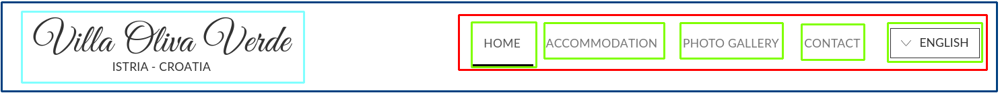
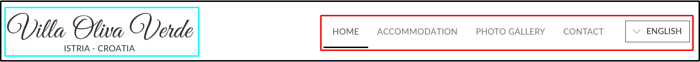
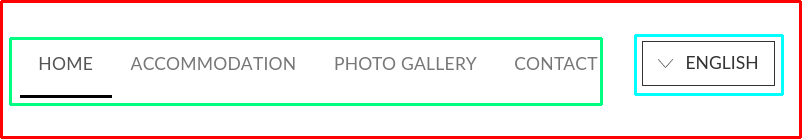
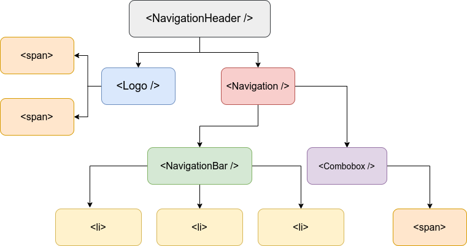
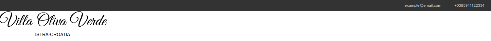
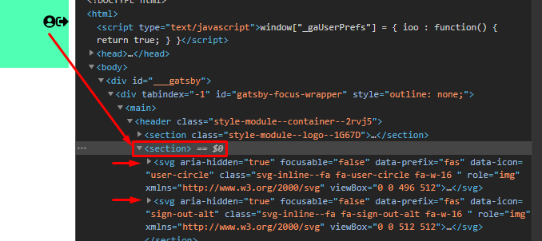
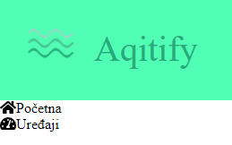
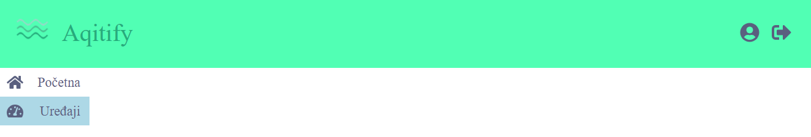
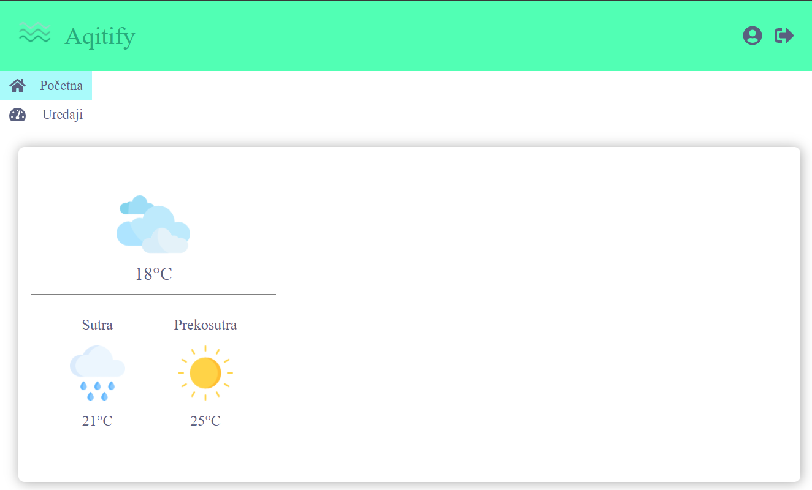

# Uvod
  U ovoj vježbi ćemo napraviti navigaciju i definirati **page layout**. Također, napravit ćemo i footer za stranicu. Navigaciju ćemo realizirati koristeći **JavaScript array**.
 
# Segmenti stranice
U ovoj vježbi imamo više segmenata stranice za obraditi. Krenimo s težim: Navigacijski Header.
## Navigacijski header
Navigacijski header sastoji se od:
- Loga stranice
- Navigacije koja se sastoji od
  - Navigacijske trake
  - Combobox (Dropdown) menija
 
Logo se sastoji od dva obična spana s fancy fontom.
 
Za prikaz navigacijskih tabova u navigacijskoj traci koristit ćemo **JS array**.
ReactJS dopušta renderiranje (dinamičkih) nizova elemenata. To je jako korisno za prikaz listi poput popisa svih korisnika, liste artikala u web shopu i slično, a u našem primjeru, navigacijske trake.
 
<br/>
 Navigacijska traka <br/>
 Niz navigacijskih tabova
 
Navigacijska traka bit će *container* za navigacijske tabove koji su njena "djeca". Sjetimo se [vježbe 1](https://github.com/n00ne1mportant/HCI_2021/tree/intro-react#verticallistcontainer) i HoC koponenti. Cijeli kod je [ovdje](https://jsfiddle.net/6fe7aj4u/27/). Ali vidimo da navigacijski tabovi nisu samo stringovi. Izgledaju kao botuni i imaju hover animacije. Možemo reći i da su oni male komponente koje omotavaju string. JS ima zgodnu funkciju koja stvara niz React komponenti iz niza stringova, a to je **.map()**.

# ReactJS concept: array transform with .map() <a name="map"></a>
`array.map()` jedna je od najbitnijih funkcija u JS-u i programiranju općenito. Gotovo svaki moderni jezik ima svoju izvedbu `array.map()` i `array.reduce()` funkcije koju ćemo također spomenuti. Ono što onda radi je jako jednostavno, ali moćno: uzima niz, transformira ga u novi niz i vraća taj novi niz. Pri tome se niz nad kojim se poziva `map()` NE mijenja, nego se stvara nova varijabla (immutable variable, sjetimo se [vježbe 0]).
 
Što se u nizu transformira? Ovisi što želimo. Koristi se `callback` funkcija koja se poziva nad svakim elementom niza, a vraća **novi** element niza. Dakle:
 
array.map():sviElementiNiza => elementNiza => callback(elementNiza) => noviElementNiza
 
Primjer je tisuću riječi. Imamo niz od 5 brojeva i želimo niz njihovih kvadrata:
```javascript
const numbers = [1,3,5,8,10]
const transformFunction = number => number*number;
const squares = numbers.map(transformFunction)
console.log(squares)
// [1, 9, 25, 64, 100]
```
Ili kako se to češće piše koristeći anonimne funkcije:
```javascript
const numbers = [1,3,5,8,10]
const squares = numbers.map(el => el*el)
console.log(squares)
// [1, 9, 25, 64, 100]
```
Anonimna funkcija nas štedi definicije i imenovanja funkcije kao u prvom primjeru.
Analizirajmo `.map()` funkciju.
 
`.map()` funkcija prima funkciju koju ona naziva `callback`. `callback` funkcija prima trenutni element niza nad kojim onda vrši transformaciju. Bitno je da `callback` funkcija vrati vrijednost sa `return` ili u našem primjeru, imamo one-liner koji podrazumijeva `return` (vježba 0). `callback` može vratiti bilo što: objekt, novi niz (pa bismo imali niz nizova), nešto nasumično ili, ono što je nama zanimljivo, **React komponentu**. Možemo koristiti `map()` da od niza stringova stvorimo niz React komponenti. Pogledajmo sljedeća dva primjera:
```javascript
const lowerCaseNames = ["mate", "ante", "jure"]
const uppercCaseNames = lowerCaseNames.map(el => el.toUpperCase())
console.log(ucNames)
// ["MATE", "ANTE", "JURE"]
```
Dosta jednostavno. Dodajmo malo logike: ako je element paran broj dijelimo ga sa 2, ako je neparan množimo ga sa 2. Ako je string, ide u upper case inače vraćamo null: 
```javascript
const mixedArray = [10, "huehue", 3, "mate", "not a string", 7, true, {}]
const transformedMixedArray = mixedArray.map(el => {
  if (typeof el === "string")
    return el.toUpperCase()
  if (typeof el === "number"){
    // je li djeljiv s dva?
    if (el % 2 === 0)
      //paran
      return el / 2
    else // neparan
      return el * 2
  }
  else // svi ostali tipovi (bool/object/array/func...)
  return null
  })
console.log(transformedMixedArray)
  // [5, "HUEHUE", 6, "MATE", "NOT A STRING", 14, null, null]
```
Ovaj malo kompleksni primjer pokazuje da su mogućnosti transformacija unutar `map()` funkcije dosta široke. Ali ovo što smo vidjeli dosad je samo JavaScript, znači ništa novo. Pogledajmo primjenu u Reactu:
 
```jsx
import React from 'react'
const names = ["Joe", "Jack", "Jess", "James"]
const ListOfNames = props => (
  <ul>
    {names.map(el => {
      return (
        <li>
          {el.toUpperCase()}
        </li>
      )}
    )}
  </ul>
)
```
`{}` zagrade unutar React koda omogućuju poziv JavaScript funkcija kako bismo ih inače pozivali. Isto vrijedi i unutar `<li></li>` koji su već unutar `{}`, znači moguće je ugnježđivanje. 
 
Što vraća ovaj kod? Pokušajte pretpostaviti i provjerite [ovdje](https://jsfiddle.net/dwsgb0hu/).
 
# Planiranje: Navigacijski header <a name="plan"></a>
Sad planiramo što ćemo raditi. Za početak se fokusiramo na *Navigacijski header*. Pokušajmo precizno odgovoriti od čega se sastoji, a zatim to od čega se sastoji podijeliti na komponente. Onda ćemo svaku od tih komponenti dijeliti dalje dok ne dođemo do obilnih HTML elemenata. Navigacijski header je top level komponenta. Dodijelit ćemo joj ime `<NavigationHeader />` i sadržavat će ostale komponente po hijerarhiji.
 
## Kompozicija komponenti
Navigacijski header se sastoji od 2 child komponente:
- Loga
- Navigacije (container)
 
 <br/>
 Logo  <br/>
 Navigacija <br/>
### Logo
Logo je zapravo samo tekst u danom fontu, dakle nije slika. Radi se o 2 `<span>` elementa. Realizirat ćemo ga unutar `<section>` taga i koristit ćemo `fex-flow: column` za stvaranje stupca. Najbitni dio je ubaciti potreban font.<br/>
  <p align="center">
  
</p>
 
### Navigacija (container)
Navigacijska traka se sastoji od 2 dijela:
- Navigacijska traka
- Combo-Box (dropdown)
 
Budući da je *Navigacija* samo container, rastavimo je dublje:
- Navigacija (container)
  - Navigacijska traka
    - Navigacijski tabovi `<li>`
  - Combobox
 
Container ćemo realizirati kao `<section>` ili `<div>` (zapravo nema razlike osim u [semantici](https://medium.com/design-code-repository/html-elements-section-vs-div-vs-article-a8c34e6548cf)). Navigacijski tabovi nalazit će se unutar **liste**. Lista može biti unutar `<nav>` ili obični `<ul>`. Semantički, `<nav>` je točniji, ali tehnički je isto. Container će sadržavati još i *combobox*. *Combobox* ćemo mockat za sad (bit će div s borderom), ubacit ćemo pravi *combobox* kasnije. Dakle:<br/>
<br/>
 Container <br/>
 Navigacijska traka <br/>
 Combobox<br/>
Navigacijskom containeru ćemo dodijeliti komponentu `<Navigation />`.
### Combobox
Combobox će samo biti `<span>` s borderom. U daljnjim vježbama dat ćemo mu funkcionalnost. Dodijelit ćemo mu komponentu `<Combobox />`.
### Navigacijski tabovi
Navigacijski tabovi su stilizirani `<li>` elementi. Ne trebaju komponentu.
 
## Sadržaj git commitova <a name="toc"></a>
Svaki git commit kao i prije je korak prema rješenju. Branch se sastoji od sljedećih commitova:
- [**Commit 1: adding NavigationHeader**](#c1)
  - Stvaramo praznu NavigationHeader komponentu i dodajemo je u components
  - Importamo prazan NavigationHeader u `pages/index.js`
  - Sada možemo stvoriti potkomponente NavigationHeadera i imporatat ih
- [**Commit 2: adding Logo**](#c2)
  - Stvaramo `<Logo />` komponentu
  - Importamo je u NavigationHeader
- [**Commit 3: adding Navigation**](#c3)
  - Mijenjamo raspored stvaranja komponente
  - Stvaramo prazne potkomponente:
    - `<NavigationBar />`
    - `<Combobox />`
  - Stvaramo `<Navigation />` i radimo import
  - Radimo import `<Navigation />` u `<NavigationHeader />`
- [**Commit 4: adding NavigationBar part 1**](#c4)
  - Stvaramo array navigacijskih tabova kao `<span>`
  - Dodajemo CSS za navigacijske tabove
- [**Commit 5: refactor tabs to use map()**](#c5)
  - Koristimo `map()` funkciju
  - Dodajemo logiku za active
  - Dodajemo prop za active
- [**Commit 6: refactor to use props for .active**](#c6)
  - Dodajemo prop "activeTag"
  - Provjeravamo prop "activeTag"
  - Prosljeđujemo props "activeTag" iz `pages/index.js`
- [**Commit 7: adding Combobox**](#c7)
  - Dodajemo kod i CSS za Combobox
  - Dodajemo stilove za Navigation
  - Dodajemo stilove za NavigationHeader
- [**Commit 8: adding footer**](#c8)
  - Stvaranje `<Footer />` komponente
  - Dodavanje u `pages/index.js`
  - [**Composition patern vs Inheritance pattern**](#c81)
 
# Implementacija
Implementiramo sljedeće stablo komponenti:
 
<p align="center">
  
</p>
 
## Commit 1: adding NavigationHeader <a name="c1"></a>
- Stvaramo praznu NavigationHeader komponentu i dodajemo je u components
- Importamo prazan NavigationHeader u `pages/index.js`
 
> Komentar: postoje dva načina organiziranja komponenti u Reactu. Prvi je stvaranje foldera za komponentu i `index.js` datoteke unutar. I tako za svaku komponentu. Drugi način je bez stvaranja foldera u `src/components` samo dodati `<ime>.js` i isto tako za css `<ime>.module.css`. Nema nikakve razlike osim u estetici. Ja preferiram prvi način jer mi se sviđa vidjeti foldere unutar `components`, ali naravno nije to obavezno niti "bolje" od drugog načina.
 
U `components` dodamo folder `NavigationHeader` (ili datoteku `NavigationHeader.js` ako pratimo drugi način). U njemu stvorimo `index.js` i `style.module.css` kao inače.
```jsx
import React from 'react'

import styles from './style.module.css'

const NavigationHeader = () => (
  <section className={styles.navigationHeader}>
  </section>
)
export default NavigationHeader
```
i CSS:
```css
.navigationHeader {
  height: 115px;
  display: flex;
  justify-content: space-between;
}
```
Sad dodajmo `NavigationHeader` u `pages/index.js`.
```jsx
import React from "react"

import ContactBar from '../components/contactBar'
import NavigationHeader from '../components/NavigationHeader'

const IndexPage = () => (
  <main>
   <ContactBar />
   <NavigationHeader />
  </main>
)

export default IndexPage
```
Budući da smo definirali samo container, nećemo ništa novo vidjeti na`localhost` serveru.

Možemo commitat:
```bash
$ git add .
$ git commit -m "Adding NavigationHeader"
```
[Sadržaj git commitova](#toc)
 
## Commit 2: adding Logo <a name="c2"></a>
- Stvaramo `<Logo />` komponentu
- Importamo je u NavigationHeader
 
Stvorimo Logo komponentu unutar `components`. Prema opisu od prije, Logo je `<section>` s dva `<span>` elementa.
```jsx
import React from 'react'
import styles from './style.module.css'

const Logo = () => (
  <section className={styles.logo}>
    <span className={styles.logoText}>Villa Oliva Verde</span>
    <span className={styles.sub}>ISTRA-CROATIA</span>
  </section>
)

export default Logo
```
CSS:
```css
@import url(https://hr.allfont.net/allfont.css?fonts=great-vibes);

.logo {
  display: flex;
  flex-flow: column;
  width: fit-content;
}

.logoText {
  font-family: "Great Vibes";
  font-size: 52px
}

 .sub {
  text-align: center;
  font-size: 14px;
}
```
 
`@import` služi za ubacivanje fontova ili CSS varijabli u trenutnu CSS datoteku. Font koji smo ubacili je `"Great Vibes"`.
 
Sad, kad je Logo stvoren trebamo ga ubaciti u `NavigationHeader` pa će se prikazati na serveru (jer smo `NavigationHeader` ubacili u `pages/index.js`). `NavigationHeader`:
 
```jsx
import React from 'react'
import Logo from '../Logo'

import styles from './style.module.css'
 
const NavigationHeader = () => (
  <section className={styles.navigationHeader}>
    <Logo />
  </section>
)
 
export default NavigationHeader
```
Sad bismo na serveru `localhost:8080` trebali vidjeti ovo:
<p align="center">
  
</p>
 
Ako je sve u redu možemo commitat.
```bash
  $ git add .
  $ git commit -m "Adding Logo"
```
<br/>[Sadržaj git commitova](#toc)
 
## Commit 3: adding Navigation <a name="c3"></a>
- Mijenjamo raspored stvaranja komponente
- Stvaramo prazne potkomponente:
  - `<NavigationBar />`
  - `<Combobox />`
- Stvaramo `<Navigation />` i radimo import
- Radimo import `<Navigation />` u `<NavigationHeader />`

Stvaramo potkomponente za `<Navigation />`, ali `prazne`. To znači da vraćamo `<section>` ili `<div>`. Također sve `style.module.css` datoteke postoje (da ne dobijemo not found error), ali su apsolutno prazne.
<br/>`components/NavigationBar/index.js`:

```jsx
import React from 'react'

import styles from './style.module.css'

const NavigationBar = () => <section></section>

export default NavigationBar
```
Za `Combobox`:
```jsx
import React from 'react'

import styles from './style.module.css' 

const Combobox = () => <section></section>

export default Combobox
```
Sad stvaramo `Navigation` i radimo import ove dvije komponente. Da smo stvorili `Navigation` odmah ne bismo mogli importat. Redoslijed stvaranja nije bitan. Bitno je samo ne commitat slomljen kod (gdje se server ne može prikazati zbog greške). `Navigation`:
```jsx
import React from 'react'

import NavigationBar from '../NavigationBar'
import Combobox from '../Combobox'
import styles from './style.module.css'

const Navigation = () => (
  <section>
    <NavigationBar />
    <Combobox />
  </section>
)

export default Navigation
``` 
  U `NavigationHeader` radimo import za `Navigation`:
```jsx
import React from 'react'

import Logo from '../Logo'
import Navigation from '../Navigation'

import styles from './style.module.css'

const NavigationHeader = () => (
  <section className={styles.navigationHeader}>
      <Logo />
      <Navigation />
  </section>
)
export default NavigationHeader
```
  ```bash
  $ git add .
  $ git commit -m "adding Navigation"
  ```
  Sad kad su containeri napravljeni i importani, možemo nastaviti.
 
<br/>[Sadržaj git commitova](#toc)
 
## Commit 4: adding NavigationBar part 1 <a name="c4"></a>
- Stvaramo array navigacijskih tabova kao `<span>`
- Dodajemo CSS za navigacijske tabove
 
U `NavigationBar/index.js` pišemo kod sa navigacijskim linkovima:
- Home
- Accommodation
- Foto galery
- Contact
```jsx
import React from 'react'

import styles from './style.module.css'

const NavigationBar = () => (
  <nav className={styles.navigationBar}>
      <li className={styles.active}>Home</li>
      <li>Accommodation</li>
      <li>Photo gallery</li>
      <li>Contact</li>
  </nav>
)

export default NavigationBar
```
  CSS za `NavigationBar`: 
```css
.navigationBar {
  display: flex;
  justify-content: space-evenly;
  flex-flow: row;
  width: 480px;
}

.navigationBar li {
  padding: 14px 15px;
  list-style: none;
  width: fit-content;
  font-size: 14px;
  line-height: 22px;
  text-transform: uppercase;
  color: #555
}
.navigationBar li:hover {
  border-bottom: 2px solid darkgray;
  cursor: pointer;
}

.navigationBar .active, .navigationBar .active:hover{
  border-bottom: 2px solid black;
}
  ```
  Ako je sve prošlo ok trebali bismo vidjeti ovo:
  <p align="center">
    
  </p>
 
Ako se stranica ne osvježava pokušajmo ugasiti gatsby server sa CTRL+C i pokrenuti ga opet sa `gastby develop`. Ako je sve ok, možemo commit:
  ```bash
  $ git add .
  $ git commit -m "adding NavigationBar part 1"
  ```
<br/>[Sadržaj git commitova](#toc)
 
## Commit 5: refactor tabs to use map() <a name="c5"></a>
- Koristimo `map()` funkciju
 
Umjesto da zakucavamo 5 `<li>` tagova, jednostavno pozovemo `map()` nad listom stringova na sljedeći način:
```jsx
  import React from 'react'
 
  import styles from './style.module.css'
 
  const navTabs = ['Home', 'Accommodation', 'Photo Gallery', 'Contact']
 
  const NavigationBar = () => (
    <nav className={styles.navigationBar}>
      {navTabs.map(
        tab => <li>{tab}</li>)
      }
    </nav>
  )
 
  export default NavigationBar
```
Dodali smo novu varijablu: `navTabs` koja je niz naših tabova. U `map()` funkciji ispod pretvorimo svaki `tab` njih u `<li>tab</li>`.
 
Međutim sad imamo mali problem. Nemamo `active` klasu koju smo imali prije. Ako je dodamo u map ovako:
```jsx
// ...
  const NavigationBar = () => (
  <nav className={styles.navigationBar}>
    {navTabs.map(
      tab => <li className={styles.active}>{tab}</li>)
    }
  </nav>
)
```
onda će svi tabovi biti aktivni (probajte). Mi želimo da samo `Home` bude active. Kako ovo riješiti?
 
Kao i uvijek, postoji više načina. Najlakši je onaj koji je i najočiti: provjerimo je li trenutni tag `Home`, ako nije vratimo `<li>` bez active, a ako je vratimo `<li className={styles.active}>`.
```jsx
// ...
const NavigationBar = () => (
  <nav className={styles.navigationBar}>
    {navTabs.map(tab => {
      if (tab === 'Home')
      return (
        <li className={styles.active}>
          {tab}
        </li>)
      else
        return <li>{tab}</li>
      }
    )}
  </nav>
)
``` 
Možemo i one-linerom s ternarnim operatorom:
```jsx
const NavigationBar = () => (
  <nav className={styles.navigationBar}>
    {navTabs.map(tab => <li className={tab==='Home' ? styles.active : ''}>
      {tab}</li>
    )}
  </nav>
)
```
  Stavljamo active ako je `Home`, inače prazna klasa. *GG ez*
 
<br/>[Sadržaj git commitova](#toc)
 
## Commit 6: refactor to use props for .active <a name="c6"></a>
- Dodajemo prop "activeTag"
- Provjeravamo prop "activeTag"
- Prosljeđujemo props "activeTag" iz `pages/index.js` u NavigationHeader
- Prosljeđujemo props "activeTag" iz `NavigationHeader` u `NavigationBar`
 
Prije nego krenemo dalje napravimo još jednu sitnicu. Ako se nalazimo npr. na `Contact` stranici i koristimo ovu istu navigaciju (jer zašto ne?) onda imamo problem... Zakucali smo provjeru aktivne stranice na `Home`, što znači da će uvijek `Home` biti aktivan i ništa drugo osim `Home` ikad. To **ne želimo**. Rješenje su 3 linije koda. Prvo, želimo reći komponenti što da provjerava dinamički, a za to koristimo **props**. Onda u provjeri trebamo samo ubaciti taj props. I na kraju, unutar `pages/index.js` i svih drugih stranica kasnije, trebamo samo proslijediti aktivnu stranicu kao props. Koristit ćemo ime `activeTab` u tu svrhu. Krenimo s `NavigationBar`:
```jsx
const NavigationBar = props => (
  <nav className={styles.navigationBar}>
      {navTabs.map(tab => <li className={tab === props.activeTab ? styles.active : ''}>
        {tab}</li>
      )}
  </nav>
)
```
Primijetimo novi `props` parametar i njegovu uporabu u provjeri `props.activeTab`. Isto tako možemo i koristiti dekonstrukciju pa nam `props` ne treba:
```jsx
const NavigationBar = {activeTab} => (
  <nav className={styles.navigationBar}>
    {navTabs.map(tab => <li className={tab === activeTab ? styles.active : ''}>
      {tab}</li>
    )}
  </nav>
)
```
Osobno preferiram takav zapis jer odmah vidim koje parametre očekujem ako ih ima više, ali naravno oba pristupa su točna i po standardu. Sad trebamo proslijediti dotični parametar. Idemo u `pages/index.js` i vidimo ovo:
```jsx
const IndexPage = () => (
  <main>
    <ContactBar />
    <NavigationHeader />
  </main>
)
```
  <a name="props"></a>
I vidimo da imamo problem... Naša komponenta je `NavigationBar`, a ovdje vidimo `NavigationHeader`. To je parent komponenta naše komponente.
Znači moramo poslat prop iz `pages/index.js` u `NavigationBar`, a `NavigationHeader` stoji između... Jesmo li krivo složili arhitekturu?
 
Ne! Ovo se događa dosta često i gotovo je nemoguće za izbjeći. Kako se to riješava? Lako. Koristimo nešto što React programeri zovu "props drilling". To je fancy naziv za slanje našeg propa u parent pa onda iz parenta u naš child. `pages/index.js =prop=> NavigationHeader =prop=> Navigation =prop=> NavigationBar`. Krenimo s `pages/index.js`:
```jsx
const IndexPage = () => (
  <main>
    <ContactBar />
    <NavigationHeader activeTab = "Home" />
  </main>
)
```
  Ok, poslali smo `activeTab` varijablu u `NavigationHeader`. Sad idemo tamo i šaljemo dalje dok se ne "dokopamo" `NavigationBar` komponente kojoj to želimo poslati (otud naziv "drilling").
```jsx
const NavigationHeader = ({ activeTab }) => (
  <section className={styles.navigationHeader}>
      <Logo />
      <Navigation activeTab={activeTab} />
  </section>
)
```
Sad smo poslali prop u `Navigation`. To je posljednja stanica prije `NavigationBar`. Idemo u `Navigation`
```jsx
const Navigation = ({ activeTab }) => (
  <section>
      <NavigationBar activeTab={activeTab} />
      <Combobox />
  </section>
)
```
Sad je `activeTab` napokon stigao do `NavigationBar` komponente. Ako je sve prošlo uredno vidimo ovo:
  <p align="center">
    
  </p>
 
Ako želimo biti sigurni možemo otići u `pages/index.js` i staviti "Contact" umjesto "Home":
 
  ```jsx
    const IndexPage = () => (
      <main>
        <ContactBar />
        <NavigationHeader activeTab = "Contact" />
      </main>
    )
  ```
  Onda imamo ovo:
  <p align="center">
    
  </p>
 
To je to! Razlog zbog kojeg ovo radimo je taj što sad kad napravimo `pages/ contact.js` i linkamo ga, trebamo samo dodati `activeTab = "Contact"` kao  parametar i možemo koristi iste komponente za navigaciju.
  ```bash
  $ git add .
  $ git commit -m "refactor to use props for .active"
  ```
<br/>[Sadržaj git commitova](#toc)
 
## Commit 7: adding Combobox <a name="c7"></a>
- Dodajemo kod i CSS za Combobox
- Dodajemo stilove za Navigation
- Dodajemo stilove za NavigationHeader
 
Combobox je definiran, ali prazan. Za sada ćemo napraviti lažni *combobox*. Često se koristi riječ ["mock"](https://stackoverflow.com/a/40244095) za lažne komponente, iako je taj izraz više vezan uz *unit-testing*. Idemo u `Combobox` komponentu i pišemo kod:
```jsx
  import React from 'react'
 
  import styles from './style.module.css' 
 
  const Combobox = () => <span className={styles.comboBox}>English</span>
 
  export default Combobox
```
  CSS:
```css
  .combobox {
    margin-left: 30px;
    text-align: center;
    display: block;
    height: 36px;
    width: 107px;
    border: solid 1px black;
    font-size: 14px;
    line-height: 36px;
    text-transform: uppercase;
  }
```
  Ako sad pogledamo stranicu imamo ovaj nered:
 
 
  <p align="center">
    
  </p>
 
Nažalost, ovo ne možemo riješiti unutar `Combobox` komponente. Moramo pristupiti `Navigation` containeru i podesiti `width` da `Combobox` može stati unutar skupa s navigacijom. Dodajmo sljedeći kod u prazan `Navigation/style.module.css`: 
```css
  .navigation {
    height: 52px;
    display: flex;
    align-items: center;
  }
```
  Dodajte `styles.navigation` u `.js` datoteku na root da se stil primijeni (sad već bi trebali znati kako).
 
  Sad trebamo promijeniti i `NavigationHeader` CSS. Vidimo da je sadržaj "nabijen" na rubove tj. nema margina. Također, trebali bismo ga vertikalno centrirati. Dodajmo još ove dvije linije unutar postojećeg CSS-a: 
```css
  {
    ...
    margin: 0 15px;
    align-items: center;
  }
```
  Dodajmo i `height: 52px` u `Logo` komponentu. Trebali bismo imati ovo:
 
 
  <p align="center">
    
  </p>
 
  Vrijeme za commit:
```bash
  $ git add .
  $ git commit -m "adding Combobox"
```
<br/>[Sadržaj git commitova](#toc)
 
  ## Commit 8: adding footer <a name="c8"></a>
  - Stvaranje `<Footer />` komponente
  - Dodavanje novog stila u `NavigationBar`
  - Dodavanje u `pages/index.js`
 
  `<Footer />` komponenta koju ćemo sad stvoriti nije dio kompozicije komponenti iznad. `Footer` ide direktno u `pages/index.js` ispod `NavigationHeader` komponente. Budući da je `Footer` u potpunosti statičan, nećemo ga uopće razbijati na potkomponente jer nema smisla. Stvaramo folder u `components` i pišemo kod:
```jsx
  import React from 'react'
  import styles from './style.module.css'
 
  const navTabs = ['Home', 'Accommodation', 'Photo Gallery', 'Contact']
 
  const Footer = () => (
    <footer className={styles.footer}>
        <ul className={styles.address}>
            <li className={styles.title}>
                VILA OLIVA VERDE
            </li>
            <li>Štrped 24</li>
            <li>521000 Vinkuran</li>
            <li className={styles.phone}>
                +385 99 11223344
            </li>
            <li>example@email.com</li>
        </ul>
        <ul className={styles.navigation}>
            {navTabs.map(tab =>
              <li>{tab}</li>)
            }
        </ul>
    </footer>
  )
 
  export default Footer
```
  CSS:
```css
  .footer {
      background-color: #333;
      padding: 40px;
      display: flex;
      color: white;
      font-size: 16px;
  }
 
  .footer .address {
      list-style: none;
      display: flex;
      flex-flow: column;
      text-align: center;
      border-right: 1px #999 solid;
      padding-right: 10px;
  }
 
  .title {
      font-size: 28px;
      margin-bottom: 30px;
      margin-top: 10px;
  }
 
  .phone {
      margin: 11px 0;
  }
 
  .navigation {
      padding-top: 15px;
      list-style: none;
      display: flex;
      text-transform: uppercase;
  }
 
  .navigation li {
      margin: 0 10px;
      font-size: 16px;
      height: fit-content;
  }
 
  .navigation li:hover {
      border-bottom: 1px solid white;
      cursor: pointer;
  }
  ```
  Dodajmo ga u `pages/index.js`:
  ```jsx
  import React from 'react'
 
  import ContactBar from '../components/contactBar'
  import NavigationHeader from '../components/NavigationHeader'
  import Footer from '../components/Footer'
 
  const IndexPage = () => (
    <main>
      <ContactBar />
      <NavigationHeader activeTab = 'Home' />
      <Footer />
    </main>
  )
 
  export default IndexPage
  ```
  Primijetimo par problema ovdje. Imamo istu `navTabs` varijablu koju imamo i u `NavigationBar` komponenti. Recimo da se `navTabs` promijeni u `NavigationBar` (dodamo novi tag npr.), moramo napraviti promjenu i u `Footer` komponenti. To je tzv. "problem konzistencije", a rješava se tako da se `navTabs` definira negdje izvan obje komponente pa se uvozi u njih. Na taj način koliko god referenci na `navTabs` imali, mijenjamo ga na jednom mjestu.
 
  Također, primijetite da je navigacija ista kao i na vrhu stranice. Razlikuje se samo u CSS-u, ali praktički je riječ o istoj komponenti. Umjesto ponovnog pisanja navigacijskih tabova mogli smo napraviti import `NavigationBar` komponente i proslijediti joj novu CSS klasu kao prop. CSS klasa mora biti definirana unutar `NavigationBar` .css datoteke i mora postojati logika za provjeru proslijeđene klase. Što učiniti ako se klasa proslijedi odnosno ne proslijedi.
 
  ### Composition pattern vs Inheritance pattern <a name="c81"></a>
  Vratimo se malo na teoriju. Kada bismo imali ovaj problem u klasičnom OOP-u riješili bismo ga **nasljeđivanjem (Inheritance)**. Definirali bismo klasu koja nasljeđuje `NavigationBar` i nazvali bismo je `FooterNavigationBar` na primjer. Definirali bismo nove boje i to je to. 
 
  Međutim ReactJS koristi drugi pristup koji se zove **Composition**. On omogućuje slaganje više komponenti poput kockica i tako tvori nove komponente. Polimorfizam se ostvaruje neposredno definiranjem različitog ponašanja na osnovu parametara koje komponenta prima. U sljedećim vježbama pokazat ćemo kako se to radi tako što ćemo ponovno iskoristiti `NavigationBar` komponentu u `Footer` komponenti. Također, složit ćemo `Footer` i `NavigationHeader` skupa u jednu cjelinu: **layout**
 
  <br/>[Sadržaj git commitova](#toc)
 
  # Review
  Prošli smo kroz stvaranje liste komponenti, stvaranja kompozicije komponenti i slanja `props` kroz stablo komponenti.
  Ono što treba zapamtiti:
  - Kako se planira segment stranice [[link](#plan)]
  - Što je map() i čemu služi [[link](#map)]
  - Što je "props drilling" [[link](#props)]
