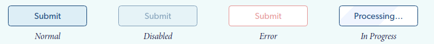
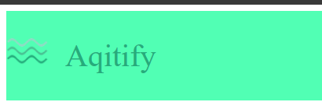

## Upute i predgovor (pročitati)
Ovo su prve vježbe s kojima započinjemo izradu web stranice unutar ovog kolegija. Dizajn stranice koju radimo uzet je od tvrtke [*Apartmanica*](https://www.apartmanica.com/) i njihove stranice [*Villa Oliva Verde*](http://villaolivaverde.com/en). U moru stranica za apartmane ovaj dizan se čini najbolji. Efikasan, uniforman i jednostavan za izradu.  
> Napomena: nismo povezani ni na koji način sa tvrtkom *Apartmanica* niti iznamljivačima vile *Vila Oliva Verde*. Motivi za korištenje danog dizajna su čisto edukacijski.

  <p align="center">
    
  </p>

Svaka od vježbi podijeljena je u **git branch** i završetkom svake vježbe radimo *merge* na *master* branch gdje ćemo na kraju imati dovršenu stranicu. Svaka funkcionalna promjena bit će spremljena u **git commit**. U sklopu svakog brancha bit će napravljen segment stranice (npr. navigacija, dio sadržaja i sl.) i objašnjen koncept Reacta. Ideja je da nakon odrađenih vježbi budete upoznati sa svim bitnim konceptima Reacta i da se dobije "odskočna daska" s koje možete početi raditi vlastite projekte. U sklopu prve vježbe napravit ćemo navigacijski header i objasniti kako radi **export / import i styling.**

### Pregled stranice

Većina stranica u modernom *web*-dizajnu sastoje se od:
  - headera u kojem je najčešće i navigacijska traka
  - naslovnog dijela (ne uvijek, ali često)
  - sadržaja stranice
  - footera s kontakt informacijama, pravnim podatcima i linkovima na društvene mreže.

Stranica koju izrađujemo prati taj format.
  <p align="center">
    
  </p>

Kroz vježbe koje slijede izradit ćemo stranicu segment po segment počevši od **Headera**. Za početak, pokrit ćemo neke ključne React koncepte za ovu vježbu.

Krenimo!

## React concepts: Styling

Dosad ste možda vidjeli styling koristeći `style` property na komponenti. To je ekvivalent pisanju in-line CSS-a.  
Iako to ima svoje primjene na nekim mjestima, generalno koriste vanjske CSS datoteke. Za razliku od CSS-a u običnom HTML-u,
CSS datoteke u Reactu mogu biti modularne: vidljive samo komponenti koja ih poziva, znači ne djeluju na druge komponente.

### Styling sa CSS modulima <a name="style"></a>

Rekli smo da ćemo koristiti `.css` datoteke za definiranje stilova komponenti. Svaka će komponenta imati svoj `.js` i `.css` dio. Kod pisanja statičkih stranica čistim HTML-om i CSS-om, pišemo jednu ili više CSS datoteka koje onda djeluju globalno na stranici. Što znači da moramo paziti da se ime klase ne ponovi u definiciji CSS-a, također bitan je poredak klasa i hijerarhija inače se klase neće ispravno primjeniti (pa se pribjegava zloglasnoj **!important** direktivi).  
Kada bi svaka komponenta imala svoj stil ne bi bilo tih problema. Takav pristup zove se **modularan**, a takve CSS datoteke **css moduli**.

#### Zašto modularan pristup

Cilj modularnog pristupa je uvijek isti: razbijanje koda na komponente zbog lakšeg snalaženja, pisanja i održavanja. Poanta je postići da svaka komponenta ima svoju logiku i kostur definiran u JavaScriptu, a stil definiran u *css* datoteci. Problem koji nastaje je taj što css uvijek djeluje na cijeli HTML dokument što znači da će postojati kolizija u imenovanju klasa. Ako imamo klasu koja se zove `.button` i mijenjamo je unutar `.css` datoteke i imamo više `.button` elementa unutar HTML dokumenta, svi oni će biti pogođeni promjenom. Ako to radimo unutar `.module.css` datoteka, bit će pogođeni samo elementi unutar te komponente. To se naziva **style scoping**.

Sa css modulima osigurava se da:
  - definicije djeluju samo na dotičnu komponentu i drugo ništa.
  - definicije stila za komponentu su dane na jednom mjestu (jedna komponenta jedan CSS)

[Izvor](https://css-tricks.com/css-modules-part-1-need/) <br/>
[Još jedan izvor](https://glenmaddern.com/articles/css-modules)

#### Implementacija

*css* moduli se definiraju posebnim nazivom datoteke, a to je **.module.css**. Dakle, ako css datoteka u svom nazivu sadrži *.module.css*, ta datoteka je css modul.
Moguće je koristiti i jedno i drugo, a bitna razlika je što datoteke koje nisu moduli djeluju na **cijeli HTML dokument**.<br/>
Pogledajmo sljedeći primjer:
  <p align="center">
    
  </p>

Za to definiramo css: `style.module.css`

```css
  /* components/style.module.css */
    .normal { /* all styles for Normal */ }
    .disabled { /* all styles for Disabled */ }
    .error { /* all styles for Error */ }
    .inProgress { /* all styles for In Progress */
```

```jsx
  /* components/submit-button.jsx */
import React from 'react';
import styles from './style.module.css';

const Button = ({
  submissionInProgress,
  errorOccured,
  isValid })
=> {
  let className = ''
  let text = "Submit"
  if (submissionInProgress) {
    className = styles.inProgress
    text = "Processing..."
  } else if (errorOccurred) {
      className = styles.error
  } else if (!isValid) {
     className = styles.disabled
  } else {
      className = styles.normal
  }
  return <button className={className}>{text}</button>
}
```

Imena css klasa su postala polja objekta `styles` kojeg importamo iz `style.module.css` datoteke. Ako malo stanemo i razmislimo o tome, to je dosta impresivno. Sad imamo jednostavno grananje gdje pridružimo odgovarajući `class` s obzirom na stanje botuna (`inProgress`, `errorOccured`...).Iako istu stvar možemo napraviti sa običnom CSS datotekom, razlika je što ako imamo neki drugi element negdje u HTML-u koji ima `class` npr. `disabled` kao u primjeru, on će također biti pogođen našom definicijom unutar ove komponente.
To je bitno razlikovati.

#### Ispod haube (za znatiželjne)

Način na koji CSS moduli rade je dosta banalan. Prije nego se kod ubaci u HTML dokument, sve klase definirane kao *.module.css* se randomiziraju. Na primjer, ako imamo klasu `.normal` unutar CSS modula, i dodamo je nekom `<button>` elementu, u HTML-u ćemo imati zanimljiv output:

```jsx
import React from 'react'
import styles from 'styles.module.css'

const SomeButton = () => (
  <div className='global-class-name'>
    <button className={styles.normal} >
      <span>This is button text</span>
    </button>
  </div>
)
```

  => Transformacija (ReactJS pomoću [Transpilera](https://babeljs.io/) i [Bundlera](https://webpack.js.org/)) =>

```HTML
  ...
  <div class='global-class-name'>
  <button class='components_some_button__normal__abc5436' >
  <span>This is button text</span>
  </button>
  </div>
  ...
```

Ime klase na kraju postaje `components_some_button__normal__abc5436`. Ovaj naziv osigurava da nema kolizije s drugim klasama koje se zovu `normal`. Na ovaj način dolazi do iluzije da naša modulirana klasa djeluje samo na jednu komponentu. CSS i dalje djeluje globalno, ali iako klase imaju ista imena u našim komponentama, randomizacija osigurava da finalna imena klasa, koja završe U HTML dokumentu, budu drugačija.

Primijetimo da `global-class-name` ostaje isti jer nije modul te se zaista definira globalno.

## Segment stranice: Header / Navigation

<p align="center">
  
</p>

Radimo navigaciju prikazanu iznad. Vidimo da se može podijeliti na komponente kako slijedi: <br/>

<p align="center">
  
</p>

 Kontakt traka i naslovna traka: **React koponente** <br/>
 Logo i navigacija: **React podkoponente**<br/>
 string jedinice unutar komponenti, mogu se prikazati kao `<span>`

## Sadržaj commitova <a name="toc"></a>

Kroz sljedeća tri commita napravit ćemo prvi dio projekta i objasniti određene koncepte. Prije nego krenemo kroz commitove, napavimo git branch:
  - Osigurajmo da `git status` daje `nothing to commit, clean working tree`  
  Pobrišite datoteke i promjene koje ste radili u projektu ako status nije clean
  - Korištenjem naredbe `git branch vj1` stvaramo novi branch `vj1`
  - `git checkout vj1` će nas prebaciti na novi branch
> Postoji kratica za ovo: `git checkout -b vj1` koja spaja dvije naredbe iznad

Naredbom `git branch` potvrdite da se nalazite na ispravnom branchu prije nastavka! Zvjezdica `*` označava odabran branch znači da moramo dobiti ovo: `*vj1`. Ako je sve prošlo u redu, nastavljamo. Slijede commiti koje ćemo napraviti:
> Prije početka commitanja u svakoj vježbi potrebno je napraviti git branch!!!
> Ovaj korak se podrazumijeva i u budućnosti se neće navoditi

  - **[Commit 1: project clean up](#c1)**
    - brisanje nepotrebnog koda i posavljanje projekta za početak rada
  - **[Commit 2: adding header contact bar](#c2)**
    - Stvorit ćemo komponentu `ContactBar` u `components` folderu
    - Sastoji se od `index.js` i `sytle.module.css` datoteka
    - Importat ćemo `ContactBar` u `pages/index.js`
  - **[Commit 3: adding global css definitions](#c3)**
    - definirat ćemo globalni CSS file
    - importat ćemo ga u gatsby direktno koristeći gatsbyev API: **gatsby-browser.js**
  - **[Merge](#m)**
    - merge naredba

### Commit 1: "project clean up" <a name="c1"></a>

Kad tek otvorimo *gatsby* projekt, vidimo da je dio koda već napisan. Taj kod napisan je za demo stranicu na `localhost:8000`. Sada ćemo izbrisati sav kod koji nam ne treba unutar `src` foldera.

Unutar `components` brišemo sve datoteke i ostavljamo prazan folder (inače ostavljamo `seo.js` jer pruža [SEO](https://searchengineland.com/guide/what-is-seo), ali budući da su ovo vježbe nećemo se zamarati time).

U `images` možemo izbrisati astronauta, icon ostavimo (potreban je za error msg). Ništa se ne mijenja ako ne brišemo ništa.

Unutar `pages` brišemo sve osim `index.js` i `404.js`.

Primijetit ćemo da se live server na `localhost:8000` sada ruši. Razlog je što smo obrisali neke od datoteka koje on koristi. Sad trebamo izbrisati i njihovu uporabu.

Otvorimo `pages/index.js`. Na vrhu datoteke vidimo da uvozimo sada izbrisani `Layout` i `seo` iz `components`. Izbrisat ćemo to i zamijeniti početni sadržaj nekim svojim HTML kodom. Npr:

```jsx

import React from "react"

const IndexPage = () => (
  <main>
    <h1>Hi people</h1>
    <p>Welcome to your new Gatsby site.</p>
    <p>This is were we will add content</p>
  </main>
)

export default IndexPage
```

I sad `404.js` na sličan način.

```jsx
import React from "react"

const NotFoundPage = () => (
  <div>
    <h1>ayy... nothing here!</h1>
    <p>You just hit a route that doesn&#39;t exist...
    the sadness.</p>
  </div>
)

export default NotFoundPage
```

Sam sadržaj nije bitan. Bitno je ukloniti reference na izbrisane datoteke.

Sada server na `locahost:8000` treba raditi normalno. Ako sve radi u redu, sad ćemo napraviti `git commit` od ovih promjena.
Pišemo sljedeće naredbe:

```bash
$ git add .
$ git commit -m "project clean up"
```

`-m` definira poruku vezanu uz trenutni `commit`. Ako je sve prošlo u redu, sa `git log` možemo vidjeti svoj commit i poruku.
  <p align="center">
    
  </p>
  <a name="fun"></a>
  
  > git komentar: svaki commit mora biti funkcionalan! To znači da ne smijemo napraviti commit ako stranica ne radi kako treba tj. ima neki error. Ukoliko moramo commitat kod koji je nedovršen ili pokvaren dobra praksa je to napomenuti sa WIP ili BROKEN u commit poruci. Na primjer: "WIP: adding login page".
  
  [Sadržaj commitova](#toc)

### Commit 2: "adding header contact bar" <a name="c2"></a>
  
  Sad krećemo s pisanjem stranice. Prvo ćemo raditi kontakt traku na vrhu stranice:
  <p align="center">
    
  </p>

  Sastoji se od jednog `<div>` containera, dva `<span>` elementa i 2 ikonice. Za sad ćemo zanemariti ikonice.
  Realizirat ćemo je u 3 koraka:
  - Stvorit ćemo komponentu `ContactBar` u `components` folderu
  - Sastoji se od `index.js` i `sytle.module.css` datoteka
  - Importat ćemo `ContactBar` u `pages/index.js`

  Krenimo sa stvaranjem foldera `contactBar` u `components` folderu. Dodajmo `index.js` datoteku i `style.modules.css` datoteku.
  <p align="center">
    
  </p>

  `index.js` sadržava izgled i logiku (logike nema u ovom slučaju), a `style.module.css` stil. `index.js`:
```jsx
import React from 'react'

const ContactBar = () => (
  <main>
    <span>example@email.com</span>
    <span>+0385911122334</span>
  </main>
)

export default ContactBar
```
  Sad je potrebno prikazati ovu komponentu u stranici. Zato idemo u `pages/index.js` i radimo **import**<br/>
  `pages/index.js`:
```jsx
import React from "react"

import ContactBar from '../components/contactBar'

const IndexPage = () => (
  <main>
    <ContactBar />
  </main>
)

export default IndexPage
```
  Primijetimo import path (`../components/contactBar`) koji pokazuje na našu koponentu. Budući da je path folder, automatski se importa "index.js" datoteka. Ukoliko ona ne postoji potrebno je navesti ime *.js* datoteke (npr. za `main.js` bit će `../components/contactBar/main.js`). U `pages/index.js` datoteku ćemo samo nizati komponente i prikazivati ih. Sada u browseru na `localhost:8000` možemo vidjeti ovo:
  <p align="center">
    
  </p>

  Ne izgleda impresivno. Dodajmo kod u `style.module.css` pa ćemo napraviti *import* stila u `index.js`. `style.module.css`:
```css
.container {
  background-color: #333333;
  height: 35px;
  display: flex;
  justify-content: flex-end;
  align-items: center;
  padding: 0 30px;
}

.container span {
    margin: 10px 20px;
    font-size: 12px;
    color: #ccc;
    font-family: 'Helvetica';
}
```

Dodajmo sad ".container" u `index.js`:

```jsx
import React from 'react'
import styles from './style.module.css'

const ContactBar = () => (
  <main className={styles.container}>
    <span>example@email.com</span>
    <span>+0385911122334</span>
  </main>
)

export default ContactBar
```

U browseru bismo trebali vidjeti sljedeće:
  <p align="center">
    
  </p>

  Done! Možemo commitat promjene:
```bash
$ git add .
$ git commit -m "adding header contact bar"
```
  <a name="cesto"></a>
> git komentar: ovaj commit se mogao razbiti u 3 commita: dodavanje index.js, dodavanje .css i na kraju import u page/index.js. Jedan commit je jednostavnosti radi. Preporuka je da se commita često i da se commitovi sastoje od svega 10-ak linija koda ili manje. Dakle puno malih commitova, ne par velikih.

  <br/>[Sadržaj commitova](#toc)

## Commit 3: "adding global css definitions" <a name="c3"></a>

Posljednji commit u ovoj vježbi. U ovom commitu pokazat ćemo kako dodati globalne stilove i definicije u gatsby projekt. Često u projektima ne želimo da pojedini browseri definiraju svoje "browser specific" stilove, nego želimo uniformno iskustvo naše stranice neovisno o browseru kojeg korisnik ima. To postižemo definiranjem default parametra HTML elemenata. Želimo definirati jedan CSS koji će se primijeniti globalno na stranici i unutar kojeg ćemo izbaciti ukrase za `<nav>` i `<ul>`, izbaciti automatske margine i padding za body, definirati fontove za cijeli projekt i slično. Jedan takav CSS file možete naći [ovdje](https://github.com/n00ne1mportant/PublicFilesRepo/blob/master/global.css). To je upravo globalni CSS file kojim se koristi gatsby.

  Dodat ćemo svoj dosta jednostavniji file u dva koraka:
  - definirat ćemo taj CSS file (duh)
  - importat ćemo ga u gatsby direktno koristeći gatsbyev API: **gatsby-browser.js**

Definirajmo `global.css` za početak. Lokacija datoteke je proizvoljna, a ja ću izabrati `/src/global/global.css`. Stvaramo folder i datoteku:

```css
  html {
    font-family: sans-serif;
    -ms-text-size-adjust: 100%;
    -webkit-text-size-adjust: 100%;
  }
  body {
    margin: 0;
    -webkit-font-smoothing: antialiased;
    -moz-osx-font-smoothing: grayscale;
  }
  a:active,
  a:hover {
    outline-width: 0;
  }
  article,
  aside,
  details,
  figcaption,
  figure,
  footer,
  header,
  main,
  menu,
  nav,
  section,
  summary {
    display: block;
  }
```

To će biti dovoljno, više [ovdje](https://github.com/n00ne1mportant/PublicFilesRepo/blob/master/global.css). Sad radimo import. Tražimo **gatsby-browser.js** datoteku i samo dodamo sljedeću liniju:
`import './src/global/global.css'`<br/>
Sad će se `global.css` primjeniti nad cijelim dokumentom. Na ovaj način možemo jasno vidjeti kako se koristi `module.css` zajedno s globalnim CSS-om.

  Commitajmo ove promjene:

```bash
$ git add gatsby-browser.js
$ git add src/global/global.css
# ili
# git add .
# za dodavanje svih promjena
$ git commit -m "adding global css definitions"
```

<a name="rebase"></a>
> (napredni) git komentar: možda vam se čini da je ovaj commit mogao biti dio prvog setup commita ili da je mogao doći prije dodavanja komponente. To je točno. Ako mislite da je sad kasno jer su commitovi već napravljeni, to je krivo. Git ima naredbu koja se zove "interactive rebase", a poziva se: `git rebase -i <hash početnog commita>`.  
Interactive rebase omogućava dodavanje commita između commita, spajanje više commita u jedan, promjenu redoslijeda i slično. Ove radnje se jednim imenom zovu "rewriting history". Alat je siguran za korištenje dok se koristi nad commitovima koji NISU javni. Drugim riječima, ako je commit pushan na GitHub NE SMIJE se rebaseat. Ako se to učini push i pull bit će onemogućeni sa GitHub repom, razlog je "history mismatch". Zato je poželjno raditi push samo kad smo sigurni da se commitovi koji se šalju neće mijenjat. [Više](https://www.atlassian.com/git/tutorials/rewriting-history/git-rebase)<br/>
[Još Više](https://thoughtbot.com/blog/git-interactive-rebase-squash-amend-rewriting-history)
  
[Sadržaj commitova](#toc)

### Git merge project-1-start <a name="m"></a>

Možemo reći da smo završili s ovim branchom. Imamo 3 commita i ne planiramo ih više dodavati u ovaj branch. Vrijeme je da se napravi merge na master branch.

Merge će uzeti promjene koje su nastale odkad je branch stvoren i usporediti ih s masterom. Ako nema konflikata (različitih nad istom datotekom u oba brancha), merge će proći bez problema.
Imamo 3 koraka:
  1) Trenutni branch mora biti čist (provjeriti sa `git status`)
  2) Treba se prebaciti u ciljni branch za merge. U ovom slučaju to je `master`
  3) Pozivamo merge naredbu sa branchom kojeg mergamo

Počnimo:

```bash
## 1)
$ git status
# ako je sve ok, idemo dalje.
# Ako ne radimo dodatne commitove
## 2)
$ git checkout master
## 3)
$ git merge vj1
```

Ako je sve prošlo bez grešaka gotovi smo.
> git komentar: git branch pa git merge je najbolji način korištenja gita. Svaki feature koji se dodaje u projekt je branch, a svaki korak prema tom featureu je commit. Tu je više informacija o mogućim [git workflowima](https://www.atlassian.com/git/tutorials/comparing-workflows) i o [git merge](https://www.atlassian.com/git/tutorials/using-branches/git-merge) naredbi.

Ali naš kod se nalazi lokalno na našem računalu. Ako želimo "gurnuti" kod online na GitHub, potreban je GitHub [račun](https://github.com/) i [repozitorij](https://docs.github.com/en/free-pro-team@latest/github/getting-started-with-github/create-a-repo). Bitno je stvoriti **PRAZAN** repozitorij. Kad je repo napravljen, trebamo ga dodati kao remote i *push* na njega:

```bash
# dodavanje repozitorija
$ git remote add origin https://korisničkoIme/repo
# push
$ git push -u origin master
```

Zastavica `-u` potrebna je samo prvi put kad se radi push novog brancha.  
Centralni remote repo se po "dogovoru" uvijek zove "origin", ali ime je zapravo proizvoljno (neka bude origin zbog jednostavnosti i navike).  
Ovime smo napravili push za master. Kako bismo napravili push za novi branch, npr. `vj1` koji smo stvorili ranije?  
Prvo, moramo se prebaciti u novi branch, i onda ga push:

```bash
$ git checkout vj1
# prebačaj na vj1
$ git push -u origin vj1
```

Zašto opet `-u` ako smo rekli ranije samo prvi put?  
Zato što je `vj1` novi branch. **Prvi put za svaki branch**.  
Primjetimo da nema `git remote add` naredbe. To je zato što je origin sad već dodan.

Ovime završavamo vježbe. Naredbe za branch, merge i  push se sad smatraju poznatima i neće se navoditi dalje u vježbama. Svaka vježba je svoj branch koji je potrebno pushat na GH.

## Review

  Prošli smo dvije osnovne stvari za rad s Reactom, a to su *import* / *export* i stilovi. U uvodnom dijelu kolegija pokazali smo kako se koristi `style` objekt,
  a ovdje smo prošli kroz `.css` i `.module.css`. Ono što je bino znati na kraju ovih vježbi je upravo to:
  - *Import* / *Export* [[link](#ie)]
  - Styling [[link](#style)]
  - git
    - funkcijonalne jedinice [[link](#fun)]
    - često commitanje [[link](#cesto)]
    - rebase [[link](#rebaase)]
    - **merge** i **push** [[link]](#m)

  [Sadržaj commitova](#toc)
