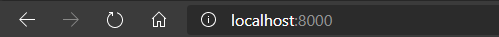
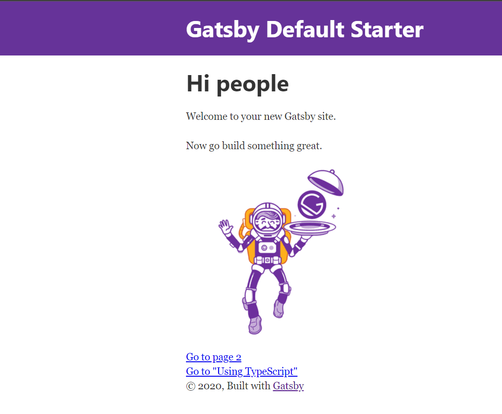
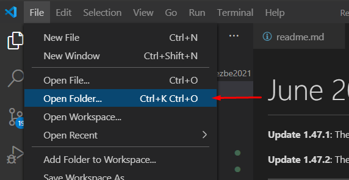
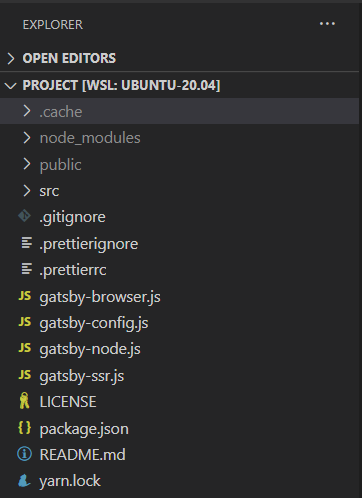
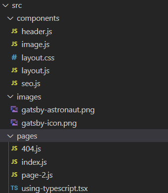

# Javascript ekosustav i NodeJS

Javascript ekosustav okolina je javascripta koja se sastoji od biblioteka, softverskih paketa, editora i ostalih resursa koji omogućuju i olakšavaju razvoj JS aplikacija.

[Izvor](https://www.altexsoft.com/blog/engineering/javascript-ecosystem-38-tools-for-front-and-back-end-development/)

U ovom poglavlju fokusirat ćemo se na *package manager* aplikaciju koja omogućuje jednostavan i brz pristup repozitoriju gotovog koda kako ne bismo nepotrebno riješavali riješene probleme. Korištenje ovim paketima besplatno je jer su dani kao *open source* softver.

Kao što znamo, Javascript je jezik koji se isključivo izvršava unutar *web*-pretraživača (Chrome, Firefox i sl.), međutim postoji run-time okruženje za pokretanje Javascript koda izvan okvira pretraživača, to je okruženje **NodeJS**.

## NodeJS

Radi jednostavnosti NodeJS je program koji može pokretati Javascript kod s tvrdog diska slično kao što to može i Java run-time. Princip rada je jednostavan: NodeJS enkapsulira **V8** engine, što je upravo Javascript engine koji koristi Chrome pretraživač. Možemo reći da je NodeJS izvadio motor automobila i pokreće taj motor izvan automobila i koristi se njime za druge namjene. Ta namjena najčešće je *web*-server, stoga se NodeJS često zove "Javascript za servere". Način izvršavanja jako je sličan izvršavanju Java koda.

 <div align="center">
  
 </div>

Nećemo ulaziti detaljnije u izvedbu jer nije u okviru onog što se radi na ovom kolegiju, ali za one koje zanima ovdje je [izvor](https://www.freecodecamp.org/news/what-exactly-is-node-js-ae36e97449f5/).

## NPM: Package manager

Instalacija NodeJS-a neophodna je za rad s modernim Javascriptom čak i ako ne radimo serverske aplikacije. Jedan od razloga je *NPM*. NPM je **Node Package Manager**. To je dio instalacije NodeJS-a i JS ekosustava, a njegova svrha je instalacija softverskih paketa i upravljanje stablom ovisnosti paketa (dependency tree) što brže i efikasnije. NPM se može pozvati iz komandnog prozora nakon instalacije NodeJS-a. Koristit ćemo se njime da bi instalirali GatsbyJS.

## Što je GatsbyJS i čemu služi

GatsbyJS je framework za ReactJS. Možemo reći da imamo framework koji se oslanja na framework što se može činiti kao  golem overhead, ali cilj je Gatsby-a upravo olakšavanje izrade statičkih *web*- stranica. GatsbyJS je "static site generator" uporabom ReactJS-a.

"Static site" znači da imamo HTML + CSS + JS. Tri datoteke (ili više ako ih razbijemo na više dijelova, ali to je samo estetika) koje možemo staviti na USB pa prebaciti na neki *web*-server ili podići na Apache ili ga samo otvoriti u *web*-pretraživaču na računalu. Ispred sebe onda vidimo gotovu stranicu i to je to. S ReactJS-om, trebamo dignuti server koji će služiti ReactJS aplikaciju. Trebamo NodeJS i NPM za instalaciju svih paketa koje ReactJS koristi. Ne možemo to jednostavno prebaciti na USB ili samo otvoriti u pretraživaču. Stoga se za statične stranice ReactJS ne preporučuje jer stvara ogroman overhead (preporučuje se ručno pisanje HTML-a ili WordPress). GatsbyJS rješava ovaj problem na jednostavan način: piše se pojednostavljena verzija ReactJS-a (nema ručne navigacije i routinga npr.) i onda kad smo gotovi, GatsbyJS će sav taj ReactJS kod pretvoriti u klasični HTML + CSS + JS statični *site*.

GatsbyJS premošćuje most između ReactJS-a i statičnih stranica.

## Instalacija alata

U sljedećim poglavljima korak po korak instalirat ćemo sve potrebne alate za početak rada. Krenut ćemo s NodeJS-om koji nam daje NPM. NPM onda instalira GatsbyJS i sve ostale pakete koje ćemo možda trebati.

### NodeJS i NPM

#### Windows

Za *windows* korisnike, potrebno je skinuti NodeJS instaler sa [službene stranice](https://nodejs.org/en/). Uvijek skidamo LTS verziju ("long term support"). Non-LTS verzije su **nešto kao** "beta" verzije.

Nakon instalacije, možemo potvrditi da je sve prošlo u redu koristeći terminal:

```bash
$ node -v
v10.19.0
$ npm -v
6.10.3
```

Ako neka od naredbi daje *error* umjesto verzije softvera, instalacija nije prošla uredno. Za Windows je čest *error* da se `node.exe` ne doda u *system path variable*. Simptom je da se naredba "node" ne može pronaći. Problem je lako [riješiti](https://stackoverflow.com/questions/27864040/fixing-npm-path-in-windows-8-and-10).

#### Linux (Ubuntu/Debian)

Prvo radimo repository update, zatim instalaciju softvera.

```bash
$ sudo apt-get update
-||-
$ sudo apt-get install nodejs
```

 Pathing bi trebao raditi po defaultu.

#### Arch based

```bash
$ sudo pacman -Syu
-||-
$ sudo pacman -S nodejs
```

#### WSL

Ovisi o verziji Linuxa. Postoji problem s pathingom kod instalacije NPM ako je NPM instaliran i na Windowsu. Zbog načina na koji WSL radi (oslanja se na Windows registre) pokušat će pokrenuti NPM s Windowsa što neće proći. Može se koristiti [Yarn](https://classic.yarnpkg.com/en/docs/install/#debian-stable) ili se može samo unmountat `/mnt/c`. Također, [deinstalacija NodeJS-a u Windowsu i restart Linux shella rješava problem](https://github.com/microsoft/WSL/issues/3882) (ako se to može nazvati rješenjem).

### Git

Gatsby CLI koristi **git** za dohvaćanje početnog koda u projektu. Kod dohvaća sa svog GitHub repozitorija. Instalacija gita je dosta jednostavna.

#### Windows

Kao i za sve na Windowsu, postoji setup.exe za instalaciju gita. Ovdje je [link](https://git-scm.com/download/win) za Windows setup file.
Default postavke su u redu, ali treba paziti da je `add to your PATH` **označen**. Inače, doći će do problema opisanog ispod. Ako je sve prošlo u redu, `git --version` treba raditi:

```bash
$ git --version
git version 2.23.0.windows.1
```

##### Mogući problem

kao i kod Nodea moguće je da git.exe ne bude dodan u path. Problem se rješava istim [postupkom](https://www.computerhope.com/issues/ch000549.htm) kao i za Node. Stackoverflow pitanje [ovdje](https://stackoverflow.com/questions/31167181/adding-git-to-path-variable-cant-find-github-under-appdata-local)  

#### Linux (Ubuntu/Debian)

Isto kao i node. Treba napomenuti da je git najčešće predinstaliran na Linux.

```bash
$ sudo apt-get update
-||-
$ sudo apt-get install git
```

#### Arch based  

```bash
$ sudo pacman -Syu
-||-
$ sudo pacman -S git
```

### GatsbyJS CLI

#### Instalacija CLI alata

Jednom kad su NodeJS i NPM spremni, potrebno je instalirati GatsbyCLI. To je alat koji služi za konfiguraciju i stvaranje GatsbyJS projekata. Instalira se pomoću NPM-a. Koristi se global flag `-g` za instalaciju kako bi se alat mogao koristiti globalno iz terminala (umjesto samo u folderu gdje je `npm install` pozvan što je defaul). Naredba izgleda ovako:

`$ npm install -g gatsby-cli`

Provjerimo sa `$ gatsby -v`

```bash
~ gatsby -v
║ Gatsby collects anonymous usage analytics
║ to help improve Gatsby for all users.
║ If you'd like to opt-out, you can use `gatsby telemetry --disable`
║ To learn more, checkout https://gatsby.dev/telemetry
Gatsby CLI version: 2.12.61
```

Ako se prikazuje navedena poruka, sve je prošlo u redu.
  Poruka o telemetriji (prikupljanje podataka) pojavit će se samo jednom.

#### Stvaranje novog projekta

Koristeći se sad instaliranim CLI, stvaramo novi projekt:

`$ gatsby new moj-projekt`.

Proces će potrajati neko vrijeme. GatsbyCLI sad dohvaća sve potrebne pakete za rad sa ReactJS-om koristeći se NPM-om ispod haube i naravno alate koji će taj React kod na kraju pretvoriti u HTML/CSS/JS. Kad ne bismo koristili GatsbyJS nego samo ReactJS, ovaj proces instalacije alata trebali bismo ponoviti na svakom serveru s kojeg serviramo našu stranicu.

Nakon nekog vremena vidjet ćemo sljedeću poruku:

```bash  
Your new Gatsby site has been successfully bootstrapped. Startdeveloping it by running:
cd moj-projekt
gatsby develop
```

Napravimo kako piše:

```bash
cd moj-projekt && gatsby develop
```

Gatsby sad podiže development server koji servira React aplikaciju.
Kad se proces završi, vidimo sljedeće:

```bash
success Building development bundle - 7.165s
```

Sada u svom browseru upišemo danu adresu:

`localhost:8000`

  <p align="center">
    
  </p>

Trebali bismo vidjeti "Hello world" Gastby stranicu.</br>

  <p align="center">
    
  </p>

Detaljne upute o instalaciji mogu se naći na službenoj [stranici](https://www.gatsbyjs.org/docs/quick-start/).

### Editor i kod projekta

U redu, sad je sve spremno, ali kako i gdje pišemo kod?

Ne postoji ograničenje za korištenje editora, ali preporučuje se [VSCode](https://code.visualstudio.com/). Alternativa su [Atom](https://atom.io/) i [WebStorm](https://www.jetbrains.com/webstorm/), koji toplo preporučujem ako vam se ne sviđa VSCode. Inače se plaća, ali ga studenti FESB-a [mogu dobiti besplatno](https://www.jetbrains.com/community/education/#students). Smatra se najboljim editorom trenutačno, a u stopu ga slijedi VSCode.

Nakon instalacije, otvorimo folder koji sadržava naš projekt.
  <p align="center">
    
  </p>

Trebalo bi nas dočekati ovo:
  <p align="center">
    
  </p>

Prođimo kratko kroz strukturu projekta.

#### Folderi

Sve što vidimo automatski stvara Gastby alat. Većinu tih foldera interno koristi Gatsby za postavljanje *web*-servera te nisu naša briga. Ali idemo redom:

- .cache  
- public
- node_modules
- src

*.cache* folder upravo je što mu i naziv govori: *cache*. Nikad ga ne diramo, ali ponekad kad mijenjamo konfiguraciju projekta *.cache* će trebati izbrisati da se promjene primjene. Izvan toga nam je beskoristan.

*public* folder sadržava radnu verziju statičke stranice u danom trenutku. Nikad ne trebamo gledati što se nalazi u njemu i nama nema nikakvu uporabu.

*node_modules* folder je ogroman. Postoji u svakome modernom JS projektu, a sadrži kod svih paketa koje smo dodali koristeći NPM ili u ovom slučaju, kod paketa koje je dodao GatsbyCLI. Tu se nalazi ReactJS kod, GatsbyJS kod i sve što njima treba za rad. Nikad ne trebamo ulaziti u taj folder. Vratit ćemo se na njega poslije.

*src* označava *source*. Ovo je jedini folder koji nas zanima. Sav naš kod ide u ovaj folder. Vratit ćemo se na njega kad budemo detaljnjije pregledavali strukturu koda u Gatsby projektima.

#### Datoteke

Imamo:

- .gitignore
- .pretierignore i .pretierrc
- package.json i package.lock
- gatsby-config.js

Osim njih imamo druge `gatsby-*.js` datoteke. One su dosta specifične te ih za većinu projekata ne trebamo. Ako budu potrebne, znat ćemo čemu služe (upute će nas dovesti do njih).

*.gitignore* je datoteka koja osigurava da *cache*, *build files*, *node_modules* logovi i slične stvari ne ulaze u git. Razlog je taj što ti podatci ne trebaju biti u gitu. Ne trebamo se zamarati tom datotekom, ona je unaprijed ispravno podešena. Detaljnije [ovdje](https://www.atlassian.com/git/tutorials/saving-changes/gitignore).

*.pretierignore i .pretierrc* datoteke su koje sadrže postavke za [Prettier](prettier.io). Alat za formatiranje koda koji preporučuje Gatsby. Ako ga ne želimo koristiti obje datoteke se mogu izbrisati.

*package.json* i *package.lock* sadržavaju popis paketa koji se koriste u projektu. *package.lock* se **ne** smije dirati ručno. On je *autogenerated*. *package.json* možemo mijenjati ako je to potrebno i ručno, ali pakete dodajemo i brišemo kroz NPM alat. *package.json* pokazuje što se nalazi u *node_modules* folderu. Ponekad paketi znaju "zapeti" i ostanu poluinstalirani. U tom slučaju potrebno je izbrisati *node_modules* folder i pokrenuti `npm i` da se napravi reinstalacija paketa. *lock* datoteka pri tome se ne dira.

*gatsby-config.js* glavna je datoteka za konfiguraciju Gatsbya. Dodavanje novih plug-ina, modula i ostalih konfiguracija radi se kroz *gatsby-config.js*. Sve upute o tome lako se nađu na [službenim stranicama](https://www.gatsbyjs.org/docs/api-reference/).

#### src

Sad prelazimo s nebitnih i manje bitnih stvari na bitne. Folder *src* sadržava naš kod i izgleda ovako:

  <p align="center">
    
  </p>

*components* sadržava sve naše ReactJS komponente koje ćemo definirati. *pages* sadržava stranice, poput */home, /about, /login* i sl. Vidimo da je većina koda u ovom folderu *.js*. Unutar *pages* vidimo *index.js*. To je početna stranica. Detaljnije o samom kodu i promjenama koje ćemo napraviti slijedi u idućim poglavljima.
