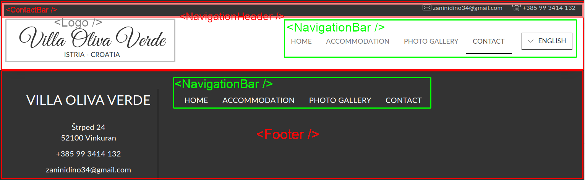

# Uvod
  U ovim vježbama nastavit ćemo gdje smo stali ranije i napravit ćemo malo refaktoriranja koda. Promjenit ćemo kompoziciju komponenti koju smo napisali zadnji put što će nam dati više modularan i čist raspored komponenti i koda. Također, održavanje takvog koda i snalaženje u njemu je puno lakše.

  Promjene koje ćemo napravit tiču se spajanje više cijelina u jednu koju ćemo zvati **modul**. Modul je veći logički segment *web*-stranice. Također, pokazat ćemo kako radi *composite design pattern* kad želimo koristiti istu komponentu na više mjesta u dizajnu uz male razlike.

  Na kraju, dodat ćemo novi sadržaj na stranicu. Dodat ćemo sadržaj sa slikama i tekstom. Koristit ćemo se `Gatsby-Image` API-em koji nam dostupan u projektu.
## Segment stranice
  Segment stranice koji pišemo je naslovna slika i dva paragrafa u tijelu stranice.
  <p align="center">
    
  </p>

  Taj sadržaj dolazi između `<NavigationHeader/>` i `<Footer/>` komponenti. 

## React concept
  Tri koncepta koja ćemo proći u ovim vježbama bit će **Layout**, **Lazy loading** i **Modul** komponente.
  ### Layout
  *Page layout* je koncept u *web*-developmentu kojim se definira nepromjenjivi format stranice, a cilj je uniformnost kod multi-page stranica. Najbolji primjer za to su upravo navigacija i footer. Kod *web*-aplikacija sa više stranica u navigaciji želimo zadržati dio stanice isti, a dio mjenjat. U našem primjeru, footer ostaje isti kod svake stranice. Navigacijska traka također, ali se mjenja trenutno posjećena stranica. Sadržaj između headera i footera se u potpunosti mjenja ovisno o tome na kojoj smo stranici.<br/>
  
  <br/>

   Layout: ponavlja se u svakoj stranici <br/>
   Sadržaj stranice: mjenja se navigacijom (primjetimo strelicu)

  Prije nego možemo napraviti ovakav *layout* moramo imati navigacijsku traku i footer. To smo napravili u prošlim vježbama.
  ### Moduli
  Ako gledamo komponente heiarhijski vidimo da nisu sve komponente na istoj razini. Neke komponente poput `ContactBar` nemaju nijednu drugu komponentu unutar sebe, samo HTML. Komponente kao što je `NavigationHeader` su puno složenije. Čak možemo reć da predstavljaju zaokruženu logičku cijelinu. `NavigationHeader` i `Footer` su dvije komponente koje samostalno predstavljaju cijeli segment *web*-stranice. Takve komponente zovemo **moduli**.
  
  Ne postoji striktna definicija *modula* i ne koriste se uvjek. Podjela na module može biti više. Na prijmer, `ContactBar` može biti sam svoj modul, ili ga se može dodati u `NaigationHeader` pa skupa s njim tvori modul.
  <p align="center">
    
  </p>

  U nastavku dodat spojit ćemo `NavigationHeader` i `ContactBar` u jedan modul.

  ### Gatbsy-Image (lazy loading)
 *Lazy-Loading* je popularan koncept u *web-developmentu*, a radi se o učiavanju stranice segment po segment dok se ona koristi. Cilj je smanjit početno učitavanje tako što će se učitati samo ono što će korisnik vidjet. Dok korisnik gleda učitani sadržaj, ostatk sadržaja se učitava. Ovo se radi na način da nema *pop-in* effekta koji se dogodi kad se nešto učita i novi sadržaj "uskoči" pa se sav sadržaj i raspored stranice naglo poremeti. Umjesto toga vidimo dio sadržaja i *loading* animacije posvuda po stranici dok se sadržaj učitava. Kad se sve učita animacije se zamjenu sadržajem i nema smetnji.

 Kod slika ovo je posebno zanimljivo jer slike traže duže učitavanje i mogu biti dostva velike. Njihov *pop-in* zato može dosta poremetiti stranicu i loše utjecati na iskustvo korisnika. Slika se *lazy-loada* na način da se učitava zamućena pa se postepeno izbistri ili se učita *loading placeholder* na njeno mjesto i samo se zamjeni slikom kad je spremna. Postoji i dosta varijanti na temu, ali cilj je isti: bolje korisničko iskustvo.

 Pisanje koda ručno za učitavanje slika na ovaj način može biti komplicirano. *Gatsby* zato nudi svoj API u vidu GraphQL API-a za dohvaćane slika i gotove komponente za njeno optimiraje i prilagođavanje stranici. Unutar ove vježbe nećemo previše ulazit u GraphQL jer on sam može biti kolegij za sebe, ali objasnit ćemo kako se radi sa optimiziranim slikama unutar *Gatsby* API-a. 

## Planiranje komponenti
Za razliku od prije, komponente u ovoj vježbi su dosta jednostavnije. Međutim, mjenjamo raspored postojećih komponenti:
  - Dodajemo `ContactBar` u `NavigationHeader`
  - Dodajemo `NavigationBar` u `Footer`
  - Dodajemo `NavigationHeader` i `Footer` u HoC komponentu: `Layout`
  - U `pages/index.js` uvozimo `Layout` umjesto `NavigationHeader` i `Footer`
Nova kompozicjia izgledat će ovako:
<p align="center">
  
</p>

Sad kad smo to riješili pišemo nove komponente u `Layout`. Nove komponente se sastoje od dvije top komponente gdje se svaka sastoji od još dvije podkomponente:
  - `<PageTitle />`
    - `<TitleImage />`
    - `<InquiryBlock />`
  - `<PageContent />`
    - `<ImageParagraph />` x 2

<p align="center">
  
</p>

### Kompozicjia
Puna kompozicjia komponenti sa `layout` HoC-om.
<p align="center">
  
</p>

## Sadržaj git commitova <a name="tocc"></a>
  - [**Commit 1: Adding ContactBar to NavigationHeader**](#c1)
    - Import `ContactBar` u `NavigationHeader`
    - Dodamo `ContactBar` u kod
    - Izbrišemo `ContactBar` iz `pages/index.js`
  - [**Commit 2: Adding NavigationBar to Footer**](#c2)
    - Izoliranje `navTabs` varijable
    - Uvoz `NavigationBar` komponente
    - Dodavanje `useThisStyle` varijable
    - CSS magija
  - [**Commit 3: Creating Layout**](#c3)
  - [**Commit 4: Creating Modules**](#c4)
  - [**Commit 5: Creating TitlePage**](#c5)
    - Stvaramo prazne komponente `<TitileImage />` i `<InquiryBlock>`
    - Stvararamo `<TitlePage>` i radimo import
    - Dodamo ga u `layout`
  - [**Commit 6: Creating TitleImage**](#c6)
    - index.js
    - style.module.css
  - [**Commit 7: Creating InquiryBlock**](#c7)
      - index.js
      - style.module.css
  - [**Commit 8: Creating PageContent**](#8)
      - index.js
      - style.module.css
  - [**Commit 9: Creating ImageParagraph**](#9)
      - Kako radi gatby-image
      - Stvaranje `<Image />` komponenti
      - Import i stvaranje `ImageParagraph` koponente
      - Reverse porp

### Commit 1: Adding ContactBar to NavigationHeader <a name="c1"></a>
  - Import `ContactBar` u `NavigationHeader`
  - Dodamo `ContactBar` u kod
  - Izbrišemo `ContactBar` iz `pages/index.js`

Prebacivanje `ContactBar` koponente je jednostavno. Idemo u `NavigationHeader` i dodajemo `import`:
```jsx
import React from 'react'

import Logo from '../Logo'
import Navigation from '../Navigation'
import ContactBar from '../contactBar'

import styles from './style.module.css'

const NavigationHeader = ({activeTab}) => (
    <section className={styles.navigationHeader}>
        <ContactBar />
        <Logo />
        <Navigation activeTab={activeTab} />
    </section>
)

export default NavigationHeader
```
Ovo daje sljedeći rezultat:
<p align="center">
  
</p>

Očito, to nije ono što želimo. Ovaj rezlutat je očekivan ako `<ContactBar/>` ubacimo **unutar** `<section>` komponente. Budući da je na `<section>` u CSS-u definitan *row flex* logično je da će on dodati i `<ContactBar/>` u svoj redak. To je ono što vidimo.

Na svu sreću, ne trebamo ništa posebno mjenjat, samo raspored komponenti. Želimo da `ContactBar` bude **sibling** za `<section>`, ne **child**. Znači ovo:
```jsx
const NavigationHeader = ({activeTab}) => (
  <ContactBar />
  <section className={styles.navigationHeader}>
    <Logo />
    <Navigation activeTab={activeTab} />
  </section>
)
```
Ovaj kod daje error... React komponenta **NE SMIJE** vratiti **sibling** kompoziciju, samo **parent => child**. Možemo dodati jedan `<div></div>` oko svega i riješavamo problem. Međutim, React nudi riješenje i za to: **React Fragment**. Posebni prazan tag `<></>` za omotavanje *sibling* komponenti:
```jsx
const NavigationHeader = ({activeTab}) => (
  <>
    <ContactBar />
    <section className={styles.navigationHeader}>
      <Logo />
      <Navigation activeTab={activeTab} />
    </section>
  </>
)
```
Ovo će dati željeni rezultat, ali će se `ContactBar` pojavit duplo. To je ok, moramo ga izbrisati iz `pages/index.js`. Napravimo sad to:
```jsx
import React from "react"

import NavigationHeader from '../components/NavigationHeader'
import Footer from '../components/Footer'

const IndexPage = () => (
  <main>
    <NavigationHeader activeTab = 'Home' />
    <Footer />
  </main>
)

export default IndexPage
```
> Bitno: React NE MOŽE vratiti više od jednog element paralelno. Može vratiti ugnježdene elemente (parent=>child). **React Fragment** je riješenje ako moramo vratiti više elemenata paralelno.

```bash
$ git add .
$ git commit -m "Adding ContactBar to NavigationHeader"
```
[Sadržaj commitova](#tocc)
### Commit 2: Adding NavigationBar to Footer <a name="c2"></a>
U prošlim vježbama smo rekli da riješenje navigacije u `Footeru` nije dobro. Problem je ponavljanje što je nešto što treba izbjegavati ([DRY](https://dzone.com/articles/software-design-principles-dry-and-kiss) princip).

Riješit ćemo ovaj problem na iz 4 koraka.
- Izoliranje `navTabs` varijable
- Uvoz `NavigationBar` komponente
- Dodavanje `useThisStyle` varijable
- CSS magija

Izolirajmo `navTabs`. Stvorit ćemo folder i varijablu `src/constants/const.js`
Dodajmo sljedeću liniju unutar:
```jsx
export const navs = ['Home', 'Accommodation', 'Photo Gallery', 'Contact']
```
Također, brišemo `navTabs` definiciju u `NavigationBar`. Sad radimo import ove varijable unutar `NavigationBar`:
```jsx
// src/components/NavigationBar/index.js
import React from 'react'
import { navTabs } from '../../constants/const'
import styles from './style.module.css'
```
Ovo je error. Naziv koji smo dali u `constants/const.js` je `navs`. Znači moramo mjenajt `navTabs.map()` u `navs.map()` i import u `import { navs } from '../../constants/const'`

Postoji bolji način. Sjećamo se `as` riječice? Probajmo ovo:<br/>
`import { navs as navTabs } from '../../constants/const'`
```jsx
import React from 'react'
import { navs as navTabs } from '../../constants/const'
import styles from './style.module.css'

const NavigationBar = ({ activeTab }) => (
    <nav className={styles.navigationBar}>
        {navTabs.map(tab => <li className={tab=== activeTab ? styles.active : ''}>
            {tab}</li>
        )}
    </nav>
)

export default NavigationBar
```
Naravno mogli smo jednostavno dati ime `navTabs` u `const.js`, ali želio sam pokazati kako se koristi `as`. 

Napravimo istu stvar u `Footer` komponenti.
```jsx
import React from 'react'
import styles from './style.module.css'

import {navs as navTabs} from '../../constants/const' // <==

const Footer = () => (
  <footer className={styles.footer}>
    <ul className={styles.address}>
      ...
      ...
      <ul className={styles.navigation}>
        {navTabs.map(tab =>
          <li>{tab}</li>)
        }
      </ul>
    </ul>
  </footer>
)
```
Ok, ovo riješenje je bolje nego ono prije jer ne kopiramo varijablu, ali nije idealno. Idealno bi bilo izbjeć i ovaj `map()` jer ga imamo u `NavigationBar`. Želimo iskoristit `NavigationBar` i reći mu da bude crn sa bijelim slovima. Također, ne želimo `active`. Kad god želimo nešto reć komponenti koristimo `props`. Sad ćemo izbacit `nav` import i `<ul>map()</ul>` i dovest `NavigationBar`.
```jsx
import React from 'react'
import styles from './style.module.css'

import NavigationBar from '../NavigationBar'

const Footer = () => (
  <footer className={styles.footer}>
      <ul className={styles.address}>
          <li className={styles.title}>
              VILA OLIVA VERDE
          </li>
          <li>Štrped 24</li>
          <li>521000 Vinkuran</li>
          <li className={styles.phone}>
              +385 99 11223344
          </li>
          <li>example@email.com</li>
      </ul>
      <NavigationBar />
  </footer>
)

export default Footer
```
<p align="center">
  
</p>

Nije dobro. Ali to je ok. Dodajmo prop u `<NaviagtionBar />` koji ćemo nazvat `useThisStyle`<br/>
`<NavigationBar useThisStyle = "footer"/>`<br/>
Neće se promjeniti ništa jer moramo dodati logiku u `NavigationBar`. Ono što želimo je da komponenta koristi `className` koji joj dođe kroz `useThisStyle` prop. Trenutno koristi `styles.navigationBar`. 
Ako to zamjenimo sa `styles[useThisStyle]` je li problem riješen?

Ne. Mi želimo koristiti `.footer` klasu u `Footer` komponenti. U `NavigationHeader` želimo ostaviti `styles.navigationBar`. Ovo je jednostavni `if` problem. Ako je poslan `useThisStyle` koristi njega, ako nije onda `.navigtionBar`. JS ima `default param` funkcijonalnost. Realizira se pomoću ili operatora (`||`):
```jsx
// components/NavigationBar/index.js
...
const NavigationBar = ({ activeTab, useThisStyle }) => (
    <nav className={styles[useThisStyle || navigationBar]}>
        {navTabs.map(tab => <li className={tab=== activeTab ? styles.active : ''}>
            {tab}</li>
        )}
    </nav>
)
```
Napredak!
<p align="center">
  
</p>

Sad samo treba dodati novu kaslu u CSS, a ta klasa je `.footer` (to je ono što šaljemo kao prop u `useThisStyle`). Ta klasa je praktiči ono što smo koristili u `Footer` komponenti prije. Novi `NavigationBar` CSS:
```css
.navigationBar {
    display: flex;
    justify-content: space-evenly;
    flex-flow: row;
    width: 480px;
}

.navigationBar li {
    padding: 14px 15px;
    list-style: none;
    width: fit-content;
    font-size: 14px;
    line-height: 22px;
    text-transform: uppercase;
    color: #555
}
.navigationBar li:hover {
    border-bottom: 2px solid darkgray;
    cursor: pointer;
}

.navigationBar .active, .navigationBar .active:hover{
    border-bottom: 2px solid black;
}

.footer {
    margin: 30px;
    list-style: none;
    display: flex;
    text-transform: uppercase;
}

.footer li {
    margin: 0 25px;
    font-size: 16px;
    height: fit-content;
}

.footer li:hover {
    border-bottom: 1px solid white;
    cursor: pointer;
}
```
Iz `Footer` CSS-a izbrišemo sve `.navigation` definicije.

To je to. Ovo što smo upravo napravili je jedan od načina primjene **composition** patterna u Reactu.

Commitajmo
> Od sad pa nadalje pretpostavljam da znamo commitat. Broj datoteka u ovom commitu je 5. Ako je sve u redu, možemo nastaviti

[Sadržaj commitova](#tocc)
### Commit 3: Creating Layout <a name="c3"></a>
Ovo će biti kratak commit. Stvaramo novi folder: `src/layouts` i dodajemo datoteku `headerFooter.js`. Razlog zbog kojeg stvaramo folder je taj što teoretski na stranici možemo imati više layouta. Čak i layout unutar layouta. Iako mi imamo samo jedan, želio bih pokazati kako struktura projekta može izgledati kod većih *gatsby* aplikacija.

U taj file dodajemo `NavigationHeader` i `Footer`. Između njih šaljemo `children` prop. To je posebni prop koji je referenca na elemente koji se nalaze unutar taga. Na primjer, za:
```jsx
<ul>
  <li>Hi 1</li>
  <li>Hi 2</li>
  <li>Hi 3</li>
</ul>
```
Svi `<li>` elementi su `children` prop za `<ul>`, a njihov međusobni odnos je "sibling".
Manje priče, više koda:
```jsx
// /src/layouts/headerFooter.js
import React from 'react'
import NavigationHeader from '../components/NavigationHeader'
import Footer from '../components/Footer'

const HeaderFooterLayout = {children} => (
  <>
    <NavigationHeader />
      {children}
    <Footer />
  </>
)

export default HeaderFooterLayout
```
Sad vidimo da kad budemo slali sljedeće komponente po planu, slat ćemo ih kao `children` u `layout`. 

Idemo u `pages/index.js` primjeniti novi pristup:
```jsx
import React from "react"

import HeaderFooterLayout from "../layouts/headerFooter"

const IndexPage = () => (
  <HeaderFooterLayout>
    {/* Body components here! */}
  </HeaderFooterLayout>
)

export default IndexPage
```
Možda se sjećate da je postojao `layout` file na početku projekta koji je došao skupa sa *gatsbyem* ? Taj `layout.js` ima istu svrhu kao i ovaj kojeg smo mi napravili. Razlika je samo u tome što ubaciva u stranicu. 
> Možemo commit: 2 filea

[Sadržaj commitova](#tocc)
### Commit 4: Creating Modules <a name="c4"></a>
I ovo će biti kratak commit. Stvorit ćemo `src/modules` folder gdje će ići komponente za koje smatramo da su *Moduli* cijele stranice. Po mom skromnom mišljenju to su:
  - NavigationHeader
  - Footer
> Modul možemo definirati kao komponente koje se pojavljuju u `pages/*.js` datotekama.

Maknut ćemo cijele `/components/NavigationHeader` i `/components/Footer` foldere u `/modules`. Ovo će slomit aplikaciju jer layout više ne može dohvatiti te komponente. Samo ćemo ispravit *import path*:
```jsx
// layouts/headerFooter.js
import React from 'react'
import NavigationHeader from '../modules/NavigationHeader'
import Footer from '../modules/Footer'
...
```
Možemo commitat
> 9 fileova => 5 filieova kad se doda u staging <br/>
> ([D]elte + [C]reate = [R]ecreate)

[Sadržaj commitova](#tocc)
### Commit 5: Creating TitlePage <a name="c5"></a>
  - Stvaramo prazne komponente `<TitileImage />` i `<InquiryBlock>`
  - Stvararamo `<TitlePage>` i radimo import
  - Dodamo ga u `layout`

Kao inače kad stvaramo novu složenu komponentu. Razlika je u tome što će `<TitlePage />` ići u module, a ostale dvije komponente u `components`

```jsx
// /components/TitleImage/index.js
import React from 'react'

import styles from './styles.module.css'

const TitleImage = () => (
    <section className={styles.titleImage}>
    </section>
)

export default TitleImage
```
```jsx
// /components/InquiryBlock/index.js
import React from 'react'

import styles from './styles.module.css'

const TitleImage = () => (
    <section className={styles.titleImage}>
    </section>
)

export default TitleImage
```
I naravno:
```jsx
// /modules/TitlePage/index.js
import React from 'react'

import TitleImage from '../../components/TitleImage'
import InquiryBlock from '../../components/InquiryBlock'
import styles from './styles.module.css'

const TitlePage = () => (
    <section className={styles.titlePage}>
        <TitleImage />
        <InquiryBlock />
    </section>
)

export default TitlePage
```

Dodajmo modul u `pages/index.js`:
```jsx
import React from "react"

import HeaderFooterLayout from "../layouts/headerFooter"
import TitlePage from '../modules/TitlePage'

const IndexPage = () => (
  <HeaderFooterLayout>
    <TitlePage />
  </HeaderFooterLayout>
)

export default IndexPage
```

Možemo commit.
> 6 datoteka

[Sadržaj commitova](#tocc)
### Commit 6: Commit 6: Creating TitleImage <a name="c6"></a>
  - index.js
  - style.module.css

Prije nego iskopiramo kod par napomena. Realizirat ćemo ovu komponentu koristeći običnu neefikasnu CSS sliku. U sljedećim vježbama pokazat ćemo kako se instalira NPM modul kojeg nudi gatsby koji se zove "*gatsby-background-image*" [[ovdje](https://www.gatsbyjs.com/plugins/gatsby-background-image/)]. To je optimizirana verzija slike. Moći ćemo idjeti razlike u preformansama kad je dodamo na taj način.

Slika koju ćemo koristit je statična i nalazi se u `src/images/cover.jpg`. "Carusel" nećemo radit u ovim vježbama. Krenimo.
```jsx
// /components/TitleImage/index.js
import React from 'react'

import styles from './style.module.css'

const TitleImage = () => (
  <section className={styles.titleImage}>
    <div>
      <h1>VILLA OLIVA VERDE</h1>
      <p>Isolated from the tourist crowd for a pleasant<br/> and peaceful vacation</p>
    </div>
  </section>
)

export default TitleImage
```
CSS
```css
.titleImage {
    height: 650px;
    width: 100%;
    position: relative;
    background: url("http://villaolivaverde.com/imagecache/objectmax/27-12-19/55d36453-07b8-49f3-8763-6d157fa4be23.jpg") no-repeat center center;
    background-size: cover;
}

.titleImage > div {
    width: fit-content;
    height: fit-content;
    display: flex;
    flex-flow: column;
    background: transparent;
    position: absolute;
    top: 50%;
    left: 50%;
    transform: translateX(-50%) translateY(-50%);
    text-align: center;
    color: white;
    text-transform: uppercase;
}

.titleImage h1 {
    font-size: 64px;
    text-shadow: 0 0 20px rgba(0, 0, 0, 0.5);
    margin-bottom: 45px;
}

.titleImage p {
    font-size: 30px;
    text-shadow: 0 0 10px rgba(0, 0, 0, 0.8);
    padding: 45px 12px;
    margin: 0;
    border-top: 2.5px solid #FFF;
}
```

Commit ready! 
>2 datoteke

[Sadržaj commitova](#tocc)
### Commit 7: Creating InquiryBlock <a name="c7"></a>
  - index.js
  - style.module.css
Kao i prije, mockat ćemo funkcijonalnosti i dodat ćemo ikonice sa weba (bez gatsbya). Ovo je ok jer su ikonice dosta male i brzo se učitavanju tako da čak i ako se dogodi pop-in neće se primjetiti.
```jsx
import React from 'react'

import styles from './style.module.css'

const InquiryBlock = () => (
  <section className={styles.inquiryBlock}>
    <div className={styles.dateBoxContainer}>
      <span>Arrival date</span>
      <div className={styles.dateBox}>
          
          <span>{`${(new Date()).getDate()}.${(new Date()).getMonth() + 1}.${(new Date()).getFullYear()}`}</span>
      </div>
    </div>
    <div className={styles.dateBoxContainer}>
      <span>Departure date</span>
      <div className={styles.dateBox}>
        
        <span>{`${(new Date()).getDate() + 1}.${(new Date()).getMonth() + 1}.${(new Date()).getFullYear()}`}</span>
     </div>
   </div>
   <button>Send inquiry</button>
  </section>
)

export default InquiryBlock
```
CSS
```css
.inquiryBlock {
    background-color: #333;
    margin: 0 auto;
    color: white;
    display: flex;
    height: 44px;
    padding: 40px 12.5%;
    width: 75%;
    min-width: 828.797px;
    justify-content: space-evenly;
}

.inquiryBlock .dateBoxContainer {
    display: flex;
    align-items: center;
}

.inquiryBlock .dateBoxContainer span, img {
    height: fit-content;
}

.inquiryBlock .dateBoxContainer img {
    padding: 12px;
    border-right: 1px solid black;
    filter: invert();
}

.inquiryBlock .dateBoxContainer .dateBox {
    height: 44px;
    width: 225px;
    display: flex;
    border: 1px solid white;
    justify-content: space-between;
    align-items: center;
    margin-left: 23px;
}

.inquiryBlock .dateBoxContainer .dateBox span {
    margin: 0 auto;
    margin-left: 10px;
}

.inquiryBlock button {
    height: 44px;
    width: fit-content;
    background: black;
    color: white;
    padding: 11px 40px;
    font-size: 16px;
    border: none
}

.inquiryBlock button:hover {
    cursor: pointer;
    border: white 1px solid;
}
```

Primjetimo da kod CSS koda pišem puno stablo klasa da dođem do pojedinog elementa. Na primjer:<br/>
`.inquiryBlock .dateBoxContainer .dateBox span` može biti i `.dateBox span`. Pisanje punog stabla poboljšava preglednost. Hiearhija klasa je vidljiva. Ono što također pomaže su deskriptivna imena. Također, ovaj stil pisanja djeluje na [CSS specificy index](https://css-tricks.com/precedence-css-order-css-matters/). Docs [ovjde](https://developer.mozilla.org/en-US/docs/Web/CSS/Specificity) i [kalkulator](https://specificity.keegan.st/) za bolje razumjevanje. Ako se nađete u situaciji da posežete za [!important](https://www.geeksforgeeks.org/how-to-apply-important-in-css/) vjerovatno imate nered u CSS-u i dodavanje stabla za targetanje elemenata može pomoć. Ali postoje situacije kad je **!important** [opravdan](https://css-tricks.com/when-using-important-is-the-right-choice/).

Možemo commit.
> 2 datoteke

[Sadržaj commitova](#tocc)
### Commit 8: Creating PageContent <a name="c8"></a>
  - Stvaramo praznu djecu u `components`: `ImageParagraph`
  - Stvaramo `PageContent` u `modules`
  - Radimo import u `PageContant`
  - Dodajemo u `layout`


Kao i inače, stvaramo praznu djecu prvo pa ih importamo u modul. Onda modul importamo u layout.
Napravimo sad i to:
```jsx
// components/ImageParagraph/index.js
import React from 'react'
import styles from './style.module.css'

const ImageParagraph = () => <section className={styles.imageParagraph}>

</section> 

export default ImageParagraph
```
Modul:
```jsx
// modules/PageContent/index.js
import React from 'react'
import styles from './style.module.css'
import ImageParagraph from '../../components/ImageParagraph'

const PageContent = () => <section className={styles.pageContent}>
    <ImageParagraph />
    <ImageParagraph />
</section> 

export default PageContent
```
I naravno `pages/index.js`:
```jsx
import React from "react"

import HeaderFooterLayout from "../layouts/headerFooter"
import TitlePage from '../modules/TitlePage'
import PageContent from "../modules/PageContent"

const IndexPage = () => (
  <HeaderFooterLayout>
    <TitlePage />
    <PageContent />
  </HeaderFooterLayout>
)

export default IndexPage
```
To je to. Mžemo commit
> 5 datoteka

[Sadržaj commitova](#tocc)
### Commit 9: Creating ImageParagraph <a name="c9"></a>
  - Kako radi gatby-image
  - Stvaranje `<Image />` komponenti
  - Import i stvaranje `ImageParagraph` koponente
  - Slanje komponenti kroz props
  - Reverse porp

Ovo če biti duži commit jer moramo objasnit što je `gatsby-image`, zašto i kako se koristi. Ranije pričali smo o lazy loadingu. `gastby-image` je način koji se realzira u Gastbyu.

Zbog činjenice da je Gatsby *static site generator* (sjećamo se?), način na koji on radi sa rezursima se bitno razlikuje od načina na koji obične *web*-stranice i React rade. U gatsbyu nije moguće dodati slike pomoću lokalne putanje. Na primjer, ako imamo sliku u `src/images` i dodajemo je sa ``. To neće radit. Razlog je jednostavan: gatsby ima "build" i kad se build događa, komponente se pretvaraju u HTML i struktruka koda se mjenja. Drugim riječima, folder u kojem se događa build nije isti folder u kojem se nalazi komponenta, tako da relativna putanja poput `src="../images/image.jpg"` nema smisla.

Ali kad bi ovo radilo, lazy loading ne bi radio. Za referenciranje potrebnih rezursa za build koirsit se poseban jezik koji se zove **GraphQL**. To je query jezik (kao SQL), ali ne služi pristupu bazi podataka nego modelu podataka (viši nivo apstrakcije). Koristi se na backend serverima kao zamjena za popularni REST (Facebook je prešao sa REST-a na GraphQL). Gatsby ima svoj GQL API za dohvaćanje slika, markdown stranica (za blogove), naslova stranice, broja stranica, navigaciju i cijeli niz metapodataka. Sve slike koje se referenciraju u projektu GQL-om (što ćemo mi sad radit) se ubacuju u komponente prilikom "build" procesa u optimiziranoj varijanti (lazy-loading). 

API je dostupan na `http://localhost:8000/___graphql`. [Docs](#https://www.gatsbyjs.com/docs/graphql/). Za [slike](ttps://www.gatsbyjs.com/docs/working-with-images/).

Da bi slike bile dostupne GQL-u moraju se nalazit u `src/images` folderu. Ako se pitate zašto, ova postavka je promjenjiva u `gatsby-config.js` datoteci:
```js
module.exports = {
  siteMetadata: {
    title: `Gatsby Default Starter`,
    description: `Kick off your next, great Gatsby project with this default starter. This barebones starter ships with the main Gatsby configuration files you might need.`,
    author: `@gatsbyjs`,
  },
  plugins: [
    `gatsby-plugin-react-helmet`,
    {
      resolve: `gatsby-source-filesystem`,
      options: {
        name: `images`,
        path: `${__dirname}/src/images`, // <== HERE
      },
    },
    `gatsby-transformer-sharp`,
    `gatsby-plugin-sharp`,
    ...]
  ... }
```
Ok, sad kad znamo malo pozadine, pitanje je kako se radi sa svim ovim. Dosta jednostavno: za svaku sliku koja se želi optimirati mora postojat posebna komponenta samo za tu sliku. Ovo se može zaobići uz neke "Helper" li "Wrapper" komponente i pokazat ću kako. Za sada držat ćemo se ove paradigme: jedna slika, jedna komponenta.

Krenimo sa prvim korakom: dohvaćanje slike.</br>
Slike koje ćemo koristiti se nalaze se 
- [ovdje](http://villaolivaverde.com/imagecache/bigthumbnail/27-12-19/9c96f739-4c03-4954-97b1-34fea47dd427.jpg) i
- [ovdje](http://villaolivaverde.com/imagecache/bigthumbnail/20-12-19/93c3e84f-9bdd-43b9-979e-3b906147cac1.JPG)

Nakon što ih spremite, ubacite ih u `src/images` folder i daje im neko jednostavno ime. Ja ću im dati imena
 - `prva.jpg`
 - `druga.jpg`

 zato što sam jako kreativan. 
 <p align="center">
   
 </p>

 Sad stvaramo novi folder u `/src/components` kojeg zovemo `Images` (`/src/components/Images`). Sad je vrijeme da stvorimo *GatsbyImage* komponente. Stvaramo `components/Images/First` i `components/Images/Second` kao što inače stvaramo komponente. Kerenimo sam prvom:
 ```jsx
import React from 'react'

const First = () => {
    <div></div>
}

export default First
 ```

 Sad treba koristeći GQL dovatit sliku iz `src/images` i dovuć ju ovdje. Dobivamo sljedeći kod:
 ```jsx
import React from 'react'
import { useStaticQuery, graphql } from "gatsby"
import Img from "gatsby-image"

const First = () => {
    const data = useStaticQuery(graphql`
    query {
      myImage: file(relativePath: { eq: "prva.jpg" }) {
        childImageSharp {
          fixed(width: 570) {
            ...GatsbyImageSharpFixed
          }
        }
      }
    }
  `)
   return 
}

export default First
 ```
Izgleda kompliciranije nego što jest. Krenimo redom:
```jsx
const data = useStaticQuery(graphql`...`)
```
`useStaticQuery(graphql` uvjek idu skupa. To jest `grapql` priprema query tako da ga `useStaticQuery` može pozvat. Ništa pametno. Sam query je ono što nas zanima:
```js
    query {
      myImage: file(relativePath: { eq: "prva.jpg" }) {
        childImageSharp {
          fixed(width: 570) {
            ...GatsbyImageSharpFixed
          }
        }
      }
    }
```
`file(relativePath: {eq: "prva.jpg"}` <br/>
Kao što smo rekli ranije, GQL može dohvaćati puno stvari. `file` znači da želimo da dohvati file (duh). Unutar zagrada definiramo uvjete koje taj file mora zadovoljavat. Želimo da negov `relativePath`, to je path unutar `src/images` foldera, bude jednak stringu `prva.jpg`. Jednakost označava `eq` parametar (equals). <br/>
`myImage` je poizvoljan alias u koji spremamo rezultat poziva.

Ovo ostalo je specifično za slike. `childImageSharp` je transformator koji uzima sliku i optimira je. Rezultirajuća slika može biti `fixed` ili `fluid`. Vidimo da je naša `fixed`. Svi parametri koji sljede su definicije za optimiziranu sliku. Definiramo njenu širinu u našem slučaju, ali možemo definirati puno više stvari. Možemo primjenii filtere kao na instagramu, dobit negativ, crno-bijelu sliku, zamagljenje i niz drugih stvari. Sve te transformacije se definiraju unutar `childImageSharp`. `...GatsbyImageSharpFixed` je predefiniran set parametara koje daje Gatsby. Ovi koje vidimo su za *lazy-loading*.

Definirjmo sad na isti način i drugu sliku:
```jsx
import React from 'react'
import { useStaticQuery, graphql } from "gatsby"
import Img from "gatsby-image"

const Second = () => {
    const data = useStaticQuery(graphql`
    query {
      myImage: file(relativePath: { eq: "druga.jpeg" }) {
        childImageSharp {
          fluid(maxWidth: 800) {
            ...GatsbyImageSharpFluid
          }
        }
      }
    }
  `)
   return (
     <div style={{maxWidth: "800px", minWidth: "300px"}}> 
       
     </div>
   )
}

export default Second
```
Ova slika je `fluid` umjesto `fixed`. Postoji jedna bitna razlika. Slika koja je `fluid` **mora** biti unutar container komponente. Uvjek će pokušati uzet cijelu komponentu. Definiranje veličine komponente pomoću `maxWidth` i `minWidth` (ili `height` naravno) uz fleksibilan size (`width`/`height` u postocima) rezultirat će responzivnom fleksibilnom slikom. U ovom primjeru zakucao sam neke parametre pomoću `style` objekta jer ne želim radit `.css` file zbog jednog `div` elementa. Ovaj pattern za definiranje `fluid` slika sa containerom odmah u komponenti i definiranim max/min parametrima u containeru je dobar pristup za pisanje fluid slika. Ovi parametri mogu se slati i kroz `props`.

> `fluid(maxWidth: 800)` ne znači ništa. Fluid NEĆE poštivat maxWidth stavlejn ovdje. Ovo samo govori kakav treba biti container te slike. Primjetite da je ista vrijednost stavljena u `maxWidth` u CSS-u.

Sad radimo import u `ImageParagraph`... Ali koju sliku uvozimo? Budući da imamo dvije slike i jednu `ImageParagraph` komponentu? Također, imamo i dva različita teksta. Možemo napravit `ImageParagraph_1` i `ImageParagraph_2` pa zakucat prvi tekst i sliku u prvi pa drugi tekst i sliku u drugi, ali to nije naš stil ^ ^

Želimo reć komponenti što da iscrta u trenutku kad je stvaramo. Sad već znamo kako govorimo komponentama što da rade u Reactu: `props`
```jsx
import React from 'react'
import styles from './style.module.css'

const ImageParagraph = ({image, title, text }) => (
  <section className={styles.imageParagraph}>
    <div className={styles.imageHalf}>{image}</div>
    <div className={styles.articleHalf}>
        <article >
          <h2>{title}</h2>
          <p>{text}</p>
        </article>
    </div>
  </section>
  )

export default ImageParagraph
```
CSS:
```css
.imageParagraph {
    display: flex;
    justify-content: space-between;
    margin: 60px auto;
    width: 90vw;
    align-items: center;
    background-color: #f3f3f3;
}

.reverse {
    flex-flow: row-reverse;
}

.imageParagraph .imageHalf, .articleHalf {
    min-width: 45%;
    height: 100%;
}

.imageParagraph article {
    max-width: 70%;
    margin: 0 auto;
    letter-spacing: 0.2px;
}

.imageHalf div, .imageHalf div div {
    width: 100%;
}
```
Apsolutno je moguće poslati komponente kroz props umjesto korz `props.children`. Ovo je pogotvo korisno u situacijama kad se šalju *sibling* komponente što je slučaj kod nas. Komponenta se "aktivira" sa `<Component />` i samo se prikaže direktno u kodu kasnije.

U `PageContent` imamo ovo:
```jsx
import React from 'react'
import styles from './style.module.css'
import ImageParagraph from '../../components/ImageParagraph'
import First from '../../components/Images/First'
import Second from '../../components/Images/Second'

const firstText = `
  Villa Oliva Verde is positioned in Vinkuran, isolated from the tourist
  crowd for a pleasant and peaceful vacation. 
  It is ideal for nature lovers who enjoy peace and relaxation. 
  Villa has four bedrooms called Olive, Lavanda, 
  Sea and Antique room. Each bedroom has its own bathroom, TV and air conditioning. 
  Also, there are two more sofa beds and the living room with 
  a pull-out sofa bed so ....
`

const secondText = `
  solated from the tourist crowds, yet just a few kilometers 
  from the tourist centers, lies the fishing village Vinkuran. 
  The private apartments above Vinkuran Bay and Soline Cove guarantee 
  a pleasant and peaceful vacation. Vinkuran has a sheltered beach along pine trees.
  ....`

const PageContent = () => (
  <section className={styles.pageContent}>
    <ImageParagraph image={<First />} title="About us" text={firstText}/>
    <ImageParagraph image={<Second />} title="Vinkuran" text={secondText}/>
  </section>)

export default PageContent  
```
Primjetimo samo jos jednu sitnicu. U drugoj komponenti redosljed je okrenut. To možemo postić dodavanjem klase koja ima `flex-flow: row-reverse;` na komponentu.
Želimo to konrolirati parametrom: ako se pošalje, stavi kalsu inače ne. Definirajmo prop `reversed`:
```jsx
import React from 'react'
import styles from './style.module.css'

const ImageParagraph = ({image, title, text, reversed }) => (
  <section className={reversed ? `${styles.imageParagraph} ${styles.reverse}` : styles.imageParagraph}>
    <div className={styles.imageHalf}>{image}</div>
    <div className={styles.articleHalf}>
        <article >
          <h2>{title}</h2>
          <p>{text}</p>
        </article>
    </div>
  </section>
  )

export default ImageParagraph
```
Opet ternarni operator zamjenjuje `if else` kao i prije. Sad samo treba poslat parametar iz `PageContent`:
```jsx
const PageContent = () => <section className={styles.pageContent}>
    <ImageParagraph image={<First />} title="About us" text={firstText}/>
    <ImageParagraph image={<Second />} title="Vinkuran" text={secondText} reversed/>
</section> 
```
Kod slanja *bool* paramatara dovoljno je samo stavit ime parametra. Nije potrebno pisati `reserved={true}`. Ako parametar nije poslan,  to je, naravno, `false`.
Možemo commit
> 7 datoteka

Preporučena documentacija za `gastby-image` i `graphql`:
  - [gatsby-image](#https://gatsby.dev/gatsby-image)
  - [useStaticQuery](#https://www.gatsbyjs.org/docs/use-static-query/)
  - [Kolekcija videa](#https://egghead.io/playlists/using-gatsby-image-with-gatsby-ea85129e)

[Sadržaj commitova](#tocc)
## Review

Prošli smo što je to layout, modul i kako lazy-loading. To je ono što je najbitnije u ovim vježbama. Ponovit ćemo.
  - *Modul*: komponenta koja se direktno referencira u `pages/*.js` datotekama. Logički predstavlja zaokruženu cjelinu *web*-stranice
  - *layout*: komponenta koja definira zajedničku strukturu više modula ili komponenti. Često se koristi kod multi-page aplikacija za definiranje sadržaja koji je isti na stranicama. Eliminira kopiranje koda
  - *lazy-loading*: Omogućava učitavanje sadržaja dinamički. Dok se sadržaj učitava korisnik može navigirati stranicom. Izbjegava *pop-in* i pruža ugodno korisničko iskustvo
  - *GraphQL*: jezik kojeg koristi gatsby (ne isključivo) za upravljanje metapodatcima. Koristi se međuostalim za učitavanje slika uz *lazy-loading*
  - *gatsby-image*: gatsby izvedba *lazy-loading* slika. Oslanja se na *GraphQL*