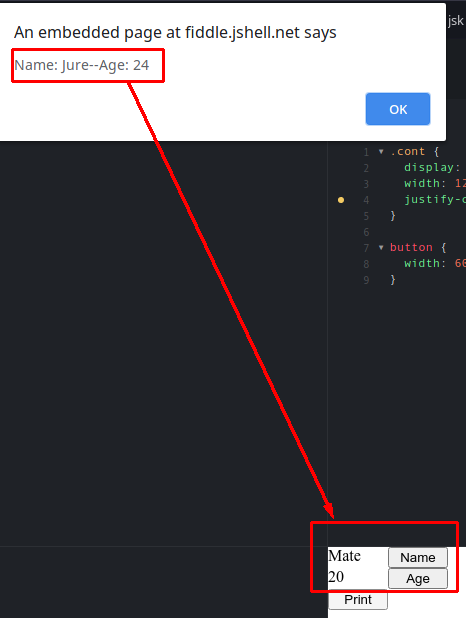
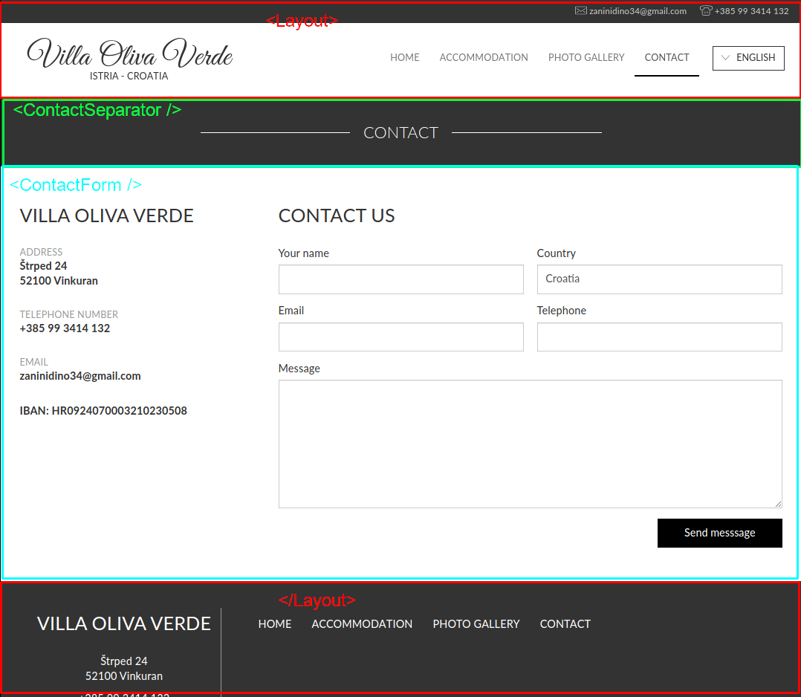
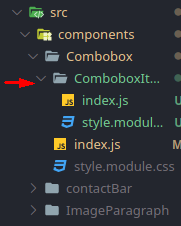
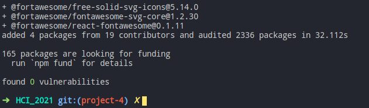
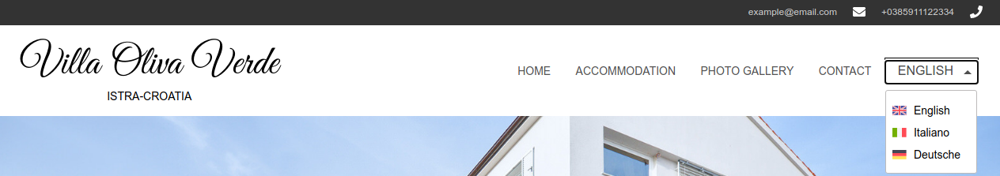
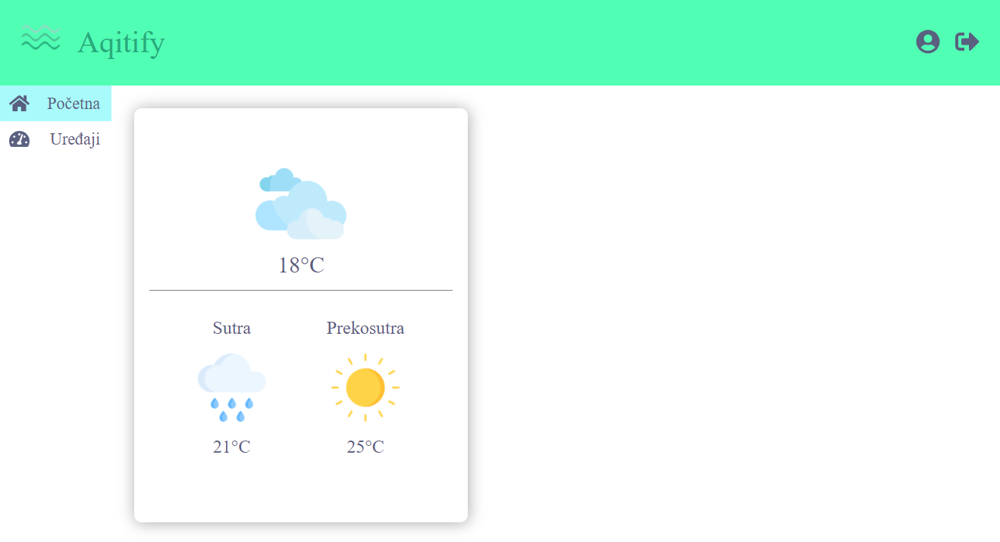
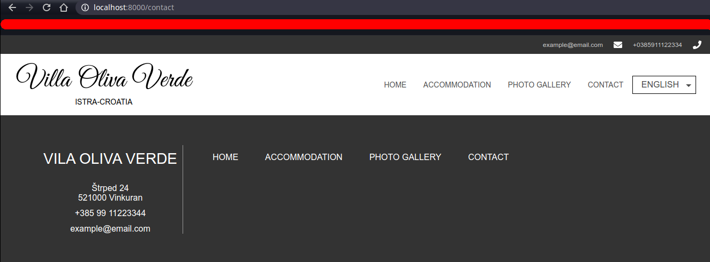

# Uvod
U ovoj vježbi dodajemo još jednu stranicu. Koristit ćemo `layout` koji smo stvorili ranije da bismo uštedjeli na kodu. Mislim da će uporaba `layout` komponenti tada postati u potpunosti jasna.
 
Postoji još jedan koncept koji nismo dosad objasnili, a spada pod ključne koncepte Reacta: **state**. Ako ste imalo čitali [docs](https://reactjs.org/docs/getting-started.html) morali ste vidjeti [state](https://reactjs.org/docs/faq-state.html#gatsby-focus-wrapper). *State* se često koristi uz props za dinamičko mijenjanje sadržaja. Svaka promjena *state* varijable uzrokuje ponovno iscrtavanje stranice (render). Nakon što obradimo *state*, stvorit ćemo vlastitu komponentu koja ga koristi (`Combobox` na koji smo se rekli vratiti).
 
Postoji još nešto što smo izbjegli ranije: `node_modules`. U prvoj vježbi kad smo postavljali projekt rekli smo da se koristi za javne JS biblioteke (library). Sada ćemo dodati neke nove komponente (poput `Combobox`)  objasniti kako radi `npm`. Čemu služi postat će jasno jako brzo :)
## Segment stranice
Segment koji pokrivamo je nova stranica: **Contact**.
<p align="center">
  
</p>
 
Spojit ćemo stranicu na navigaciju tako da klikom na "CONTACT" navigiramo se na ovu stranicu. Kod stranice nalazit će se u `pages` folderu gdje se dosad nalazio samo `index`. Objasnit ćemo kako radi navigiranje i kako se stranice povezuju.
 
## React concept
Kao što smo najavili, koncepti koje ćemo objasniti su React *state* i upravljanje bibliotekama (library). 
### React State
Prije nego krenemo u *state* ide malo teorije. React koristi poznati dizajn pattern koji se zove **observer pattern**. Točnije, React implementira **state pattern** koji je njegov podskup. Ideja je jednostavna. Jedan objekt ima svoje unutarnje stanje (state). Drugi objekti su povezani s tim stanjem i na osnovu njega definiraju svoje ponašanje i svoje stanje. Kad se stanje tog objekta promijeni, svi povezani objekti su obaviješteni te mijenjaju svoje ponašanje i/ili svoja unutarnja stanja. Zatim se ta promjena propagira dalje na objekte koji su povezani s njihovim stanjima. Svaki od tih objekata **reagira** na promjenu svog ili stanja drugih objekata. Otud React dobiva svoje ime.
 
Implementacija je jednostavna. Postoji poseban objekt koji se zove `state` i posebna funkcija koja se zove `setState()`. Poziv funkcije `setState` mijenja `state` i React automatski notificira sve povezane komponente. Komponente se povezuju na `state` tako što primaju `props` koji je dio tog `state` objekta. Sad možda postaje teško za pratiti... Primjer je 1000 riječi.
 
Imamo jednostavnu komponentu koja ima dva `<p>` elementa i dva `<button>` elementa. Prvi `<p>` je ime osobe, a drugi je broj godina starosti. Kad kliknemo na prvi button želimo da se promijeni text unutar prvog `<p>`, a kad na drugi da se poveća broj godina. Kako bismo to napravili?
 
Ideja koja nam pada na pamet je jednostavna: definiramo dvije varijable za imena osoba i jednu za broj godina. `OnClick` u buttonu mijenjamo svaku od njih. Ništa posebno. Pokušajmo:
```jsx
import React from 'react'
 
let name = "Mate"
let age = 20
 
const StateDemo = () => (
  <div>
    <div className="cont">
      <p>{name}</p>
      <button onClick={() => name = "Jure"}>Name</button>
    </div>
    <div className="cont">
      <p>{age}</p>
      <button onClick={() => age = age + 1}>Age</button>
    </div>
  </div>
)
```
https://jsfiddle.net/kdtcsw7j/
 
Klik na button ne mijenja ništa. Možda smo krivo spojili `onClick`? Dodajmo `<button>` koji će ispisati obje varijable:
```jsx
import React from 'react'
 
let name = "Mate"
let age = 20
 
const StateDemo = () => (
  <div>
    <div className="cont">
      <p>{name}</p>
      <button onClick={() => name = "Jure"}>Name</button>
    </div>
    <div className="cont">
      <p>{age}</p>
      <button onClick={() => age = age + 1}>Age</button>
    </div>
    <button onClick={() => window.alert(`Name: ${name}--Age: ${age}`)}>Print</button>
  </div>
)
```
https://jsfiddle.net/Ly91egqb/
 
Kliknimo na prvi button pa na drugi par puta pa na treći. Vidimo li da se varijable mijenjaju, a HTML ostaje isti? Zašto?
<p align="center">
  
</p>
 
Razlog je dosta logičan. Kad se komponenta stvorila prvi put, vrijednost tih varijabli je bila "Mate" i "20". To je ono što je React pretvorio u HTML. Vrijednost tih varijabli se mijenja, ali se komponenta ne stvara ponovno. Ostala je zaleđena u svom prvobitnom stanju. Recimo da baš i nije... *Reaktivna* :D
<p align="center">
  
</p>
 
<a name="state"></a>U redu, trebamo samo reći komponenti da se osvježi s novim vrijednostima i to je to?<br />
Ne baš. Zamislimo koji bi to bio nered, da moramo svakoj komponenti govoriti da se osvježava kad želimo promijeniti nešto. React ovo riješava koristeći spomenuti **state**. Evo kako radi.
 - Radimo import state funkcije
 - Dodajemo tijelo i return u komponentu*
 - Stvaramo varijablu koja je dio state objekta i njenu set funkciju **unutar** komponente
 - Pozovemo pripadajuću `set` u `onClick` funkcijama
 
 ```jsx
 import React, { useState } from 'react'
 
 const StateDemo = () => {
  const [name, setName] = useState("Mate");
  const [age, setAge] = useState(20);
 
  return (
  <div>
    <div className="cont">
      <p>{name}</p>
      <button onClick={() => setName("Jure")}>Name</button>
    </div>
    <div className="cont">
      <p>{age}</p>
      <button onClick={() => setAge(age + 1)}>Age</button>
    </div>
    <button onClick={() => window.alert(`Name: ${name}--Age: ${age}`)}>Print</button>
  </div>
  )
}
 ```
https://jsfiddle.net/qz4he5uv/
 
> Primijetit ćete da u jsfiddle nema import naredbe nego uzimamo `useState` iz `React` objekta</br>
> To je specifično za jsfiddle. U normalnoj praksi koristit ćemo import kao što je dan iznad.
 
> *Razlog zbog kojeg dodajemo tijelo i return u komponentu je taj što `useState()` **moramo** pozvati unutar tijela komponente i to na početku! Poziv te funkcije mora biti prva stvar unutar komponente. [Docs](https://reactjs.org/docs/hooks-rules.html)
 
Kako bismo napravili da svakim klikom na prvu tipku mijenjamo ime iz "Mate" u "Jure" i iz "Jure" u "Mate"? Pokušajte sami. Trebamo samo ubaciti malo logike u prvi `onClick`.
 
Bitne napomene uz **state**. Kod guglanja često ćete vidjeti ovakav kod: 
```jsx
class Example extends React.Component {
  constructor(props) {
    super(props);
    this.state = {
      count: 0
    };
  }
 
  render() {
    return (
      <div>
        <p>You clicked {this.state.count} times</p>
        <button onClick={() => this.setState({ count: this.state.count + 1 })}>
          Click me
        </button>
      </div>
    );
  }
}
```
gdje imate nekakav `class` i `React.Component` pa na dnu neki `render()` koji vraća *JSX*. Ovo je stari način pisanja Reacta. Tad je *state* postojao samo kod komponenti koje su `class`, a kod funkcionalih komponenti (to su sve komponente koje smo mi dosad napisali) *state* nije bio dostupan. Iz tog razloga funkcionalne elemente su se "kačile" na jednu statefull *class* komponentu i koristile njezin *state*. To je znalo rezultirati dosta složenim konstrukcijama u većim aplikacijama. *Class* komponente nisu izbačene niti se izbjegavaju, još uvijek imaju svoju ulogu. Ako se odlučite pratiti neki tutorial na internetu koji koristi *class* to je skroz ok i kod će raditi kako treba bez penala.
 
<a name="hook"></a>Sad objasnimo što je `useState` i šta se događa tamo gore. `useState` je **[React Hook](https://reactjs.org/docs/hooks-intro.html)**. To je dosta nov koncept koji je između ostalog dao *state* funkcionalnim komponentama. *Hookova* ima više, ali mi ćemo se zadržati na `useState` i kasnije `useEffect` kad budemo radili login. [Docs](https://reactjs.org/docs/hooks-state.html) je tu.
 
*useState* je funkcija koja omogućava komponenti koja ju pozove korištenje statea (logično). To je funkcija koja vraća array od 2 elementa:
  1) Varijablu koja je dio statea
  2) Funkciju koja postavlja / mijenja tu varijablu
 
Ta dva elementa uvijek dolaze u paru. Funkcija `useState()` prima argument. Taj argument, kako ste već mogli zaključiti, je početna vrijednost varijable. Pogledajmo sad ponovno naš primjer:
```jsx
  const [name, setName] = useState("Mate");
  const [age, setAge] = useState(20);
  // ...
  // ...
  <button onClick={() => setName("Jure")}>Name</button>
  <button onClick={() => setAge(age + 1)}>Age</button>
```
Postaje bistrije? `Set` funkcije primaju novu vrijednost *state* varijable. Nakon što funkcija izvrši, komponenta se ponovno iscrta. U Reactu to se zove **rerender** i spada pod ključne koncepte Reacta. Što će se dogoditi ako varijablu koja je state pošaljemo drugoj komponenti kroz `props` i onda pozovemo `setState`?<br/>
Slanjem state varijable kroz `props` toj drugoj komponenti mi smo ih združili. To jest, druga komponenta je "zakačena" na prvu. Nakon što se prva komponenta rerendera, rerenderat će se i sve komponente unutar nje kojima se mijenja props. Znači da će se i ta komponenta osvježiti i primiti novu vrijednost kroz props. Ako se props ne mijenja rerender se **NEĆE** dogoditi zbog uštede na vremenu i time boljim performansama (zašto rušiti i ponovno graditi komponentu koja se apsolutno nije promijenila).
 
>**BITNO: Rerender se događa u dva slučaja:**
> - **Komponenti se mijenja state**
> - **Komponenti se mijenja props**
 
### NPM i node_modules <a name="npm"></a>
Ako pogledate po internetu kako nešto napraviti u Reactu vrlo je vjerovatno da će vas tutorial uputiti na neku gotovu komponentu ili rješenje na npmjs.com. Kao što smo spomenuli u uvodnom poglavlju, **NPM** je **N**ode **P**ackage **M**anager. Mi zapravo već koristimo NPM upravo sad. Pomoću njega smo instalirali *gatsby*, a gatsby je instalirao React i niz drugih komponenti. Gdje se nalaze? Nalaze se u *node_modules* folderu. 
 
Svi dodatni paketi koje instaliramo dodaju se u *node_modules*. Popis paketa je vidljiv u `package.json` datoteci pod `dependencies` objektom.
 
#### `package.json` dependency, NPM i git
Svaki put kad dodamo neki novi paket on se upisuje u `package.json`. Razlog je očit: želimo znati što sve naša aplikacija treba da bi mogla raditi. Kada prvi put napravite `git clone` bilo kojeg JS projekta primijetit ćete da nemate `node_modules`. Potrebno je pokrenuti `npm install` da bi se `node_modules` pojavio. 
 
Razlog je isto očit: `node_modules` **ne ide** u git, a razlog tome je taj što je folder prevelik. Također, smatra se boljom praksom da su paketi "svježi", a postoje i neki sigurnosni razlozi u koje nećemo ulaziti. Bitno je da `node_modules` **nikad ne ide** pod git.
 
Kada dodajemo novi paket koristimo `npm i <ime paketa>`. Ova uputa bit će napisana na *npmjs* ili *github* stranici paketa kojeg tražite.
Svaki od ovih paketa onda postaje **dependency**.
> Dependency je dio softvera o kojem drugi softver ovisi. U našem slučaju, React je dependency za našu stranicu jer se naš kod ne može izvršiti bez njega.
 
#### Bugovi, problemi i greške s NPM-om
Rad s NPM-om će uzrokovati greške. Nažalost. Srećom, lako se rješavaju. Sve što treba napraviti je izbrisati `node_modules` iz projekta i pokrenuti `npm install`. Ovaj postupak će riješiti 90% problema kojih možemo imati s paketima. Riječ je o dobrom starom "ugasi pa upali" rješenju. 7% se može riješiti ako još izbrišemo i `package-lock.json` prije poziva `npm install`. Međutim, s ovim treba bit oprezan. To je zapravo "ugasi, resetaj pa upali" na neki način. Ako i nakon toga postoji problem, vjerovatno je problem sa samim paketom. Tada treba čitati dokumentaciju dotičnog paketa na githubu.
 
Simptomi problema koje će riješiti "ugasi pa upali" su greške tipa da paket fali, da se funkcija ne može pronaći, da je nešto u paketu undefined ili null. Sve su to zapravo simptomi da se paket nepotpuno instalirao.
Ovo se može dogoditi ako se `package.json` mijenja ručno. Ako dodajemo ili brišemo unose tamo bez korištenja `npm` programa.
## Planiranje komponenti
Za početak ubacit ćemo par stvari koje smo ranije ostavili za kasnije :)
 
Jedna od njih je pravi `Combobox` umjesto našeg *mock* boxa. Također, vidjet ćemo kako ubaciti **FontAwsome** koji nam nudi razne ikone.
 
Nakon toga napravit ćemo pravi `Combobox` sami (ručno) koristeći *useState* o kojem smo pričali ranije. 
 
Na kraju, radimo `Contact` stranicu.
<p align="center">

</p>
 
## Sadržaj git commitova <a name="toc"></a>
Commitovi će sadržavati kod za doradu starih komponenti i dodavanje novih. Inače, te dvije radnje se rade u dva brancha umjesto u jednom. To će biti naznačeno. Budući da su ovo vježbe, ostavljeno je ovako.
  - [**Commit 1: creating accutal Combobox**](#c1)
    - Radimo Combox
    - Radimo ComboboxItem
    - Dodajemo novu konstantu
    - Radimo import i pripremamo state
    - Radimo map na različite načine
    - CSS
    - Koristimo state varijable
    - Rješavamo `selectedItem`
    - Definiramo inicijalne vrijednosti
    - Rješavamo pop-in
  - [**Commit 2: rework: adding FontAwsome**](#c2)
    - Dodajemo *FontAwsome*
    - Dodajemo ikone u `ContactBar`
  - [**Commit 3: rework: adding Combobox picker**](#c3)
    - Dodajemo `react-flags-select` 
    - Importamo ga umjesto `<Combobox />`
  - [**Commit 4: adding gatsby's background image**](#c4)
    - Dodajemo `gatsby-background-image` paket
    - Skidamo sliku u `src/images/titleImage.jpg`
    - Koristimo `gatsby-background-image` umjesto CSS-a
  - [**Commit 5: contact page init**](#c5)
    - Dodajemo page u `pages/contact.js`
    - Dodajemo navigacijski link
    - Dodajemo `<layout/>`
    - Dodajemo `<ContactSeparator />`
  - [**Commit 6: contact page ContactForm**](#c6)
    - Stvaramo `ContactForm` modul
    - Dodajemo `ContactForm` u `pages`
 
# Implementacija
Stvaramo Combobox koji smo prije mockali. Stvaranje te komponente je složeno, ali se sastoji od jednostavnih koraka.
Kasnije ćemo vidjeti kako si možemo skratiti muke koristeći `npm`
 
Dodajemo [*FontAwsome*](https://fontawesome.com/) za React kao [npm package](https://github.com/FortAwesome/react-fontawesome). 
 
Kad dodamo ikone, onda prelazimo na `Combobox`. Dodat ćemo [paket](https://www.npmjs.com/package/react-flags-select). Live demo možemo vidjeti [ovdje](https://ekwonye-richard.github.io/react-flags-select/).
 
Za kraj napravit ćemo navigaciju na `Contact` page i cijeli page.
 
## Commit 1: Creating actual Combobox <a name="c1"></a>
Ovo će biti jako dug commit...<br/>
Idemo napraviti pravi `Combobox` koristeći React state koji smo upoznali ranije. Očito je da taj state ima dvije varijable:
  - Trenutno odabran jezik
  - Je li Combobox otvoren
 
<a name="ic"></a>Unutar `Combobox` komponente stvorit ćemo i **unutarnju komponentu** koja će se nalaziti u `Combobox` folderu.
> Unutarnja komponenta je komponenta koju isključivo koristi jedna komponenta i usko je vezana uz nju. Zanči da se **ne može** lako koristiti u drugim komponentama. To jest, pisana je specifično za tu jednu komponentu.
 
Unutarnja komponenta za `Combobox` će biti `ComboboxItem` koji sadrži tekst (naziv jezika) i sliku (zastavu države). Koristit ćemo `map` funkciju za stvaranje niza `ComboboxItem` komponenti.
 
### Combox
HTML ima `<select>` i `<option>` tagove koji služe za stvaranje `Combobox` komponenti. Mi to nećemo koristiti jer ne želimo implementirati logiku ručno. Također, `<option>` ne podržava slike :/ <br/>
Koristit ćemo `div` i `ul`.
 
### ComboboxItem
`ComboboxItem` komponenta je `<li>` s labelom i zastavom države. Label je `<span>`, a zastava je ``.
 
### Kod
Idemo u `components/Combobox` i brišemo sve. Stavljamo sljedeći kod:
```jsx
import React from 'react'
 
import styles from './style.module.css' 
 
const Combobox = () => {
    return (
        <div className={styles.combobox}>
        </div>
    )
}
 
export default Combobox
```
 
Sad dodajmo u `src/constants` niz koji drži ponuđene jezike i slike koje idu uz njih:
```jsx
// src/constants/const.js
export const navs = ['Home', 'Accommodation', 'Photo Gallery', 'Contact']
 
export const languages = [
    {
        language: "English",
        name: "eng",
        flag: "http://villaolivaverde.com/static/template_shared/img/en.svg"
    },
    {
        language: "Italiano",
        name: "it",
        flag: "http://villaolivaverde.com/static/template_shared/img/it.svg"
    },
    {
        language: "Deutsche",
        name: "de",
        flag: "http://villaolivaverde.com/static/template_shared/img/de.svg"
    },
]
```
Objasnimo polja:
  - *language*: Naziv jezika, tj. ono što piše uz zastavu
  - *name*: Nije vidljiv korisniku. Omogućava nam praćenje odabrane opcije
  - *flag*: Link na sliku zastave
 
Sad imamo nacrt za `ComboboxItem`. Mora primati ta tri polja kroz svoj `props`. I mora primati još jedno: *selected*. To je da znamo koji je od njih odabran. Napravimo sad `ComboboxItem` u `components/Combobox` folderu:
<p align="center">
  
</p>
 
```jsx
import React from 'react'
 
import styles from './style.module.css'
 
const ComboboxItem = ({language, name, flag, selected}) => (
    <div key={name}
    selected={selected} 
    name={name} 
    className={styles.coboboxItem}>
        <span>{language}</span>
        
    </div>
)
 
export default ComboboxItem
```
 
Sad u `Combobox` dodamo state i dva importa koja smo upravo pripremili:
```jsx
import React, {useState} from 'react'
 
import { languages } from '../../constants/const'
import ComboboxItem from './ComboboxItem'
import styles from './style.module.css' 
 
const Combobox = () => {
    const [selectedItem, setSelectedItem] = useState()
    return (
      <div className={styles.combobox}>
        <ul>
        </ul>
      </div>
    )
}
 
export default Combobox
```
Dodamo dobri stari `map()` i imamo ovo:
```jsx
// ...
return (
    <div className={styles.combobox}>
        {<ul>
          {languages.map(el => 
            <ComboboxItem language={el.language}
              name={el.name} 
              flag={el.flag} />)}
        </ul>
        }
    </div>
)
//...
```
Primijetimo ovaj patern `name={el.name} language={el.language}` itd. Ono što radimo je uzimamo vrijednosti koje smo definirali u `const` i dajemo ih kao props u `<ComboboxItem>` eksplicitno. Mogli smo i izbaciti `el.` ako napišemo ovako: <a name="dec"></a>
```jsx
return (
  <div className={styles.combobox}>
      {<ul>
        {languages.map(({language, name, flag}) => 
          <ComboboxItem language={language}
            name={name} 
            flag={flag} />)}
      </ul>
      }
  </div>
)
```
Napravili smo dekonstrukciju argumenata odmah u pozivu funkcije. To je isto što radimo i s `props` kod komponenti.
 
Ništa posebno pametno, samo ušteda. Ali, ovaj sljedeći zapis još je zanimljiviji:
```jsx
return (
    <div className={styles.combobox}>
      {<ul>
          {languages.map(el => 
          <ComboboxItem {...el} />)}
       </ul>
      }
    </div>
)
```
Što se tu događa? Zapravo ono što smo napravili je isto kao i u primjeru iznad, samo kraće. Pridijelili smo sva polja u `el` **istoimenim** *props* poljima. Znači `el.languge` ide u `props.language`, `el.name` ide u `props.name` itd. Ako imate typo, neće raditi.
> Sva tri načina rade istu stvar i imaju isti performans. Sami birajte pristup koji vam se sviđa. Sve ovo je dio novog ES6 standarda i neće raditi u običnom browser JS-u (tamo "..." operator ne postoji).<br/>
> Bitno je da polja koja se mapiraju i props imaju ista imena ako želite ovo koristiti. Inače, mora se koristiti prvi ili drugi pristup.
 
Sad još moramo uvjetovati prikaz izbornika. Ne želimo da se prikazuje ako je zatvoren. Dodajemo `const [open, setOpen] = useState(false)` i uvjetni rendering sa `?`:
```jsx
import React, {useState} from 'react'
 
import { languages } from '../../constants/const'
import ComboboxItem from './ComboboxItem'
import styles from './style.module.css' 
 
const Combobox = () => {
    const [selectedItem, setSelectedItem] = useState()
    const [open, setOpen] = useState(false)
    return (
        <div className={styles.combobox}>
            {open ? 
                <ul>
                    {languages.map(el => 
                    <ComboboxItem {...el} />)}
                </ul>
                : null
            }
            {selectedItem}
        </div>
    )
}
 
export default Combobox
```
Dodajemo i `selectedItem`. To je ono što želimo da piše kad odaberemo jezik. <br/>
Znači ako želimo prikazati izbornik onda `open` mora biti `true`, inače `false`.
Kad želimo samo prikazati ili ne prikazati komponentu ovisno o uvjetu, možemo koristiti i `&&` umjesto `?`. Tada nam ne treba `null`. 
```jsx
/
<div className={styles.combobox}>
    {open && 
        <ul>
            {languages.map(el => 
            <ComboboxItem {...el} />)}
        </ul>
    }
</div>
```
Dodajmo CSS u `Comobobox` i `ComboboxItem`:
```css
.combobox {
    position: relative;
    cursor: pointer;
    margin-left: 30px;
    text-align: center;
    display: block;
    height: 36px;
    width: 107px;
    border: solid 1px black;
    font-size: 14px;
    line-height: 36px;
    text-transform: uppercase;
}
 
.combobox ul {
    list-style: none;
    display: flex;
    flex-flow: column;
    padding: 0;
    margin: 0;
    position: absolute;
    top: 38px;
    background-color: #eee;
    z-index: 10;
}
```
`ComboboxItem`:
```css
.comboboxItem {
    display: flex;
    text-align: center;
    font-size: 12px;
    width: 107px;
    height: 36px;
    padding: 0;
    align-items: center;
    justify-content: center;
}
 
.comboboxItem:hover {
    cursor: pointer;
    background-color: white;
}
 
.comboboxItem img {
    display: flex;
    height: 18px;
    padding-left: 7px;
}
 
.selected {
    background-color: white;
}
```
Sad kad smo riješili izgled, riješimo logiku.
### Logika i state <a name="props"></a>
Kako kontroliramo je li `Combobox` otvoren ili zatvoren?<br/>
**Klikom**<br/>
Koristimo `onClick` *callback* za postavljanje `isOpen` i `onClick` na item za postavljanje odabranog itema. Znači, dva `onClick` i dvije `setState` funkcije.
- Kada se klikne na glavni `<div>` stavljamo open na suprotnu vrijednost (toggle)
- Kad se klikne na *item* stavljamo `selectedItem` na kliknuti *item*
- Klikom na *item* aktivira se `onClick` na `Combobox` iako nije kliknut* tako da će se Combobox uvijek sam zatvoriti nakon odabira
 
>*Ovaj efekt se zove "event propagation". Nama radi u korist u ovom slučaju, ali isto tako može biti nepoželjan. Tada ga moramo ugasiti: [Više ovdje](https://www.freecodecamp.org/news/a-simplified-explanation-of-event-propagation-in-javascript-f9de7961a06e/)
 
Krenimo s prvom funkcijom u `onClick`. Koristimo lambda anonimnu definiciju:
```jsx
// ...
return (
    <div className={styles.combobox} onClick={() => setOpen(!open) }>
        {open &&
            <ul>
                {languages.map(el => 
                <ComboboxItem {...el} />)}
            </ul>
        }
        {selectedItem}
    </div>
)
// ...
```
Sad kad kliknemo na div, pokaže se izbornik ili se sakrije :)
 
>Primijetite da slike trepere. Kao da kasne s učitavanjem. To je zato što se svaki put izbornik ponovno stvara. Možemo to riješiti tako što umjesto da sakrivamo izbornik u HTML-u, sakrijemo ga s `display: none` CSS-om. Pokazat ćemo i to. <br/>
>Drugo rješenje je `gatsby-image` koji će preloadat slike i neće treperiti. Sad možda postaje jasnije čemu služi taj plugin.
 
Implementirajmo sad odabir *itema*. Budući da nam treba `onClick` unutar `ComboboxItem` komponente, idemo tamo:
```jsx
const ComboboxItem = ({language, name, flag, selected}) => (
    <li selected={selected} 
    key={name}
    name={name}
    onClick={() => {}}
    className={styles.comboboxItem} >
        <span>{language}</span>
        
    </li>
)
```
Primijetimo da imamo problem. `onClick` je ostavljen prazan jer ne može pristupiti `state` varijabli od `Combobox` niti `set` funkciji. Što sad?
 
Sad se primjenjuje taj famozni React *state pattern*. Trebamo samo poslati tu funkciju iz `Combobox` komponente u `ComboboxItem`. Taj prop ćemo zvati `setSelected`:
```jsx
const ComboboxItem = ({language, name, flag, selected, setSelected}) => (
    <li selected={selected} 
    key={name}
    name={name}
    onClick={() => setSelected({name, language})}
    className={styles.comboboxItem} >
        <span>{language}</span>
        
    </li>
)
```
Funkcija prima name i language:
- Name zato što želimo znati ime koje je označeno
- Language jer želimo ispisati jezik koji je odabran u izborniku dok je zatvoren
 
Sad iskoristimo te podatke i pošaljimo tu funkciju iz `Combobox`:
```jsx
    const [selectedItem, setSelectedItem] = useState({}) // dodajemo prazan objekt 
    const [open, setOpen] = useState(true)
    return (
        <div className={styles.combobox} onClick={() => setOpen(!open) }>
            {open &&
                <ul>
                    {languages.map(el => 
                    <ComboboxItem {...el} setSelected={setSelectedItem} />)}
                </ul>
            }
            {selectedItem.language}
        </div>
    )
```
Dodali smo `selectedItem.language` i prazan objekt u `useState`. Da nismo, `selectedItem.language` bi bacio error jer je `selectedItem` `undefined` na početku. Sad vidimo da radi kako treba, ali na samom početku `Combobox` je prazan. Riješimo i to sa `useState` i `.find()`. Također, stavimo `open` na false na početku:
```jsx
const [selectedItem, setSelectedItem] = useState(
  languages.find(el => el.name === "eng"))
const [open, setOpen] = useState(false)
```
Kao što ste vjerovatno pretpostavili, `find` traži element niza koji zadovoljava uvjet. U ovom slučaju, tražimo element kojem je `name` "eng".
 
Još dvije stvari. Definirali smo klasu (i prop) `selected` u `ComboboxItem` koji bi bilo dobro iskoristiti. Nije teško, jedna usporedba i jedan ternarni operator :)
 
Također, želim vam pokazati kako možemo izbjeći *pop-up* slika u izborniku uz CSS.
 
`Selected` prvo: 
```jsx
<ul>
    {languages.map(el => 
    <ComboboxItem {...el} 
      setSelected={setSelectedItem}
      selected={el.name === selectedItem.name}
    />)}
</ul>
```
I dodatak u `className` unutar `ComboboxItem`:
```jsx
className={`${styles.comboboxItem} ${selected ? styles.selected : ''}`} >
```
 
TA-DA!
 
A *pop-up*? <br/>
Prelako, evo ga:
```jsx
{<ul style={{display: open ? 'flex' : 'none'}}>
    {languages.map(el => 
    <ComboboxItem {...el} 
      setSelected={setSelectedItem}
      selected={el.name === selectedItem.name}
    />)}
</ul>}
```
Umjesto da uvjetujemo stvaranje cijelog `<ul>` taga, uvjetujemo samo njegov prikaz kroz CSS.
Puff, popup je nestao!
<p align="center">
  
</p>
 
Možemo commitat.
> Ovaj commit napravljen odjednom je jako loša praksa. Inače bismo ovo napravili kroz 3,4 commita, ali budući da je ovo demo
> može proći. Također, služi kao dobar primjer zašto ne valja raditi commitove na ovaj način. :)
 
[Sadržaj git commitova](#toc)
 
## Commit 2: rework: adding FontAwsome<a name="c2"></a>
  - Dodajemo *FontAwsome*
  - Dodajemo ikone u `ContactBar`
 
Ako [upišemo u google](http://letmegooglethat.com/?q=font+awsome+react+npm) "font awsome react" doći ćemo do [ovog](https://github.com/FortAwesome/react-fontawesome) paketa. Prema uputama vidimo da se paket instalira sljedećom naredom:
```bash
$ npm i --save @fortawesome/fontawesome-svg-core  @fortawesome/free-solid-svg-icons @fortawesome/react-fontawesome
```
> Napomena: instalacija se obavlja lokalno. Znači da se terminal treba nalaziti unutar foldera projekta u kojem se nalazi package.json
 
Ako je sve prošlo u redu vidimo sljedeću poruku:
 
<p align="center">
  
</p>
 
`git status` će pokazati `package.json` i `package-lock.json` kao promijenjene datoteke. `package-lock.json` ne diramo, to je autogenerated datoteka. Unutar `package.json` datoteke vidimo da su dodani novi unosi pod *dependencies*:
```json
{// ...
    "dependencies": {
      "@fortawesome/fontawesome-svg-core": "^1.2.30",
      "@fortawesome/free-solid-svg-icons": "^5.14.0",
      "@fortawesome/react-fontawesome": "^0.1.11",
      // ...
      }
  // ...
}
```
 
Dodajmo sad ikone u `src/components/contactBar`. Ovo je [popis ikona](https://fontawesome.com/icons?m=free). Ikone koje mi uzimamo su:
  - [envelope](https://fontawesome.com/icons/envelope?style=solid)
  - [phone](https://fontawesome.com/icons/phone?style=solid)
 
Vidimo da su imena ikona `fa-envelope` i `fa-phone`. U Reactu će to postati `faEnvelope` i `faPhone`. Importamo ih i dodamo u container komponentu:
```jsx
import React from 'react'
import { FontAwesomeIcon } from '@fortawesome/react-fontawesome'
import { faEnvelope, faPhone } from '@fortawesome/free-solid-svg-icons'
 
import styles from './style.module.css'
 
const ContactBar = () => (
    <main className={styles.container}>
       <span>example@email.com</span>
       <FontAwesomeIcon icon={faEnvelope} color="white" />
       <span>+0385911122334</span>
       <FontAwesomeIcon icon={faPhone} color="white"/>
    </main>
)
 
export default ContactBar
```
Također dodamo i `color="white"`. `<FontAwesomeIcon />` prima i druge CSS parametre, primjeri [ovdje](https://www.npmjs.com/package/@fortawesome/react-fontawesome#basic).
 
Također, dodajmo i onu strelicu koja nam fali u `Combobox`:
```jsx
import React, {useState} from 'react'
import { FontAwesomeIcon } from '@fortawesome/react-fontawesome'
import { faChevronDown } from '@fortawesome/free-solid-svg-icons'
 
import { languages } from '../../constants/const'
import ComboboxItem from './ComboboxItem'
import styles from './style.module.css'
 
const Combobox = () => {
    const [selectedItem, setSelectedItem] = useState(
      languages.find(el => el.name === "eng"))
    const [open, setOpen] = useState(false)
    return (
      <div className={styles.combobox} onClick={() => setOpen(!open) }>
          {<ul style={{display: open ? 'flex' : 'none'}}>
              {languages.map(el => 
              <ComboboxItem {...el} 
                setSelected={setSelectedItem}
                selected={el.name === selectedItem.name}
              />)}
           </ul>
          }
          <FontAwesomeIcon icon={faChevronDown} size="0.2x" style={  {paddingRight: "12px"}} />
          {selectedItem.language}
      </div>
    )
}
 
export default Combobox
```
 
Commitajmo promjene!
 
[Sadržaj git commitova](#toc)
 
## Commit 3: rework: adding Combobox picker<a name="c3"></a>
- Dodajemo `react-flags-select` 
- Importamo ga umjesto `<Combobox />`
 
Sad ćemo vidjeti kako smo mogli izbjeći cijeli prvi commit i izmišljanje tople vode.
 
Koristimo [docs](https://www.npmjs.com/package/react-flags-select) kao i prije. 
```bash
npm install react-flags-select --save
```
Ako je sve prošlo ok, idemo ga dodati u `src/components/Navigation` umjesto naše dosadašnje (mukotrpno napisane) `<Combobox />` komponente.
```jsx
import React from 'react'
import ReactFlagsSelect from 'react-flags-select';
import 'react-flags-select/css/react-flags-select.css';
 
import NavigationBar from '../NavigationBar'
import styles from './style.module.css'
 
const Navigation = ({ activeTab }) => (
    <section className={styles.navigation}>
        <NavigationBar activeTab={activeTab} />
        <ReactFlagsSelect  countries={['GB', 'IT', 'DE']}
          className={styles.combobox}
          placeholder="ENGLISH"
          customLabels={{"GB": "English","DE": "Deutsche","IT": "Italiano"}}
        />
    </section>
)
 
export default Navigation
```
`CustomLabels` definira tekst (labelu) za danu državu<br/>
`Placeholder` definira početni tekst kad se učita stranica<br/> 
Dodamo i `className` pa možemo malo popraviti CSS. Ovo je standardna praksa.
Ako se pitate kako znam sve ovo, odgovor je [dokumentacija](https://ekwonye-richard.github.io/react-flags-select/). Ako radite sa *npm* paketima morate se naoružati strpljenjem i pripremiti na dugo čitanje dokumentacije koja je često dosta loše napisana (za ovaj paket je dobra :thumbsup:). Gledajte da je broj skidanja visok i da je paket popularan. Nemojte skidati sve i svašta.
 
Third-party komponente će često imati otvoren `className` tako da možemo stilizirati. Mijenjamo postojeći `Navigation/style.module.css`
```css
.navigation {
    height: 52px;
    display: flex;
    align-items: center;
}
 
.combobox {
    border: black solid 1px;
    padding-bottom: 0;
}
```
 
Trebali bismo dobiti ovo:
<p>
  
</p>
 
Sad možemo usporediti koliko je vremena trebalo da napišemo ovo, a koliko da napišemo prvi commit. Postoje i mane:
- Ako je paket loše dokumentiran, izgubi se dosta vremena
- Nema fine kontrole nad izgledom i ponašanjem komponente (mijenjamo samo što komponenta dopušta)
- Ako se dependenci ažuriraju, paket može prestati raditi
 
Ako radite pixel-perfect implementaciju, nećete se često koristiti NPM-om. Većinu stvari ćete raditi ručno. Ali, zato ćete to više naplatiti i trebat će vam više vremena. Potrebno je naći fini balans između vremena i prilagodbe dizajnu. Ponekad je bolje odstupati od dizajna i uštediti na vremenu, a ponekad to nije opcija.
 
Commitajmo promjene.
 
[Sadržaj git commitova](#toc)

## Commit 4: adding gatsby's background image<a name="4">
- Dodajemo `gatsby-background-image` paket
- Skidamo sliku u `src/images/titleImage.jpg`
- Koristimo `gatsby-background-image` umjesto CSS-a

Dodajmo paket [`gatsby-background-image`](#https://www.gatsbyjs.com/plugins/gatsby-plugin-remote-images/) kroz NPM:
```bash
$ npm i gatsby-background-image --save
```
Dodajmo sliku `http://villaolivaverde.com/imagecache/objectmax/27-12-19/55d36453-07b8-49f3-8763-6d157fa4be23.jpg` kao `src/images/titleImage.jpg`. Budući da samo dodali novu sliku potrebno je ponovno pokrenut gatsby server.
> !! Potreban je restart!!

Prije nego što promjenimo kod, izbacimo CSS sliku. Tako da kad se slika pojavi bez CSS-a, znamo da kod radi kako treba.
```css
.titleImage {
    height: 650px;
    width: 100%;
    position: relative;
}
```
Sad idemo u `components/TitleImage/index.js` i radimo promjene:
- Radimo import `gatsby-background-image`
- Radimo import `gatsby-image` i `graphql` modula
- Radimo GraphQL query koji dohvaća sliku
- Mjenjamo `<section>` sa `<BrackgoundImage>` komponentom

Baziramo GraphQL query na dokumentaciji [ovdje](#https://www.gatsbyjs.com/plugins/gatsby-background-image/#how-to-use). Primjetite da smo zamjenili `<StaticQuery>` sa `useStaticQuery()`. Oba rade istu stvar:
```jsx
import React from 'react'
import { useStaticQuery, graphql } from "gatsby"
import BackgroundImage from 'gatsby-background-image'

import TitleImage from '../../components/TitleImage'
import InquiryBlock from '../../components/InquiryBlock'

import styles from './style.module.css'

const TitlePage = () => {
    const data = useStaticQuery(graphql`query 
    {
        desktop: file(relativePath: { eq: "titleImage.jpg" }) {
          childImageSharp {
            fluid(quality: 90, maxWidth: 1920) {
              ...GatsbyImageSharpFluid_withWebp
            }
          }
        }
      }
    `)
    return (
        <BackgroundImage
        Tag="section"
        className={styles.titlePage}
        fluid={data.desktop.childImageSharp.fluid}
        backgroundColor={`#040e18`}>
            <TitleImage />
            <InquiryBlock />
        </BackgroundImage>
    )
}

export default TitlePage
```
Iako nema očite razlike, slika je sad optimizirana i dok se stranica učitava nećemo imati neučitanu sliku (bijelu pozadinu) nego nešto ovako:

<p align="center">
  
</p>

Ovisno o brzini interneta, slika će se osvježit nekoliko puta prije nego se u potpunosti prikaže.

Commitajmo promjene.
 
[Sadržaj git commitova](#toc)

## Commit 5: contact page init <a name="c5"></a>
  - Dodajemo page u `pages/contact.js`
  - Dodajemo navigacijski link
  - Dodajemo `<layout/>`
  - Dodajemo `<ContactSeparator />`
 
Ovo je dosta trivijalno, ali idemo redom. Naučit ćemo kako se implementira navigacija u gastbyu. Prvo, dodajemo novi page u `pages` kojeg ćemo zvati `contact.js`. 
```jsx
// src/pages/contact.js
import React from "react"
import HeaderFooterLayout from "../layouts/headerFooter"
 
const ContactPage = () => (
    <HeaderFooterLayout activeTab="Contact">
    </HeaderFooterLayout>
)
 
export default ContactPage
```
 
Ako sad odemo na `localhost:8000/contact` vidit ćemo ovo:
<p align="center">
  
</p>
 
<a name="link"></a>Dodajmo jos link u navigaciju da se klikom na "Contact" može doći na stranicu. To radimo u `NavigationBar` komponenti dodavanjem `<Link />` komponente koju nam daje gatsby. Kako je dodat?

Trebamo imati i navigaciju na *Home* koja nas vraća na početnu stranicu. Njen link je `/`. Također, kasnije će nam trebati galerija slika. Najbolji način za ovo riješiti je da u `constants/const/navs` niz ubacimo još i linkove navigacije. Imat ćemo niz objekata umjesto stringova, ali to je ok:
```jsx
export const navs = [
    {tab: 'Home', to: '/'},
    {tab: 'Accommodation', to: '/'}, 
    {tab: 'Photo Gallery', to: '/'}, 
    {tab: 'Contact', to: 'contact'}
]
```
Sad moramo pristupati `tab` polju za doći do teksta, ali imamo jasnu navigaciju. Također, definirali smo sve ostale tabove da idu na *Home* (`/`) umjesto da bacaju error. Sad samo izmapiramo ovo koristeći `map()`
```jsx
import React from 'react'
import { navs as navTabs } from '../../constants/const'
import styles from './style.module.css'
import { Link } from 'gatsby'

const NavigationBar = ({ activeTab, useThisStyle }) => (
    <nav className={styles[useThisStyle || 'navigationBar']}>
        {navTabs.map(({tab, to}) => (
          <Link to={to} >
              <li className={tab === activeTab ? styles.active : ''}>{tab}</li>
          </Link>)
        )}
    </nav>
)

export default NavigationBar
```
`<Link />` se koristi kad linkamo svoje lokalne stranice. Inače, možemo koristiti `<a>`. `to` definira cilj. U našem slučaju, `contact`. Za *Home* imamo `/`.
 
Primijetit ćemo da imamo dekoracije kod navigacijske trake. Ovo možemo izbaciti jednom i zauvijek unutar `glboals/global.css`. Dodajmo ovo:
```css
a,
a:active,
a:hover {
  outline-width: 0;
  text-decoration: none;
  color: inherit;
}
```
umjesto definicija koje imamo tamo za `a`. Ovo osigurava da se dekoracija ukloni na svakom `a` tagu u dokumentu. Sad klikom na `contact` idemo na naš page. Klikom na druge linkove idemo na `404.js` jer drugi linkovi nisu implementirani. 
 
Krenimo dodavati sadržaj. Dodajmo `ContactSeparator` modul.
```jsx
import React from 'react'
 
import styles from './style.module.css'
 
const ContactSeparator = () => (
    <section className={styles.separator}>
        <div className={styles.horizontalLine} />
        <h2>CONTACT</h2>
        <div className={styles.horizontalLine} />
    </section>
)
 
export default ContactSeparator
```
CSS
```css
.separator {
    display: flex;
    align-items: center;
    justify-content: center;
    height: 100px;
    background-color: #333;
}
 
.separator .horizontalLine {
    height: 1px;
    width: 200px;
    background-color: whitesmoke;
}
 
.separator h2 {
    font-size: 24px;
    padding: 0 20px;
    color: whitesmoke;
    text-transform: uppercase;
    font-weight: lighter;
}
```
Commitajmo promjene.
 
[Sadržaj git commitova](#toc)
 
## Commit 6: contact page ContactForm <a name="c6"></a>
- Stvaramo `ContactForm` modul
- Dodajemo `ContactForm` u `pages`
 
Počinjemo stvarati formu. Stvorimo `modules/ContactForm` modul.
```jsx
import React from 'react'
 
import styles from './style.module.css';
 
const ContactForm = () => (
    <main className={styles.contactForm}>
        <section className={styles.contactInfo}>
            <h2 className={styles.title}>villa oliva verde</h2>
            <h3>address</h3>
            <address>
            2145 Inadia str, Wyndia
            </address>
 
            <h3>telephone number</h3>
            <p>+385 99 3245 570</p>
 
            <h3>email</h3>
            <p>example@email.com</p>
 
            <p>IBAN: HR08497593759385739574</p>
        </section>
        <section className={styles.form}>
            <h2 className={styles.title}>contact us</h2>
            <form>
                <div>
                    <label htmlFor="name">Your name</label>
                    <input name="name" type="text" />
                </div>
                <div>
                    <label htmlFor="country" placeholder="Country">Country</label>
                    <input name="country" type="text" />
                </div>
                <div>
                    <label htmlFor="email">Email</label>
                    <input name="email" type="email" />
                </div>
                <div>
                    <label htmlFor="phone">Phone number</label>
                    <input name="phone" type="tel" />
                </div>
                <div className={styles.message}>
                    <label htmlFor="message">Message</label>
                    <input name="message" type="text" />
                </div>
                <button>Send a message</button>
            </form>
        </section>
    </main>
)
 
export default ContactForm
```
CSS:
```css
.contactForm {
    display: flex;
    justify-content: space-between;
    padding: 50px 50px;
}
 
.contactForm h2 {
    text-transform: uppercase;
    color: #333;
    font-weight: lighter;
    font-size: 28px;
}
 
.contactInfo h3 {
    text-transform: uppercase;
    color: #999;
    margin: 0;
    font-size: 14px;
}
 
.contactInfo p, address {
    color: #333;
    font-weight: bolder;
    margin: 0;
    padding-bottom: 30px;
}
 
.contactInfo {
    width: 400px;
}
/*/////////////*/
.form form {
    width: 900px;
    display: flex;
    justify-content: flex-start;
    flex-flow: row;
    flex-wrap: wrap;
}
 
.form form > div {
    width: 400px;
    margin-right: 45px;
    display: flex;
    flex-flow: column;
}
 
.form form input {
    width: 400px;
    height: 35px;
    border: 1px solid lightgray;
}
 
.form form label {
    padding: 10px 0;
}
.form form .message {
    width: 100%;
}
 
.form form .message > input {
    height: 200px;
    width: auto;
}
 
.contactForm button {
    background-color: #000;
    color: white;
    width: 185px;
    padding: 11px 40px;
    margin-left: auto;
    margin-right: 45px;
    margin-top: 15px;
    border: 1px solid #000;
}
 
.contactForm button:hover {
    background: #333;
    cursor: pointer;
    border: 1px solid #333;
}
```
 
Puno koda, puno CSS-a. Ako budete čitali ovaj CSS detaljnije, vidjet ćete da nije optimalan. Za ovo bi bilo bolje koristiti `display: grid`, ali to ostavljam vama :) <br/>
Osobno preferiram `flex` gurati do krajnjih granica.

Dodajmo u `pages/contact.js`:
```jsx
import React from "react"
import HeaderFooterLayout from "../layouts/headerFooter"
import ContactSeparator from '../modules/ContactSeparator'
import ContactForm from '../modules/ContactForm'

const ContactPage = () => (
    <HeaderFooterLayout activeTab="Contact">
        <ContactSeparator />
        <ContactForm />
    </HeaderFooterLayout>
)

export default ContactPage
```
Možemo commit!

[Sadržaj git commitova](#toc)
# Review
U ovom poglavlju smo prošli dosta toga. Upoznali smo se sa konceptom *React Sate*-a i naučili smo kako radi multi-page. Ono što je bitno zapamtiti:
- Što je Unutarnja komponenta [[link](#ic)]
- Kako se dekunstruira i mapira objekt istovremeno [[link](#dec)]
- React pattern [[link](#state)]
- React `UseState` Hook [[link](#hook)]
  - Varijabla i `setState` funkcija 
  - Prosljeđivanje setState funkcije [[link](#props)]
- Što je NPM i `node_modules` [[link](#npm)]
- Instalacija paketa
  - FontAwsome [[link](#c2)]
  - React Flag Selector [[link](#c3)]
  - BackgroundImage [[link](#c4)]
- Kako se implementira multi-page [[link](#c5)]
  - `<Link />` [[link](#link)]

